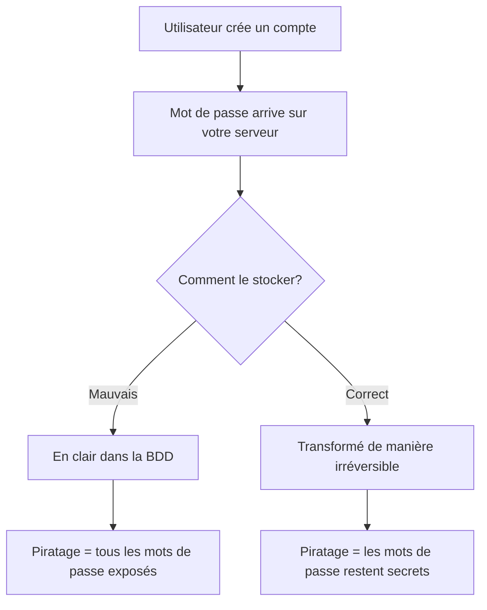
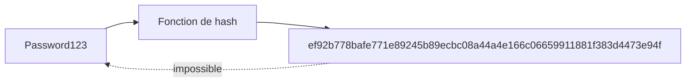
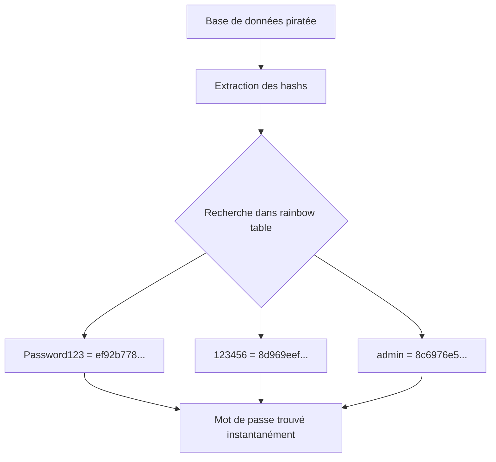
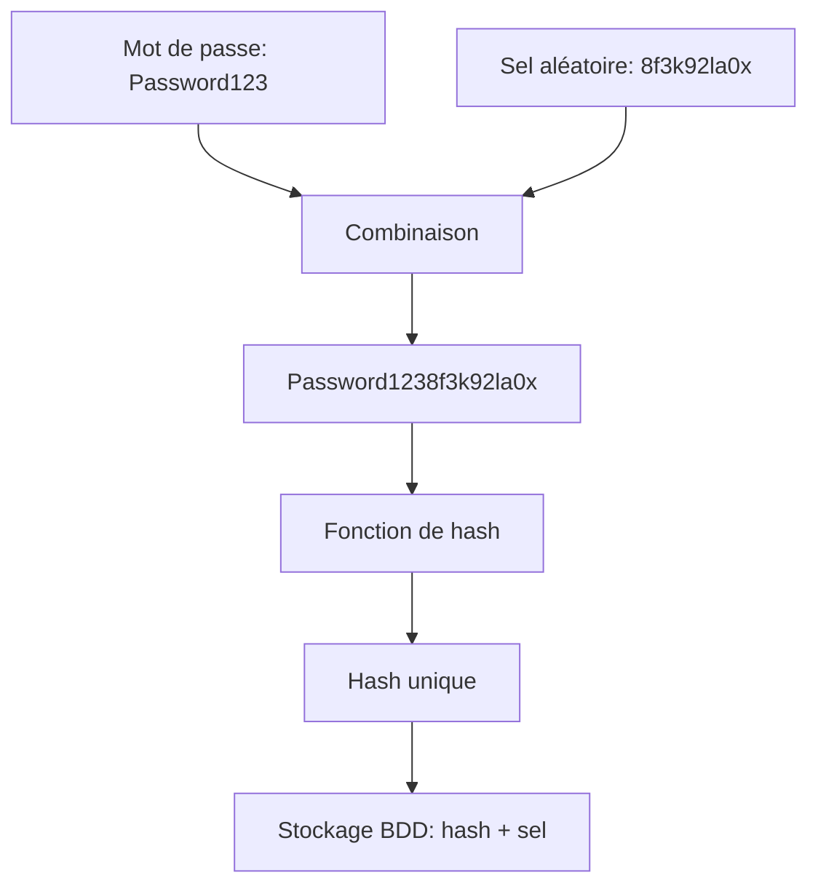
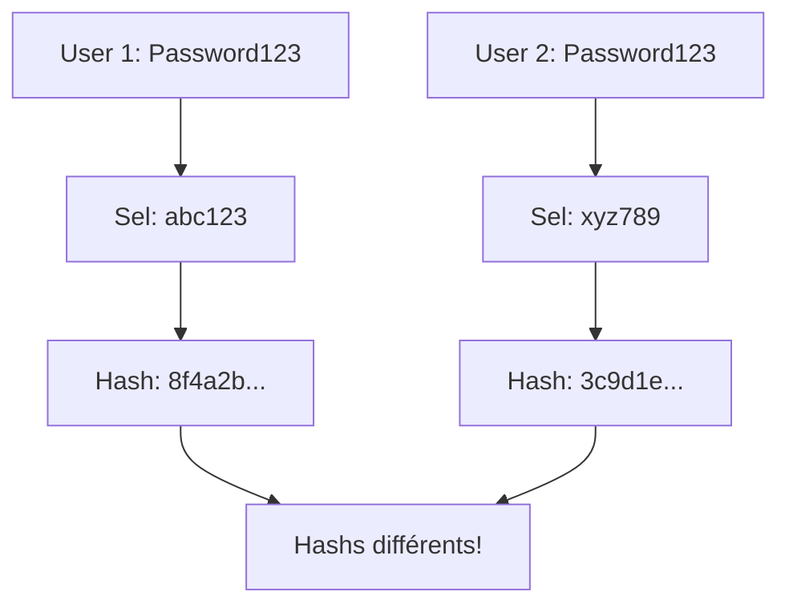
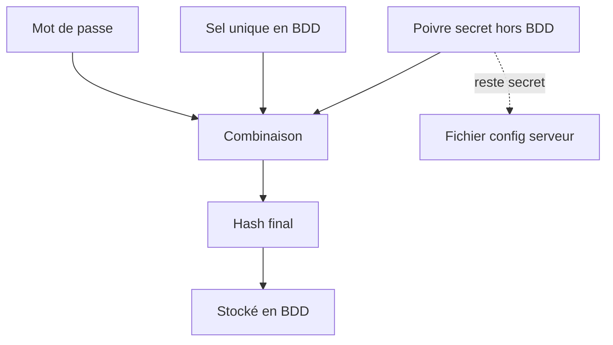
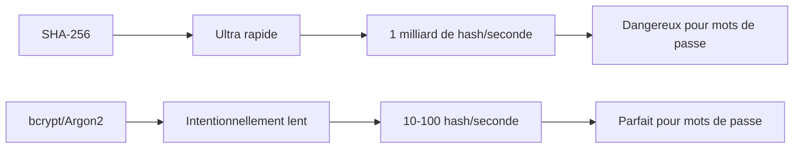
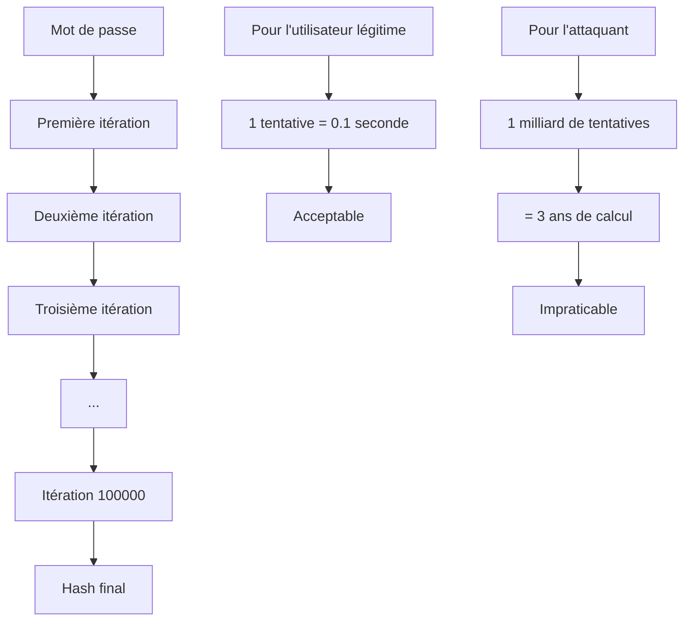
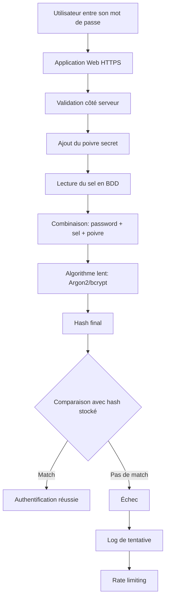
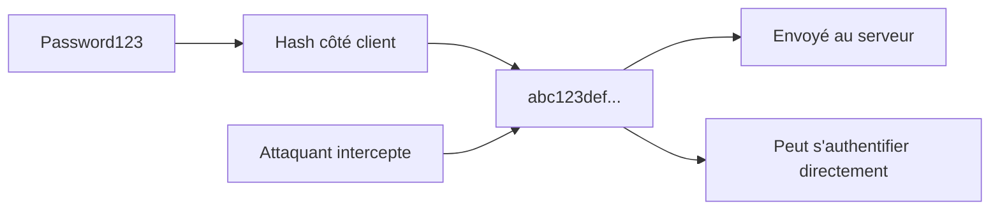

# Le sel, le hash et le poivre : comment on stocke vraiment les mots de passe

## Ou comment j'ai appris à ne plus stocker "Password123" en clair dans ma base de données

Il y a quelques années, j'ai hérité d'une base de données. Vous savez, le genre de base de données qui existe depuis 2008 et que personne n'ose toucher de peur de tout casser. Un jour, par curiosité morbide, j'ai jeté un œil à la table des utilisateurs.

```sql
SELECT TOP 5 Username, Password FROM Users;
```

Résultat : des mots de passe en clair. En 2023. Dans une application en production. Avec des vrais utilisateurs.

J'ai eu besoin d'un café. Ou trois.

Cette expérience traumatisante m'a poussé à vraiment comprendre comment on stocke correctement des mots de passe. Spoiler : c'est à la fois plus simple et plus complexe qu'on ne le pense.

## Le problème fondamental

Voici le dilemme : vous avez besoin de vérifier que l'utilisateur connaît son mot de passe, mais vous ne devez jamais, JAMAIS pouvoir le récupérer. Si vous pouvez lire le mot de passe de vos utilisateurs, vous êtes un incident de sécurité en attente.



## Le hashing : la base de tout

Le hashing, c'est une fonction mathématique à sens unique. Vous mettez un texte, vous obtenez une empreinte. Mais à partir de l'empreinte, impossible de retrouver le texte original.



Exemple avec SHA-256 :
```sql
-- Création d'un utilisateur avec mot de passe hashé
DECLARE @Password NVARCHAR(100) = 'Password123';
DECLARE @Hash VARBINARY(32);

SET @Hash = HASHBYTES('SHA2_256', @Password);

INSERT INTO Users (Username, PasswordHash)
VALUES ('jean.dupont', @Hash);

-- Vérification lors de la connexion
DECLARE @InputPassword NVARCHAR(100) = 'Password123';
DECLARE @StoredHash VARBINARY(32);
DECLARE @InputHash VARBINARY(32);

SELECT @StoredHash = PasswordHash
FROM Users
WHERE Username = 'jean.dupont';

SET @InputHash = HASHBYTES('SHA2_256', @InputPassword);

IF @InputHash = @StoredHash
    PRINT 'Mot de passe correct';
ELSE
    PRINT 'Mot de passe incorrect';
```

### Pourquoi le hash seul ne suffit pas

Le problème ? Les humains sont prévisibles. Et paresseux. Moi la première.

Si deux utilisateurs choisissent le même mot de passe, ils auront le même hash. Et les attaquants le savent. Ils ont construit des tables géantes (appelées "rainbow tables") qui listent les hashs des mots de passe courants.



Résultat : si vous utilisez juste un hash simple, n'importe quel mot de passe courant sera cracké en quelques secondes.

## Le sel : votre meilleur ami

Le sel, c'est une valeur aléatoire qu'on ajoute au mot de passe AVANT de le hasher. Chaque utilisateur a son propre sel, unique.



Implémentation SQL Server :
```sql
-- Fonction pour générer un sel aléatoire
CREATE OR ALTER FUNCTION dbo.GenerateSalt()
RETURNS VARBINARY(32)
AS
BEGIN
    RETURN CRYPT_GEN_RANDOM(32);
END;
GO

-- Fonction pour hasher avec sel
CREATE OR ALTER FUNCTION dbo.HashPasswordWithSalt(
    @Password NVARCHAR(100),
    @Salt VARBINARY(32)
)
RETURNS VARBINARY(64)
AS
BEGIN
    DECLARE @PasswordWithSalt VARBINARY(132);
    SET @PasswordWithSalt = CAST(@Password AS VARBINARY(100)) + @Salt;
    RETURN HASHBYTES('SHA2_512', @PasswordWithSalt);
END;
GO

-- Création d'un utilisateur
DECLARE @Username NVARCHAR(50) = 'jean.dupont';
DECLARE @Password NVARCHAR(100) = 'Password123';
DECLARE @Salt VARBINARY(32) = dbo.GenerateSalt();
DECLARE @Hash VARBINARY(64);

SET @Hash = dbo.HashPasswordWithSalt(@Password, @Salt);

INSERT INTO Users (Username, PasswordHash, Salt)
VALUES (@Username, @Hash, @Salt);

-- Vérification lors de la connexion
DECLARE @LoginUsername NVARCHAR(50) = 'jean.dupont';
DECLARE @LoginPassword NVARCHAR(100) = 'Password123';
DECLARE @StoredHash VARBINARY(64);
DECLARE @StoredSalt VARBINARY(32);
DECLARE @ComputedHash VARBINARY(64);

SELECT @StoredHash = PasswordHash, @StoredSalt = Salt
FROM Users
WHERE Username = @LoginUsername;

SET @ComputedHash = dbo.HashPasswordWithSalt(@LoginPassword, @StoredSalt);

IF @ComputedHash = @StoredHash
    PRINT 'Authentification réussie';
ELSE
    PRINT 'Mot de passe incorrect';
```

### Pourquoi le sel change tout

Même si deux utilisateurs ont le même mot de passe, leurs hashs seront complètement différents grâce au sel unique. Les rainbow tables deviennent inutiles.



## Le poivre : la cerise sur le gâteau

Le poivre, c'est comme le sel, mais au lieu d'être stocké en base de données, il est stocké dans votre code ou configuration serveur. C'est une clé secrète partagée par tous les utilisateurs.



L'avantage : même si quelqu'un vole votre base de données, sans le poivre, il ne peut rien faire.

```sql
-- Dans votre code applicatif (pas en BDD!)
DECLARE @Pepper NVARCHAR(100) = 'VotreCleSecreteTresTresLongue2024!';

-- Fonction de hash avec sel ET poivre
CREATE OR ALTER FUNCTION dbo.HashPasswordWithSaltAndPepper(
    @Password NVARCHAR(100),
    @Salt VARBINARY(32),
    @Pepper NVARCHAR(100)
)
RETURNS VARBINARY(64)
AS
BEGIN
    DECLARE @Combined VARBINARY(232);
    SET @Combined = CAST(@Password AS VARBINARY(100)) +
                    @Salt +
                    CAST(@Pepper AS VARBINARY(100));
    RETURN HASHBYTES('SHA2_512', @Combined);
END;
GO
```

## Les algorithmes : tous les hashs ne se valent pas

SHA-256, c'est bien pour l'intégrité des fichiers. Pour les mots de passe ? Non.

Le problème avec SHA-256 : il est TROP rapide. Un attaquant avec un bon GPU peut tester des milliards de combinaisons par seconde.

### Les algorithmes adaptés aux mots de passe

Ce qu'il vous faut, c'est un algorithme intentionnellement lent. Les champions actuels :

1. **bcrypt** : le standard depuis des années
2. **Argon2** : le gagnant du Password Hashing Competition 2015
3. **scrypt** : excellent aussi
4. **PBKDF2** : correct mais moins robuste



### Exemple avec PBKDF2 en SQL Server

SQL Server n'a pas bcrypt natif, mais on peut utiliser PBKDF2 via les fonctions cryptographiques :

```sql
-- Fonction pour générer un hash PBKDF2
CREATE OR ALTER FUNCTION dbo.PBKDF2Hash(
    @Password NVARCHAR(100),
    @Salt VARBINARY(32),
    @Iterations INT = 100000
)
RETURNS VARBINARY(64)
AS
BEGIN
    DECLARE @Hash VARBINARY(64);
    DECLARE @Counter INT = 0;
    DECLARE @Current VARBINARY(64);
    DECLARE @Result VARBINARY(64) = 0x00;

    -- Simplifié pour l'exemple
    -- En production, utilisez une vraie implémentation PBKDF2
    WHILE @Counter < @Iterations
    BEGIN
        SET @Current = HASHBYTES('SHA2_512',
            CAST(@Password AS VARBINARY(100)) +
            @Salt +
            CAST(@Counter AS VARBINARY(4))
        );
        SET @Result = @Result ^ @Current; -- XOR
        SET @Counter = @Counter + 1;
    END;

    RETURN @Result;
END;
GO
```

**Note importante** : En production, ne réimplémentez pas vous-même ces algorithmes. Utilisez des bibliothèques éprouvées côté applicatif (ASP.NET Identity, bcrypt.net, etc.). SQL Server n'est pas l'endroit idéal pour faire du hashing de mots de passe complexe.

## Le nombre d'itérations : ralentir pour mieux protéger

Les algorithmes modernes permettent de définir un "coût" ou nombre d'itérations. Plus c'est élevé, plus c'est lent, plus c'est sécurisé.



Recommandations actuelles (2024-2025) :
- **PBKDF2** : minimum 100 000 itérations (plutôt 600 000)
- **bcrypt** : coût de 12-14
- **Argon2** : selon la mémoire disponible, mais minimum 128 MB

## Architecture complète : la défense en profondeur

Voici comment tout s'assemble dans un système réel :



### Schéma de la base de données

```sql
CREATE TABLE Users (
    UserId INT IDENTITY(1,1) PRIMARY KEY,
    Username NVARCHAR(50) UNIQUE NOT NULL,
    Email NVARCHAR(100) UNIQUE NOT NULL,
    PasswordHash VARBINARY(64) NOT NULL,  -- Le hash final
    Salt VARBINARY(32) NOT NULL,          -- Le sel unique
    HashAlgorithm NVARCHAR(20) NOT NULL DEFAULT 'PBKDF2', -- Pour migration future
    Iterations INT NOT NULL DEFAULT 100000,                -- Coût de l'algo
    CreatedAt DATETIME2 NOT NULL DEFAULT GETUTCDATE(),
    LastPasswordChange DATETIME2 NOT NULL DEFAULT GETUTCDATE(),

    -- Jamais ça :
    -- Password NVARCHAR(100)  -- NON NON NON
);

-- Index pour les recherches
CREATE INDEX IX_Users_Username ON Users(Username);
CREATE INDEX IX_Users_Email ON Users(Email);
```

## Les erreurs que j'ai vues (et parfois faites)

### Erreur 1 : Hasher côté client

"Si je hash le mot de passe dans le navigateur avant de l'envoyer, c'est plus sécurisé non ?"

Non. Le hash DEVIENT le mot de passe. Si quelqu'un intercepte le hash, il peut l'utiliser pour s'authentifier.



Solution : HTTPS + hash côté serveur uniquement.

### Erreur 2 : Réutiliser le sel

"Je vais générer un sel par application, pas par utilisateur, c'est plus simple."

Félicitations, vous venez de transformer votre sel en poivre. Et si c'est stocké en BDD, c'est un poivre inutile.

### Erreur 3 : Hasher le hash

"Pour plus de sécurité, je vais hasher deux fois !"

```sql
-- Non, ça n'aide pas
SET @DoubleHash = HASHBYTES('SHA2_256',
    HASHBYTES('SHA2_256', @Password)
);
```

Si votre algorithme est faible, le hasher deux fois ne le rend pas plus fort. Utilisez un meilleur algorithme.

### Erreur 4 : Stocker le poivre en base

J'ai vraiment vu ça. Une colonne "Pepper" dans la table Users. À ce stade, autant l'appeler "Salt2".

## La checklist du DBA responsable

Avant de partir dormir tranquille, vérifiez que :

- [ ] Aucun mot de passe n'est stocké en clair
- [ ] Vous utilisez un algorithme adapté (bcrypt/Argon2/PBKDF2)
- [ ] Chaque utilisateur a un sel unique
- [ ] Le sel est stocké en base, le poivre dans la config serveur
- [ ] Les connexions utilisent HTTPS/TLS
- [ ] Vous avez un rate limiting sur les tentatives de connexion
- [ ] Les hashs sont calculés côté serveur, jamais côté client
- [ ] Vous loggez les tentatives de connexion échouées
- [ ] Vous forcez des mots de passe forts (longueur minimum, complexité)
- [ ] Vous avez prévu une procédure de migration si l'algorithme devient obsolète

## Migration d'un ancien système

"Ok, je comprends tout ça, mais ma base existe depuis 10 ans avec des MD5. Comment je migre ?"

Vous ne pouvez pas recalculer les hashs (vous n'avez plus les mots de passe originaux). La solution :

```sql
-- 1. Ajouter les nouvelles colonnes
ALTER TABLE Users ADD
    Salt VARBINARY(32) NULL,
    NewPasswordHash VARBINARY(64) NULL,
    HashVersion INT DEFAULT 1; -- 1 = ancien, 2 = nouveau

-- 2. À la prochaine connexion réussie de l'utilisateur
CREATE OR ALTER PROCEDURE sp_AuthenticateAndUpgrade
    @Username NVARCHAR(50),
    @Password NVARCHAR(100)
AS
BEGIN
    DECLARE @StoredHash VARBINARY(32);
    DECLARE @ComputedHash VARBINARY(32);
    DECLARE @HashVersion INT;
    DECLARE @UserId INT;

    SELECT @StoredHash = PasswordHash,
           @HashVersion = HashVersion,
           @UserId = UserId
    FROM Users
    WHERE Username = @Username;

    -- Vérifier avec l'ancien système
    IF @HashVersion = 1
    BEGIN
        SET @ComputedHash = HASHBYTES('MD5', @Password);

        IF @ComputedHash = @StoredHash
        BEGIN
            -- Connexion réussie, upgrader maintenant!
            DECLARE @NewSalt VARBINARY(32) = dbo.GenerateSalt();
            DECLARE @NewHash VARBINARY(64) = dbo.PBKDF2Hash(@Password, @NewSalt, 100000);

            UPDATE Users
            SET Salt = @NewSalt,
                NewPasswordHash = @NewHash,
                HashVersion = 2,
                PasswordHash = NULL -- Supprimer l'ancien
            WHERE UserId = @UserId;

            RETURN 1; -- Succès
        END
        RETURN 0; -- Échec
    END

    -- Si déjà migré, utiliser le nouveau système
    IF @HashVersion = 2
    BEGIN
        DECLARE @UserSalt VARBINARY(32);
        DECLARE @UserHash VARBINARY(64);

        SELECT @UserSalt = Salt, @UserHash = NewPasswordHash
        FROM Users WHERE UserId = @UserId;

        IF dbo.PBKDF2Hash(@Password, @UserSalt, 100000) = @UserHash
            RETURN 1;
        RETURN 0;
    END
END;
GO
```

Migration progressive : les utilisateurs actifs seront migrés automatiquement. Pour les comptes inactifs, après 6-12 mois, forcez une réinitialisation de mot de passe.

## Ce qu'il faut retenir

Si vous ne devez retenir que 5 choses :

1. **Ne stockez JAMAIS les mots de passe en clair**. Jamais. Sous aucun prétexte. Même pour "débugger".

2. **Hash + Sel unique + Poivre secret** : la trinité de base pour 2025.

3. **Utilisez un algorithme adapté** : bcrypt, Argon2 ou PBKDF2 avec beaucoup d'itérations.

4. **Le hashing se fait côté serveur** après réception via HTTPS, jamais côté client.

5. **La sécurité évolue** : prévoyez dès maintenant la possibilité de migrer vers un meilleur algorithme dans le futur.

## Pour aller plus loin

Quelques ressources si vous voulez creuser (et vous devriez) :

- OWASP Password Storage Cheat Sheet
- RFC 2898 (PBKDF2)
- RFC 7914 (scrypt)
- RFC 9106 (Argon2)
- Étude de Troy Hunt sur les bases de données piratées : haveibeenpwned.com

## Conclusion

Protéger les mots de passe de vos utilisateurs, ce n'est pas juste une bonne pratique technique, c'est une responsabilité éthique. Chaque fois qu'un utilisateur vous confie son mot de passe (même s'il est nul), il vous fait confiance.

Ne soyez pas la prochaine entreprise qui fait la une parce qu'elle stockait des millions de mots de passe en clair ou en MD5.

Après avoir écrit cet article, j'ai bu mon café en pensant à cette vieille base de données de 2008. Elle a depuis été migrée (oui, avec la méthode progressive décrite plus haut). Les utilisateurs ne se sont rendu compte de rien. C'est comme ça que ça devrait toujours se passer.

Et si vous avez une base de données avec des mots de passe en clair quelque part, arrêtez de lire et allez la corriger. Maintenant. Je peux attendre.

---

*PS : Non, encoder en Base64 n'est pas du chiffrement. Et encoder deux fois en Base64 ne rend pas les choses plus sécurisées. J'ai vraiment vu quelqu'un essayer.*

*PPS : Si votre système permet de "récupérer votre mot de passe par email", vous le stockez mal. On peut réinitialiser, pas récupérer.*
