# Les verrous et les deadlocks expliqués : pourquoi vos transactions se battent en duel

## Ou comment j'ai découvert que mes requêtes se détestaient mutuellement

Il était 3h du matin. Mon téléphone a sonné. L'alerte que tout DBA redoute : "Database unresponsive". J'ai ouvert mon laptop, les yeux encore collés, et j'ai vu l'horreur : 47 sessions bloquées. Des transactions en attente depuis 15 minutes. Des utilisateurs furieux qui ne pouvaient plus rien faire.

Le coupable ? Un deadlock. Ou plutôt, une cascade de deadlocks qui s'enchaînaient comme des dominos.

Cette nuit-là, j'ai appris que SQL Server n'était pas juste un endroit où stocker des données. C'est un champ de bataille où des transactions se battent pour des ressources limitées. Et quand deux transactions veulent les mêmes ressources dans un ordre différent, c'est le carnage.

Bienvenue dans le monde merveilleux des verrous et des deadlocks.

## Le problème : la concurrence

Imaginez une bibliothèque. Deux personnes veulent emprunter le même livre en même temps. Que se passe-t-il ?

Dans une base de données, c'est pareil. Mais au lieu de livres, on parle de lignes, de pages, de tables. Et au lieu de deux personnes, on a parfois des milliers de transactions simultanées.

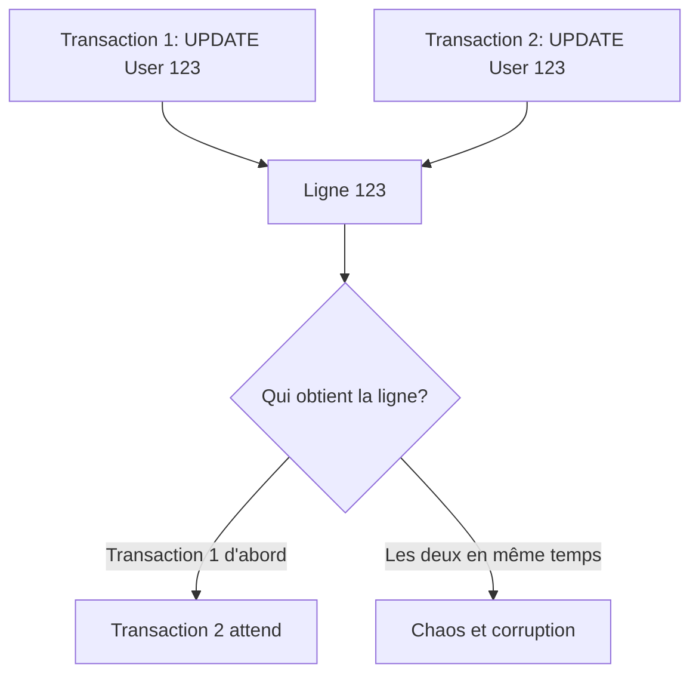

Sans système de verrous, deux transactions pourraient modifier la même donnée simultanément. Résultat : corruption de données, incohérences, cauchemar.

Les verrous existent pour éviter ça. Mais ils créent d'autres problèmes...

## Les types de verrous : une hiérarchie du contrôle

SQL Server utilise plusieurs types de verrous, du plus permissif au plus restrictif :

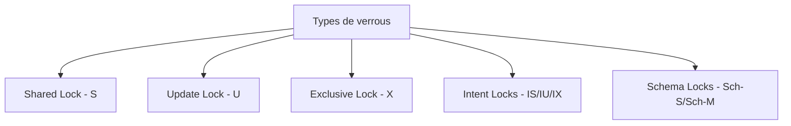

### Shared Lock (S) : lecture partagée

```sql
-- Lecture simple
SELECT * FROM Users WHERE UserId = 123;
```

**Comportement** :
- Acquis pendant la lecture
- Plusieurs transactions peuvent avoir un S lock sur la même ressource
- Empêche les modifications (X lock) pendant la lecture

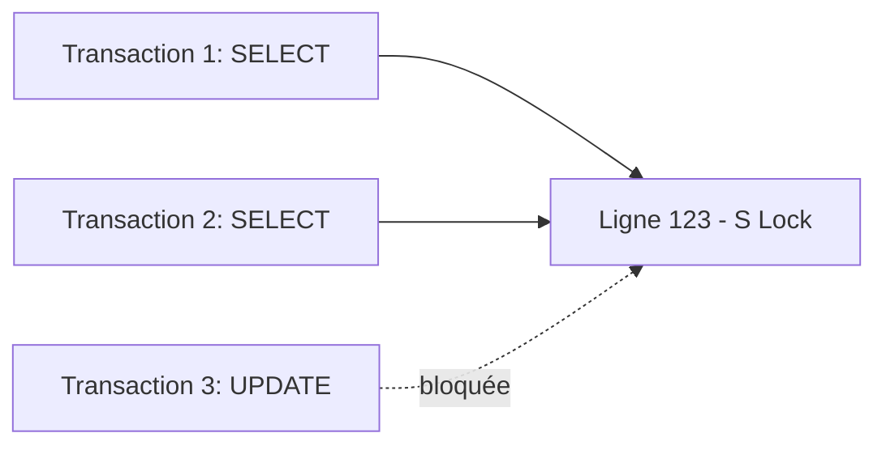

**Durée** : Par défaut, libéré dès que la ligne est lue (sauf si niveau d'isolation supérieur).

### Exclusive Lock (X) : modification exclusive

```sql
-- Modification
UPDATE Users SET Email = 'new@email.com' WHERE UserId = 123;
```

**Comportement** :
- Acquis pour toute modification (UPDATE, DELETE, INSERT)
- Une seule transaction peut avoir un X lock
- Bloque TOUTES les autres transactions (lecture ET écriture)

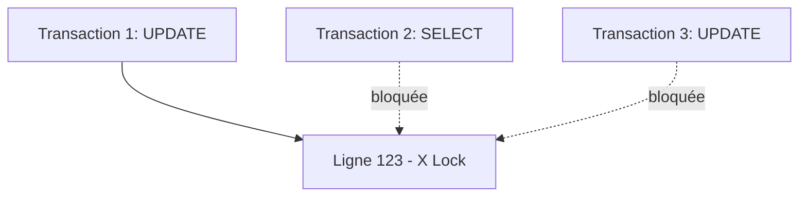

**Durée** : Maintenu jusqu'à la fin de la transaction (COMMIT ou ROLLBACK).

### Update Lock (U) : le lock intermédiaire

```sql
-- UPDATE commence par lire puis modifier
UPDATE Users SET Balance = Balance - 100 WHERE UserId = 123;
```

**Le problème sans U lock** :

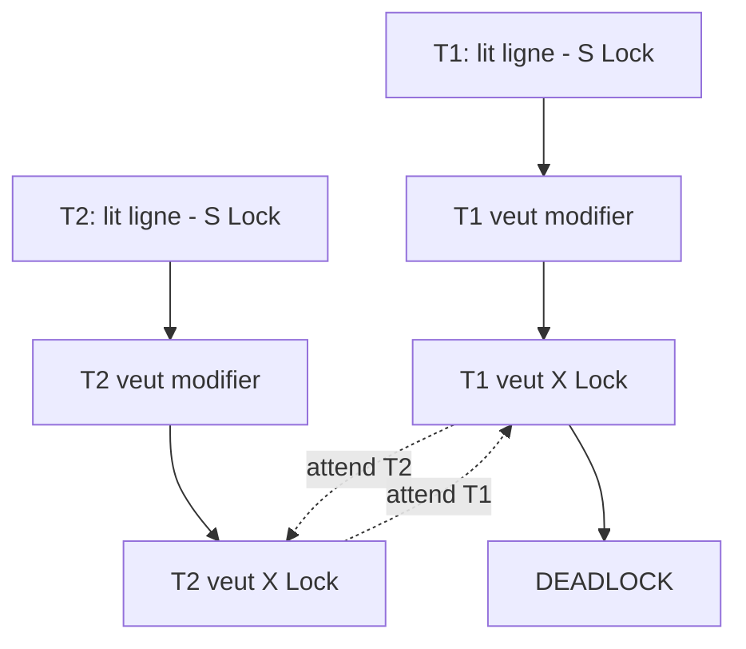

**La solution : U lock**

- Acquis pendant la lecture en vue d'une modification
- Compatible avec S lock (lecture)
- Incompatible avec U et X lock (modification)
- Empêche le deadlock ci-dessus

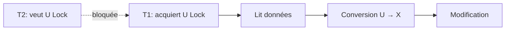

### Intent Locks : la hiérarchie

SQL Server verrouille à plusieurs niveaux :

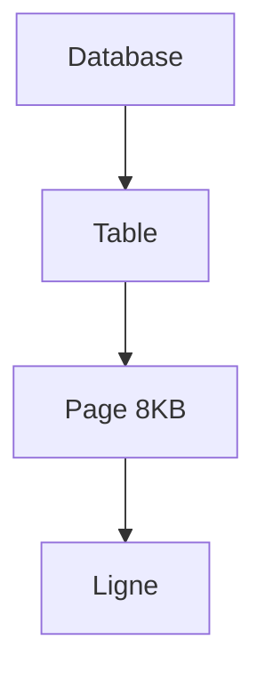

Pour éviter de vérifier chaque ligne individuellement, SQL Server utilise des Intent Locks :

- **IS** (Intent Shared) : "J'ai des S locks quelque part en dessous"
- **IX** (Intent Exclusive) : "J'ai des X locks quelque part en dessous"
- **IU** (Intent Update) : "J'ai des U locks quelque part en dessous"

```sql
-- Cette transaction
UPDATE Users SET Status = 'Active' WHERE UserId = 123;

-- Crée cette hiérarchie :
-- Database: IS
-- Table Users: IX
-- Page contenant ligne 123: IX
-- Ligne 123: X
```

**Pourquoi c'est utile** : Si quelqu'un veut un lock exclusif sur toute la table, SQL Server peut rapidement voir qu'il y a des IX locks dessus. Pas besoin de scanner toutes les lignes.

## Les niveaux d'isolation : le compromis performance/cohérence

Les niveaux d'isolation définissent comment les transactions se voient mutuellement :

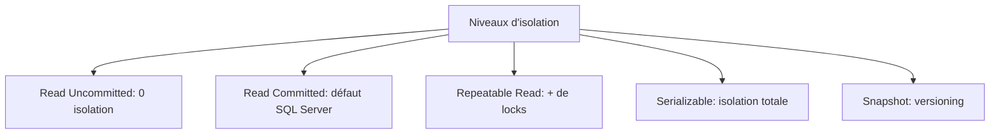

### Read Uncommitted : l'anarchie

```sql
SET TRANSACTION ISOLATION LEVEL READ UNCOMMITTED;
BEGIN TRANSACTION;
    SELECT * FROM Users WHERE UserId = 123;
COMMIT;
```

**Comportement** : Lit les données même si elles sont en cours de modification (dirty read).

**Avantage** : Aucun lock, performance maximale.
**Problème** : Vous pouvez lire des données qui seront annulées (ROLLBACK).

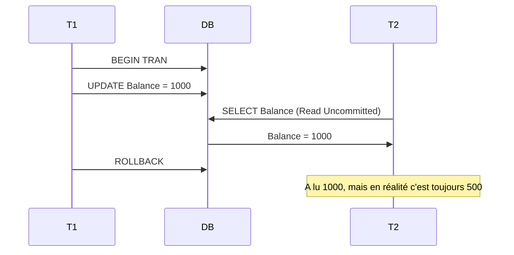

**Cas d'usage** : Rapports approximatifs, statistiques où la précision absolue n'est pas critique.

### Read Committed : le défaut raisonnable

```sql
-- C'est le défaut, mais on peut l'expliciter :
SET TRANSACTION ISOLATION LEVEL READ COMMITTED;
BEGIN TRANSACTION;
    SELECT * FROM Users WHERE UserId = 123;
COMMIT;
```

**Comportement** : Attend que les X locks soient libérés avant de lire.

**Avantage** : Pas de dirty reads.
**Problème** : Non-repeatable reads possibles.

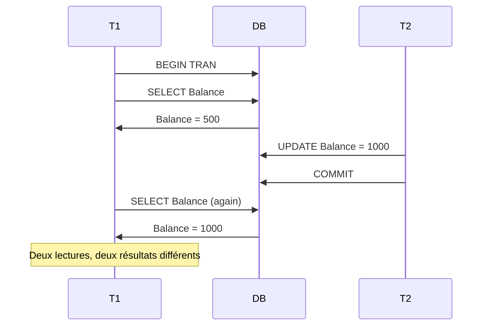

### Repeatable Read : la cohérence

```sql
SET TRANSACTION ISOLATION LEVEL REPEATABLE READ;
BEGIN TRANSACTION;
    SELECT * FROM Users WHERE UserId = 123;
    -- Faire d'autres choses
    SELECT * FROM Users WHERE UserId = 123; -- Résultat identique garanti
COMMIT;
```

**Comportement** : Maintient les S locks jusqu'à la fin de la transaction.

**Avantage** : Lectures répétables garanties.
**Problème** : Phantom reads possibles, plus de contention.

```sql
-- Transaction 1
SET TRANSACTION ISOLATION LEVEL REPEATABLE READ;
BEGIN TRANSACTION;
    SELECT COUNT(*) FROM Users WHERE Country = 'France'; -- 100
    WAITFOR DELAY '00:00:10';
    SELECT COUNT(*) FROM Users WHERE Country = 'France'; -- 105 ???
COMMIT;

-- Transaction 2 (pendant le délai)
INSERT INTO Users (Country) VALUES ('France'); -- Nouvel enregistrement
COMMIT;
```

Les lignes existantes sont verrouillées, mais de nouvelles lignes peuvent apparaître (phantom reads).

### Serializable : l'isolation totale

```sql
SET TRANSACTION ISOLATION LEVEL SERIALIZABLE;
BEGIN TRANSACTION;
    SELECT * FROM Users WHERE Country = 'France';
    -- Aucune modification possible sur les lignes matchant le WHERE
COMMIT;
```

**Comportement** : Verrouille même les lignes qui n'existent pas encore (range locks).

**Avantage** : Isolation complète.
**Problème** : Performance terrible, beaucoup de blocages.

### Snapshot : le temps figé

```sql
-- Activer au niveau database
ALTER DATABASE MyDB SET ALLOW_SNAPSHOT_ISOLATION ON;

-- Utiliser dans une transaction
SET TRANSACTION ISOLATION LEVEL SNAPSHOT;
BEGIN TRANSACTION;
    SELECT * FROM Users WHERE UserId = 123;
    -- Voit la version des données au moment du BEGIN TRAN
COMMIT;
```

**Comportement** : Utilise le versioning dans tempdb. Chaque transaction voit une version cohérente des données.

**Avantage** : Lecteurs ne bloquent jamais les écrivains, écrivains ne bloquent jamais les lecteurs.
**Problème** : Coût en tempdb, conflits d'update possibles.

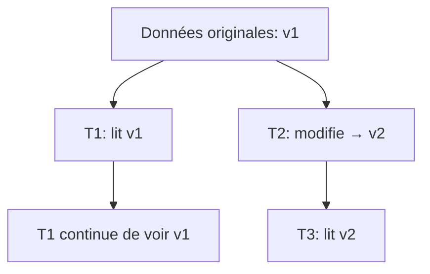

## Les deadlocks : la guerre totale

Un deadlock arrive quand deux transactions attendent l'une l'autre, créant un cycle.

### Exemple classique : ordre inversé

```sql
-- Transaction 1
BEGIN TRANSACTION;
    UPDATE Users SET Balance = Balance - 100 WHERE UserId = 1;
    -- X lock sur User 1
    WAITFOR DELAY '00:00:02';
    UPDATE Users SET Balance = Balance + 100 WHERE UserId = 2;
    -- Attend X lock sur User 2
COMMIT;

-- Transaction 2 (simultanée)
BEGIN TRANSACTION;
    UPDATE Users SET Balance = Balance - 50 WHERE UserId = 2;
    -- X lock sur User 2
    WAITFOR DELAY '00:00:02';
    UPDATE Users SET Balance = Balance + 50 WHERE UserId = 1;
    -- Attend X lock sur User 1 → DEADLOCK
COMMIT;
```

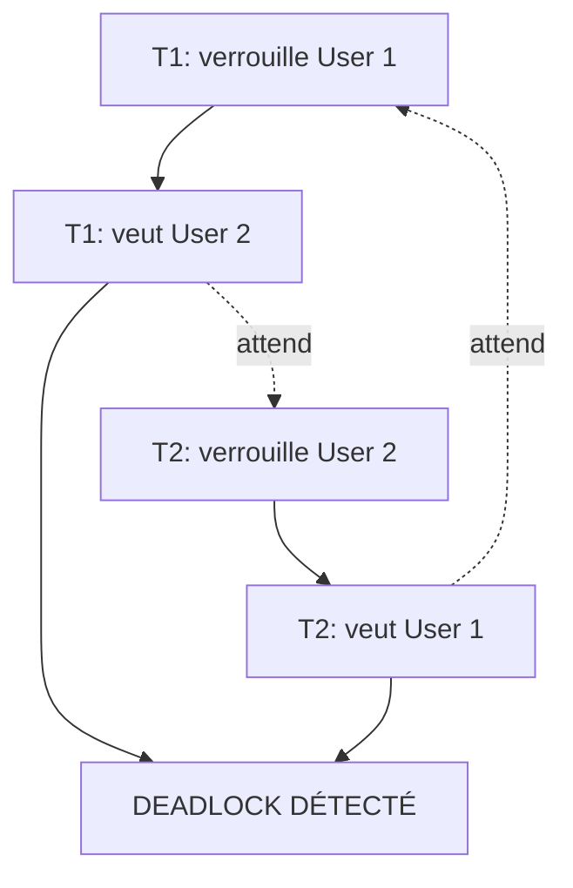

SQL Server détecte le cycle et tue une des transactions (la "victime"). Vous voyez :

```
Msg 1205, Level 13, State 51
Transaction (Process ID 52) was deadlocked on lock resources 
with another process and has been chosen as the deadlock victim. 
Rerun the transaction.
```

### Deadlock sur escalade de locks

```sql
-- Transaction 1
SET TRANSACTION ISOLATION LEVEL REPEATABLE READ;
BEGIN TRANSACTION;
    SELECT * FROM Orders WHERE OrderId = 100; -- S lock
    WAITFOR DELAY '00:00:02';
    UPDATE Orders SET Status = 'Processed' WHERE OrderId = 100; -- Veut X lock
COMMIT;

-- Transaction 2
SET TRANSACTION ISOLATION LEVEL REPEATABLE READ;
BEGIN TRANSACTION;
    SELECT * FROM Orders WHERE OrderId = 100; -- S lock
    WAITFOR DELAY '00:00:02';
    UPDATE Orders SET Status = 'Cancelled' WHERE OrderId = 100; -- Veut X lock
COMMIT;
```

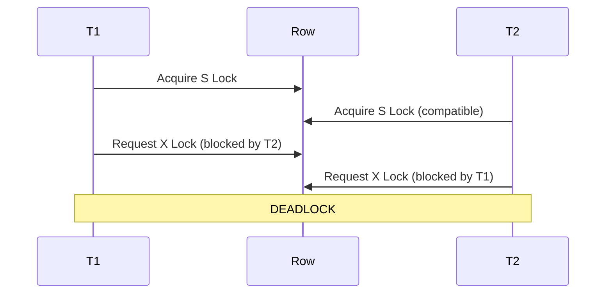

Les deux ont un S lock. Les deux veulent un X lock. Aucun ne peut l'obtenir.

**Solution** : Utiliser UPDATE lock dès le départ.

```sql
-- Correct
BEGIN TRANSACTION;
    SELECT * FROM Orders WITH (UPDLOCK) WHERE OrderId = 100;
    -- U lock acquis, empêche autre U lock
    WAITFOR DELAY '00:00:02';
    UPDATE Orders SET Status = 'Processed' WHERE OrderId = 100;
COMMIT;
```

### Deadlock de conversion

```sql
-- Table Orders a un index sur CustomerId
-- Transaction 1
BEGIN TRANSACTION;
    SELECT * FROM Orders WHERE CustomerId = 1; -- IX lock sur table, S lock sur lignes
    UPDATE Customers SET Status = 'Active' WHERE CustomerId = 1; -- Veut X lock
COMMIT;

-- Transaction 2
BEGIN TRANSACTION;
    UPDATE Customers SET Status = 'Inactive' WHERE CustomerId = 1; -- X lock
    SELECT * FROM Orders WHERE CustomerId = 1; -- Veut IS lock → DEADLOCK
COMMIT;
```

## Diagnostiquer les deadlocks

### Activer la trace des deadlocks

```sql
-- Activer la capture des deadlocks dans le Error Log
DBCC TRACEON (1222, -1);

-- Ou utiliser Extended Events (mieux)
CREATE EVENT SESSION DeadlockCapture ON SERVER
ADD EVENT sqlserver.xml_deadlock_report
ADD TARGET package0.event_file(SET filename=N'C:\Logs\Deadlocks.xel');

ALTER EVENT SESSION DeadlockCapture ON SERVER STATE = START;
```

### Lire un deadlock graph

Quand un deadlock arrive, SQL Server génère un XML avec le graphe :

```xml
<deadlock>
    <process-list>
        <process id="process1">
            <executionStack>
                <frame procname="sp_TransferMoney" />
            </executionStack>
        </process>
        <process id="process2">
            <executionStack>
                <frame procname="sp_UpdateBalance" />
            </executionStack>
        </process>
    </process-list>
    <resource-list>
        <objectlock locktype="X" mode="X" objectname="Users" />
    </resource-list>
</deadlock>
```

SSMS peut afficher ça visuellement :

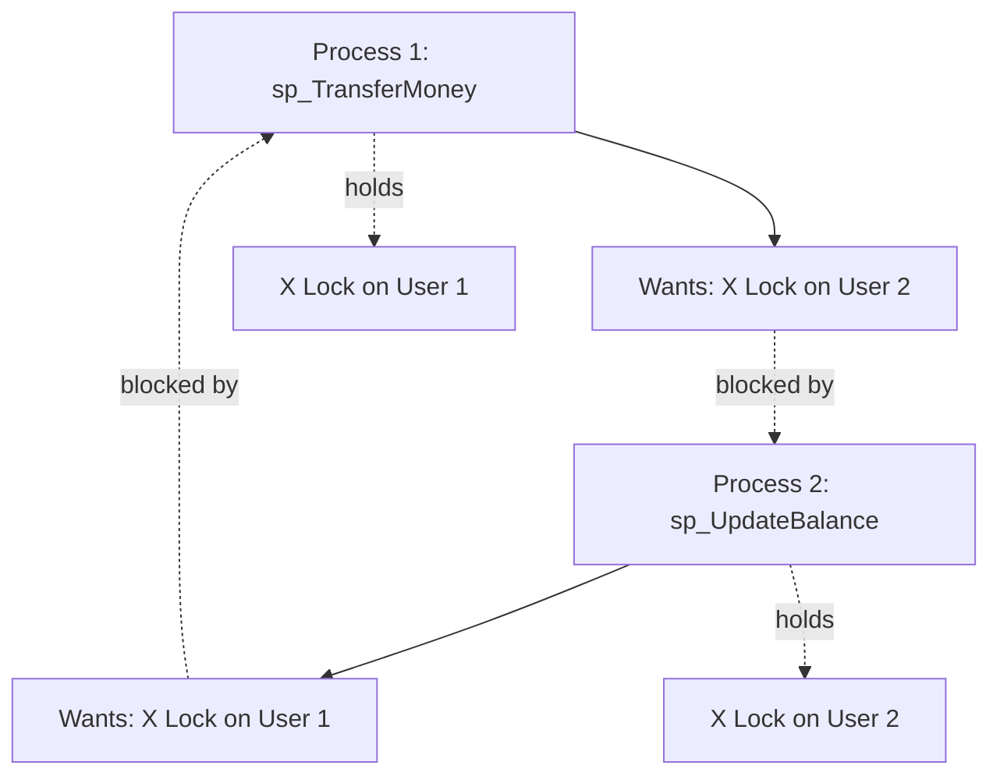

### Requêtes pour voir les blocages en temps réel

```sql
-- Voir les sessions bloquées
SELECT 
    blocking.session_id AS BlockingSessionId,
    blocked.session_id AS BlockedSessionId,
    blocked.wait_type,
    blocked.wait_time / 1000 AS WaitTimeSeconds,
    blocked.wait_resource,
    blocking_sql.text AS BlockingSQLText,
    blocked_sql.text AS BlockedSQLText
FROM sys.dm_exec_requests blocked
INNER JOIN sys.dm_exec_requests blocking 
    ON blocked.blocking_session_id = blocking.session_id
CROSS APPLY sys.dm_exec_sql_text(blocking.sql_handle) blocking_sql
CROSS APPLY sys.dm_exec_sql_text(blocked.sql_handle) blocked_sql
WHERE blocked.blocking_session_id > 0;

-- Tuer une session bloquante si nécessaire
-- KILL 52;
```

## Prévenir les deadlocks : les bonnes pratiques

### 1. Accéder aux ressources dans le même ordre

```sql
-- MAUVAIS : ordre variable
IF @condition = 1
BEGIN
    UPDATE TableA WHERE Id = @id1;
    UPDATE TableB WHERE Id = @id2;
END
ELSE
BEGIN
    UPDATE TableB WHERE Id = @id2;
    UPDATE TableA WHERE Id = @id1;
END

-- BON : ordre fixe
UPDATE TableA WHERE Id = @id1;
UPDATE TableB WHERE Id = @id2;
```

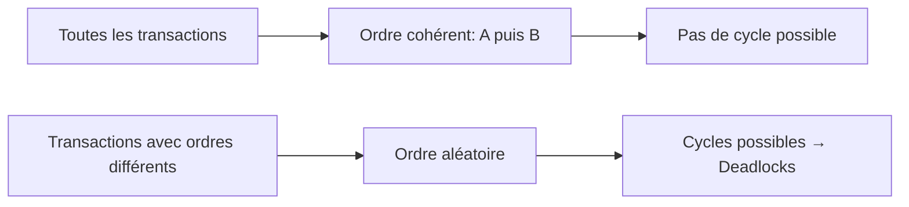

### 2. Garder les transactions courtes

```sql
-- MAUVAIS : transaction longue
BEGIN TRANSACTION;
    UPDATE Orders SET Status = 'Processing' WHERE OrderId = @orderId;
    
    -- Appel API externe de 5 secondes
    EXEC sp_CallExternalAPI @orderId;
    
    -- Calculs complexes
    EXEC sp_ComplexCalculation @orderId;
    
    UPDATE Orders SET Status = 'Processed' WHERE OrderId = @orderId;
COMMIT;

-- BON : transaction minimale
-- 1. Calculs HORS transaction
EXEC sp_ComplexCalculation @orderId;
EXEC sp_CallExternalAPI @orderId;

-- 2. Transaction ultra-courte
BEGIN TRANSACTION;
    UPDATE Orders SET Status = 'Processed' WHERE OrderId = @orderId;
COMMIT;
```

### 3. Utiliser les bons niveaux d'isolation

```sql
-- Si cohérence absolue pas nécessaire
SET TRANSACTION ISOLATION LEVEL READ COMMITTED;
-- Ou même :
SET TRANSACTION ISOLATION LEVEL READ UNCOMMITTED; -- Pour rapports

-- Si besoin de cohérence sans locks
SET TRANSACTION ISOLATION LEVEL SNAPSHOT;
```

### 4. Utiliser des hints de lock appropriés

```sql
-- UPDLOCK : prendre U lock dès le début
SELECT * FROM Users WITH (UPDLOCK) WHERE UserId = @id;

-- ROWLOCK : forcer lock au niveau ligne (éviter escalade)
UPDATE Users WITH (ROWLOCK) SET Status = 'Active' WHERE Country = 'France';

-- NOLOCK : équivalent à READ UNCOMMITTED
SELECT * FROM Orders WITH (NOLOCK);
```

### 5. Créer des index appropriés

```sql
-- Index couvrant pour éviter Key Lookups qui amplifient les locks
CREATE INDEX IX_Orders_Status_Covering
ON Orders(Status)
INCLUDE (OrderId, OrderDate, CustomerId, TotalAmount);
```

### 6. Réessayer après deadlock

```sql
-- Côté application (pseudo-code)
int retryCount = 0;
while (retryCount < 3)
{
    try
    {
        // Votre transaction
        ExecuteTransaction();
        break; // Succès
    }
    catch (SqlException ex)
    {
        if (ex.Number == 1205) // Deadlock
        {
            retryCount++;
            Thread.Sleep(Random(100, 500)); // Attente aléatoire
        }
        else throw;
    }
}
```

## Cas pratique : résoudre un deadlock récurrent

### Le problème

Application e-commerce. Deadlocks fréquents entre :
- Processus de commande (sp_CreateOrder)
- Mise à jour de l'inventaire (sp_UpdateInventory)

### Investigation

```sql
-- Analyser les deadlocks capturés
SELECT 
    XEvent.query('(event/data[@name="xml_report"]/value)[1]').value('(/deadlock)[1]', 'varchar(max)') AS DeadlockGraph,
    XEvent.query('(event/@timestamp)[1]').value('.', 'datetime') AS EventTime
FROM (
    SELECT CAST(event_data AS XML) AS XEvent
    FROM sys.fn_xe_file_target_read_file('C:\Logs\Deadlocks*.xel', NULL, NULL, NULL)
) AS Events;
```

Deadlock graph révèle :
```
Process 1 (sp_CreateOrder):
  1. INSERT Orders (IX lock sur table Orders)
  2. UPDATE Inventory (veut X lock)

Process 2 (sp_UpdateInventory):
  1. UPDATE Inventory (X lock)
  2. SELECT Orders (veut IS lock sur table Orders) → DEADLOCK
```

### La solution

```sql
-- AVANT : ordre problématique
CREATE PROCEDURE sp_CreateOrder
    @ProductId INT,
    @Quantity INT
AS
BEGIN
    BEGIN TRANSACTION;
        -- Lock sur Orders d'abord
        INSERT INTO Orders (ProductId, Quantity, Status)
        VALUES (@ProductId, @Quantity, 'Pending');
        
        -- Puis lock sur Inventory
        UPDATE Inventory 
        SET StockQuantity = StockQuantity - @Quantity
        WHERE ProductId = @ProductId;
    COMMIT;
END;

-- APRÈS : ordre cohérent
CREATE PROCEDURE sp_CreateOrder
    @ProductId INT,
    @Quantity INT
AS
BEGIN
    BEGIN TRANSACTION;
        -- TOUJOURS Inventory d'abord
        UPDATE Inventory 
        SET StockQuantity = StockQuantity - @Quantity
        WHERE ProductId = @ProductId;
        
        -- Puis Orders
        INSERT INTO Orders (ProductId, Quantity, Status)
        VALUES (@ProductId, @Quantity, 'Pending');
    COMMIT;
END;

-- Et dans sp_UpdateInventory : même ordre
CREATE PROCEDURE sp_UpdateInventory
    @ProductId INT
AS
BEGIN
    BEGIN TRANSACTION;
        -- Inventory d'abord
        UPDATE Inventory SET LastChecked = GETDATE()
        WHERE ProductId = @ProductId;
        
        -- Si besoin de Orders, après
        SELECT * FROM Orders WHERE ProductId = @ProductId;
    COMMIT;
END;
```

Résultat : plus aucun deadlock sur ce scénario.

## Monitoring et alertes

### Créer une alerte automatique

```sql
-- Alerte email quand deadlock détecté
USE msdb;
GO

EXEC sp_add_alert 
    @name = 'Deadlock Alert',
    @message_id = 1205,
    @severity = 0,
    @enabled = 1,
    @delay_between_responses = 300; -- 5 minutes entre alertes

EXEC sp_add_notification 
    @alert_name = 'Deadlock Alert',
    @operator_name = 'DBA_Team',
    @notification_method = 1; -- Email
```

### Dashboard de monitoring

```sql
-- Statistiques de deadlocks
SELECT 
    deadlock_count = SUM(CASE WHEN wait_type = 'LOCK' THEN 1 ELSE 0 END),
    avg_wait_time_ms = AVG(wait_time),
    max_wait_time_ms = MAX(wait_time)
FROM sys.dm_os_wait_stats
WHERE wait_type LIKE 'LCK%';

-- Sessions bloquées actuellement
SELECT COUNT(*) AS BlockedSessions
FROM sys.dm_exec_requests
WHERE blocking_session_id > 0;
```

## Ce qu'il faut retenir

Les verrous ne sont pas l'ennemi. Ils sont essentiels pour garantir la cohérence des données. Mais ils créent de la contention et des deadlocks si mal gérés.

**Les règles d'or** :

1. **Ordre cohérent** : Toujours accéder aux tables dans le même ordre
2. **Transactions courtes** : Plus c'est court, moins il y a de conflits
3. **Index appropriés** : Réduire les locks inutiles
4. **Bon niveau d'isolation** : Ni trop strict, ni trop laxiste
5. **Monitoring proactif** : Détecter avant que ça explose

**En cas de deadlock** :
- Analyser le deadlock graph
- Identifier l'ordre d'accès aux ressources
- Standardiser l'ordre dans toutes les procédures
- Réessayer la transaction (côté application)

## Conclusion

Les deadlocks, c'est comme les embouteillages : inévitables quand il y a du traffic. Mais avec une bonne circulation (ordre cohérent d'accès), des routes larges (bons index), et des feux de signalisation (niveaux d'isolation adaptés), on peut grandement les réduire.

Cette nuit à 3h du matin, j'ai appris que les transactions ne sont pas isolées dans le vide. Elles interagissent, se bloquent, se battent pour des ressources. Et c'est mon job de DBA de m'assurer qu'elles jouent bien ensemble.

Depuis, je lis religieusement les deadlock graphs. Je standardise l'ordre d'accès aux tables. Je garde les transactions courtes. Et je dors beaucoup mieux.

Enfin, jusqu'au prochain appel à 3h du matin.

---

*PS : Si vous voyez des deadlocks sur tempdb, c'est souvent un problème d'allocation. Consultez la doc sur tempdb contention. C'est un cauchemar à part entière.*

*PPS : J'ai un jour passé une semaine à chasser un deadlock intermittent. Il arrivait tous les 15 jours, toujours la nuit. Finalement, c'était un job de maintenance qui s'exécutait pendant les transactions de fin de journée. Moralité : pensez aux jobs automatiques.*

*PPPS : Oui, NOLOCK peut vous sauver des deadlocks. Non, ce n'est pas une excuse pour l'utiliser partout. Dirty reads peuvent causer des bugs bien pires qu'un deadlock.*
