# Lire un plan d'exécution SQL comme une pro (même si ça ressemble à l'arbre généalogique des Targaryen)

## Ou comment j'ai arrêté de faire semblant de comprendre et j'ai vraiment compris

La première fois qu'on m'a montré un plan d'exécution SQL Server, j'ai hoché la tête d'un air entendu en faisant "hmm, hmm, intéressant". En réalité, je regardais un enchevêtrement de boîtes, de flèches et de pourcentages qui n'avait aucun sens pour moi. C'était comme regarder le schéma électrique d'une centrale nucléaire alors que je cherchais juste à savoir pourquoi mon grille-pain ne marchait pas.

Mais voilà : les plans d'exécution, c'est LA clé pour comprendre pourquoi votre requête qui devrait prendre 50ms met 3 minutes. C'est la radiographie de vos requêtes. Et une fois qu'on sait les lire, on se demande comment on a pu vivre sans.

Aujourd'hui, je vais vous apprendre à déchiffrer ces hiéroglyphes. Et promis, à la fin de cet article, vous saurez exactement où chercher quand tout va mal.

## Qu'est-ce qu'un plan d'exécution ?

Un plan d'exécution, c'est la recette que SQL Server suit pour exécuter votre requête. Vous demandez des données, SQL Server réfléchit à la meilleure façon de les récupérer, et le plan d'exécution est le chemin qu'il a choisi.

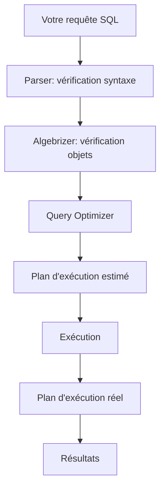

Il existe deux types de plans :

**Plan estimé** : ce que SQL Server PENSE qu'il va faire, basé sur les statistiques
**Plan réel** : ce que SQL Server a VRAIMENT fait pendant l'exécution

La différence entre les deux peut être... instructive. Et par instructive, je veux dire "révélatrice de problèmes catastrophiques".

## Anatomie d'un plan d'exécution

Regardons un plan simple pour comprendre les bases :

```sql
-- Requête simple
SELECT o.OrderId, o.OrderDate, c.CustomerName
FROM Orders o
INNER JOIN Customers c ON o.CustomerId = c.CustomerId
WHERE o.OrderDate >= '2024-01-01';
```

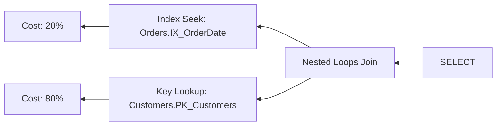

Chaque boîte représente une **opération**. Les flèches montrent le **flux de données**. Les pourcentages indiquent le **coût relatif** de chaque opération.

### Les éléments clés à regarder

**1. Le sens de lecture**

Les plans se lisent de droite à gauche et de haut en bas. Comme un livre en arabe, mais vertical. Les opérations les plus à droite s'exécutent en premier.

**2. L'épaisseur des flèches**

Une flèche fine : peu de lignes transitent
Une flèche épaisse : beaucoup de lignes transitent

Si vous voyez une flèche qui ressemble à un tuyau d'arrosage, c'est suspect.

**3. Les icônes d'avertissement**

Un triangle jaune avec un point d'exclamation : SQL Server essaie de vous dire quelque chose. Écoutez-le.

## Les opérations principales : le bestiaire

### 1. Table Scan : la force brute

```sql
-- Force un Table Scan
SELECT * FROM LargeTable WHERE NonIndexedColumn = 'value';
```

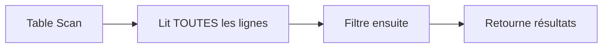

**Ce que ça veut dire** : SQL Server lit toute la table, ligne par ligne, du début à la fin.

**Coût** : Proportionnel à la taille de la table. 1 million de lignes = 1 million de lignes lues.

**Quand c'est OK** :
- Petites tables (< 1000 lignes)
- Vous voulez vraiment toutes les lignes
- La table n'a pas d'index (oups)

**Quand c'est un problème** :
- Grandes tables
- Vous ne voulez que quelques lignes
- Ça arrive sur une requête fréquente

**Comment le réparer** :
```sql
-- Créer un index approprié
CREATE INDEX IX_LargeTable_Column 
ON LargeTable(NonIndexedColumn) 
INCLUDE (OtherColumns);
```

### 2. Index Scan : la version améliorée du scan

```sql
SELECT CustomerId, CustomerName 
FROM Customers 
WHERE City LIKE '%Paris%';
```

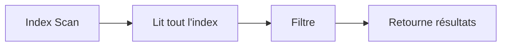

**Ce que ça veut dire** : SQL Server lit tout l'index (pas toute la table, déjà mieux).

**Coût** : Moins que Table Scan, mais pas optimal.

**Pourquoi ça arrive** : 
- L'index existe mais n'est pas "cherchable" (LIKE '%value%')
- Trop de lignes correspondent au filtre
- Les statistiques sont obsolètes

### 3. Index Seek : le Saint Graal

```sql
SELECT CustomerId, CustomerName 
FROM Customers 
WHERE CustomerId = 12345;
```

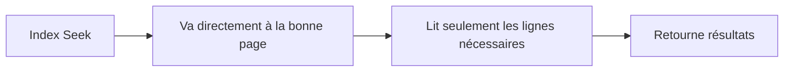

**Ce que ça veut dire** : SQL Server utilise l'index comme un index de livre. Il va directement aux bonnes pages.

**Coût** : Logarithmique. Chercher 1 ligne dans 1 million coûte environ le même prix que chercher dans 100 000.

**C'est ce que vous voulez voir** sur vos colonnes filtrées.

### 4. Key Lookup : le nécessaire coûteux

```sql
-- Index sur CustomerId seulement
SELECT CustomerId, CustomerName, Email, Phone
FROM Customers
WHERE CustomerId = 12345;
```

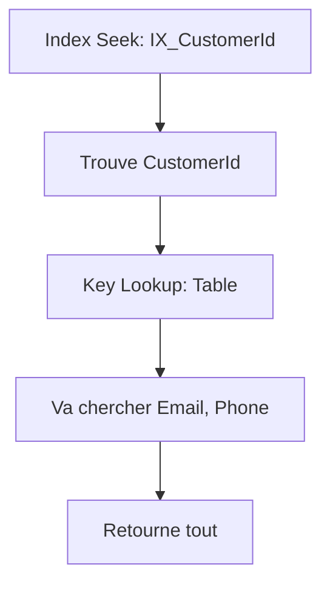

**Ce que ça veut dire** : L'index a trouvé la ligne, mais il manque des colonnes. SQL Server doit retourner à la table pour les chercher.

**Coût** : Un aller-retour supplémentaire par ligne.

**Comment le réparer** :
```sql
-- Ajouter les colonnes manquantes en INCLUDE
CREATE INDEX IX_CustomerId_Includes
ON Customers(CustomerId)
INCLUDE (CustomerName, Email, Phone);
```

### 5. Nested Loops : la boucle imbriquée

```sql
SELECT o.OrderId, c.CustomerName
FROM Orders o
INNER JOIN Customers c ON o.CustomerId = c.CustomerId;
```

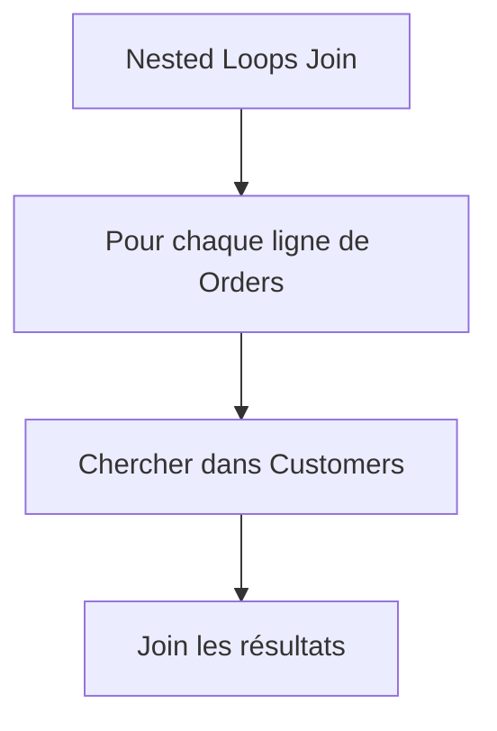

**Ce que ça veut dire** : Pour chaque ligne de la table externe, chercher les lignes correspondantes dans la table interne.

**Coût** : Nombre de lignes externes × coût de recherche interne.

**Quand c'est bon** :
- Peu de lignes externes (< 1000)
- Index Seek sur la table interne
- Petites tables

**Quand c'est mauvais** :
- Beaucoup de lignes externes
- Table Scan sur la table interne
- Vous voyez ce join prendre 80% du coût

### 6. Hash Match : la puissance pour les gros volumes

```sql
SELECT o.OrderId, c.CustomerName
FROM Orders o
INNER JOIN Customers c ON o.CustomerId = c.CustomerId
WHERE o.OrderDate >= '2024-01-01';
-- Beaucoup de lignes des deux côtés
```

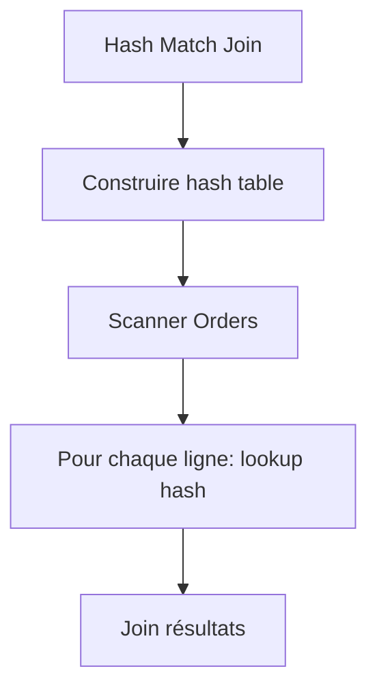

**Ce que ça veut dire** : SQL Server construit une table de hachage en mémoire avec une des tables, puis scanne l'autre.

**Coût** : Linéaire. Bon pour de gros volumes.

**Quand c'est bon** :
- Beaucoup de lignes des deux côtés
- Pas d'index utilisable
- Suffisamment de mémoire

**Warning** : Si vous voyez "spill to tempdb", c'est que la table de hachage était trop grosse pour la mémoire. Problème.

### 7. Merge Join : l'élégant

```sql
-- Les deux tables sont triées sur la colonne de join
SELECT o.OrderId, c.CustomerName
FROM Orders o
INNER JOIN Customers c ON o.CustomerId = c.CustomerId;
```

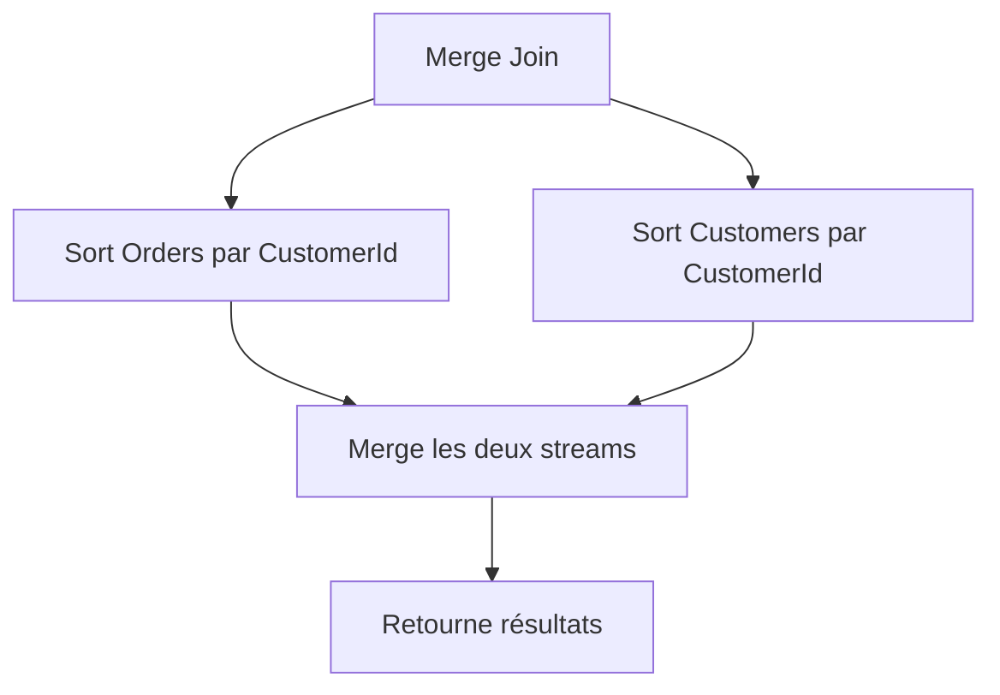

**Ce que ça veut dire** : Si les deux entrées sont triées, SQL Server peut les fusionner comme deux paquets de cartes déjà triées.

**Coût** : Linéaire et efficace.

**Quand c'est bon** :
- Les deux côtés sont déjà triés (indexes clustered)
- Beaucoup de lignes
- Peu de mémoire disponible

## Cas pratique : diagnostiquer une requête lente

Voici une requête qui prend 8 secondes. Pourquoi ?

```sql
-- Requête problématique
SELECT 
    o.OrderId,
    o.OrderDate,
    c.CustomerName,
    c.Email,
    p.ProductName,
    od.Quantity,
    od.UnitPrice
FROM Orders o
INNER JOIN Customers c ON o.CustomerId = c.CustomerId
INNER JOIN OrderDetails od ON o.OrderId = od.OrderId
INNER JOIN Products p ON od.ProductId = p.ProductId
WHERE o.OrderDate >= '2024-01-01'
    AND c.Country = 'France'
    AND p.Category = 'Electronics';
```

Activons le plan d'exécution :
```sql
SET STATISTICS IO ON;
SET STATISTICS TIME ON;

-- Votre requête ici

SET STATISTICS IO OFF;
SET STATISTICS TIME OFF;
```

### Étape 1 : identifier l'opération coûteuse

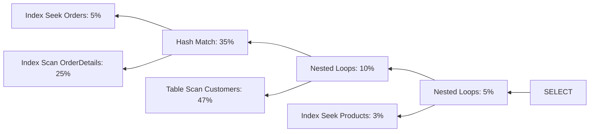

**47% sur Table Scan Customers** : PROBLÈME TROUVÉ.

### Étape 2 : comprendre pourquoi

Regardons les propriétés de l'opération :
- **Estimated rows** : 1000
- **Actual rows** : 850 000

Aïe. L'estimateur s'est trompé. Gravement.

Deux possibilités :
1. Les statistiques sont obsolètes
2. La condition `Country = 'France'` n'a pas d'index

### Étape 3 : vérifier les statistiques

```sql
-- Voir la dernière mise à jour des stats
SELECT 
    OBJECT_NAME(s.object_id) AS TableName,
    s.name AS StatName,
    STATS_DATE(s.object_id, s.stats_id) AS LastUpdated,
    sp.rows,
    sp.modification_counter
FROM sys.stats s
CROSS APPLY sys.dm_db_stats_properties(s.object_id, s.stats_id) sp
WHERE OBJECT_NAME(s.object_id) = 'Customers';
```

Résultat : dernière update en 2022. On est en 2025. Voilà le problème.

```sql
-- Mettre à jour les stats
UPDATE STATISTICS Customers WITH FULLSCAN;
```

### Étape 4 : ajouter l'index manquant

```sql
-- Créer un index sur Country
CREATE INDEX IX_Customers_Country 
ON Customers(Country)
INCLUDE (CustomerId, CustomerName, Email);
```

### Étape 5 : re-tester

Nouveau plan :

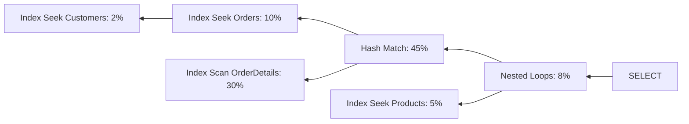

**Table Scan a disparu !** Index Seek sur Customers : 2% du coût.

Temps d'exécution : 0.3 secondes au lieu de 8.

## Les pièges classiques à repérer

### Piège 1 : différence énorme entre estimé et réel

```
Estimated rows: 100
Actual rows: 500 000
```

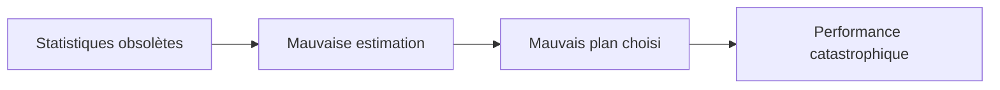

**Solution** : UPDATE STATISTICS ou AUTO_UPDATE_STATISTICS activé.

### Piège 2 : les implicit conversions

```sql
-- CustomerId est INT, mais vous passez VARCHAR
SELECT * FROM Customers WHERE CustomerId = '12345';
```

Plan d'exécution :
```
CONVERT_IMPLICIT(int, [@1], 0) = [Customers].[CustomerId]
```

L'index ne peut pas être utilisé. Table Scan garanti.

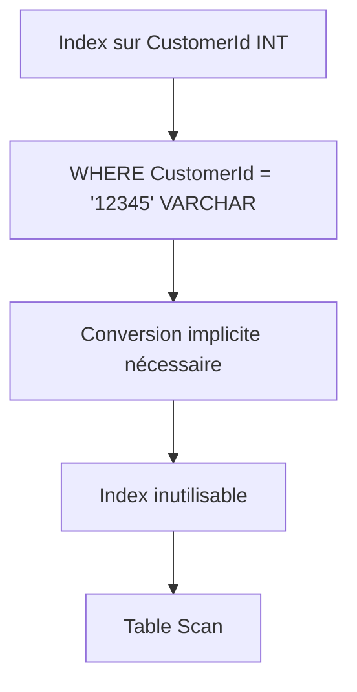

**Solution** : 
```sql
-- Utiliser le bon type
SELECT * FROM Customers WHERE CustomerId = 12345;
```

### Piège 3 : les fonctions sur colonnes indexées

```sql
-- Index sur OrderDate, mais...
SELECT * FROM Orders 
WHERE YEAR(OrderDate) = 2024;
```

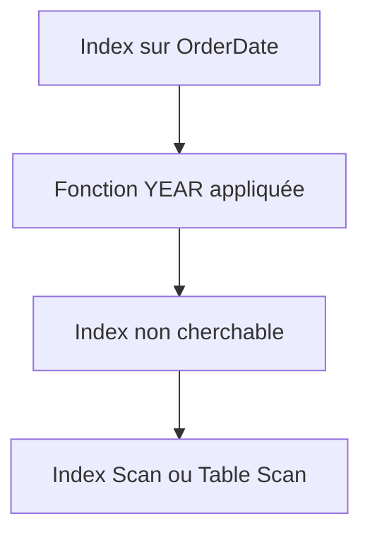

**Solution** :
```sql
-- Réécrire sans fonction
SELECT * FROM Orders 
WHERE OrderDate >= '2024-01-01' 
    AND OrderDate < '2025-01-01';
```

Maintenant c'est un Index Seek. Magie.

### Piège 4 : paramètre sniffing

Vous avez une procédure stockée qui fonctionne bien... sauf quand un client particulier l'utilise.

```sql
CREATE PROCEDURE sp_GetOrders
    @CustomerId INT
AS
BEGIN
    SELECT * FROM Orders WHERE CustomerId = @CustomerId;
END;
```

Le plan est compilé la première fois avec `@CustomerId = 1` (qui a 5 commandes).
Plan choisi : Nested Loops.

Puis quelqu'un appelle avec `@CustomerId = 12345` (qui a 100 000 commandes).
Même plan : Nested Loops. Catastrophe.

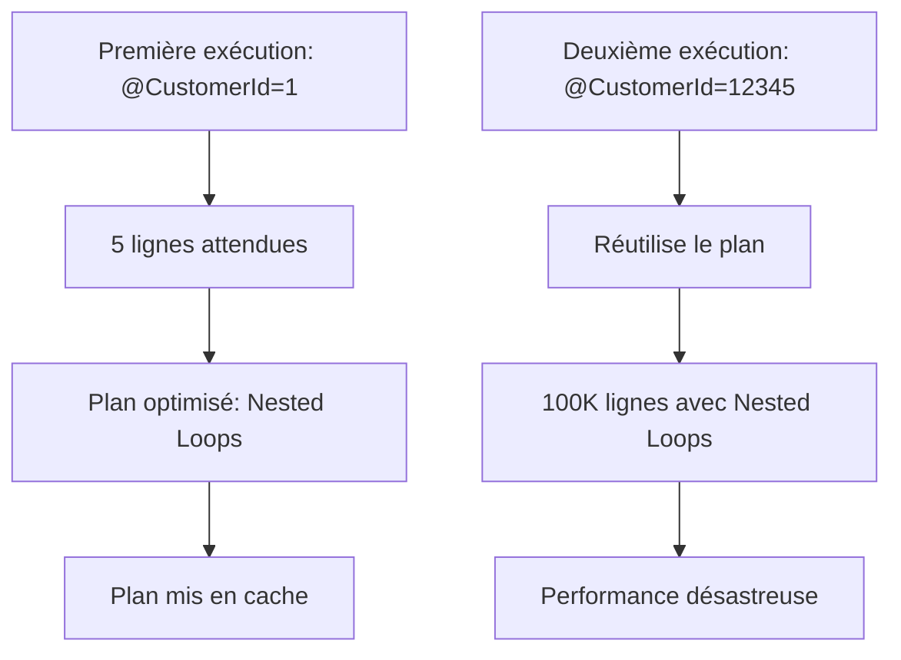

**Solutions** :
```sql
-- Option 1 : RECOMPILE
CREATE PROCEDURE sp_GetOrders
    @CustomerId INT
WITH RECOMPILE
AS
BEGIN
    SELECT * FROM Orders WHERE CustomerId = @CustomerId;
END;

-- Option 2 : OPTIMIZE FOR
CREATE PROCEDURE sp_GetOrders
    @CustomerId INT
AS
BEGIN
    SELECT * FROM Orders 
    WHERE CustomerId = @CustomerId
    OPTION (OPTIMIZE FOR (@CustomerId = 1000));
END;

-- Option 3 : Variable locale
CREATE PROCEDURE sp_GetOrders
    @CustomerId INT
AS
BEGIN
    DECLARE @LocalCustomerId INT = @CustomerId;
    SELECT * FROM Orders WHERE CustomerId = @LocalCustomerId;
END;
```

### Piège 5 : Missing index suggestions

SQL Server vous dit gentiment : "tu sais, si tu créais cet index, ça irait mieux".

```xml
<!-- Dans le plan d'exécution -->
<MissingIndexes>
    <MissingIndex Impact="95.6">
        CREATE INDEX [IX_Missing] ON [Orders] ([CustomerId]) 
        INCLUDE ([OrderDate], [TotalAmount])
    </MissingIndex>
</MissingIndexes>
```

Mais attention : SQL Server ne voit que cette requête. Il ne sait pas que créer 50 index va tuer vos INSERT/UPDATE.

**Règle** : analyser chaque suggestion, ne pas créer aveuglément.

## Les métriques importantes

Au-delà du plan visuel, regardez les statistiques :

```sql
SET STATISTICS IO ON;
-- Votre requête
```

Résultat typique :
```
Table 'Orders'. Scan count 1, logical reads 850, physical reads 0
Table 'Customers'. Scan count 1, logical reads 12543, physical reads 847
```

### Logical reads : lectures en cache
Plus c'est bas, mieux c'est. Cible : < 100 pour requêtes OLTP.

### Physical reads : lectures disque
Devrait être proche de 0 pour requêtes fréquentes (= en cache).

### Scan count : nombre de fois que la table est parcourue
Devrait être 1. Si c'est > 1, problème dans les joins.

## Les warnings à ne jamais ignorer

### Warning : No Join Predicate

```sql
-- Oups, j'ai oublié le ON
SELECT * 
FROM Orders o
CROSS JOIN Customers c;  -- TOUS les Orders avec TOUS les Customers
```

Résultat : produit cartésien. 1000 orders × 10 000 customers = 10 millions de lignes.

### Warning : Type Conversion

```
Type conversion in expression may affect "CardinalityEstimate"
```

Conversion implicite détectée. Index probablement inutilisé.

### Warning : Spill to TempDB

```
Hash Match - Granted Memory: 1024KB, Used Memory: 15360KB
```

Pas assez de mémoire, débordement dans tempdb. Très lent.

**Solution** : augmenter la mémoire allouée ou optimiser la requête.

## Outils pour aller plus loin

### 1. Plan Explorer (SentryOne)

Gratuit et infiniment meilleur que le visualiseur intégré de SSMS.

### 2. SQL Server Profiler / Extended Events

Capturer les requêtes lentes automatiquement :

```sql
-- Créer une session Extended Events pour requêtes > 1 seconde
CREATE EVENT SESSION SlowQueries ON SERVER
ADD EVENT sqlserver.sql_statement_completed(
    WHERE duration > 1000000  -- microsecondes
)
ADD TARGET package0.event_file(SET filename=N'C:\Logs\SlowQueries.xel');

ALTER EVENT SESSION SlowQueries ON SERVER STATE = START;
```

### 3. Query Store

Activé par défaut depuis SQL 2016. Historique des plans et performances.

```sql
-- Voir les requêtes les plus coûteuses
SELECT 
    q.query_id,
    qt.query_sql_text,
    rs.avg_duration / 1000 AS avg_duration_ms,
    rs.avg_logical_io_reads,
    rs.count_executions
FROM sys.query_store_query q
JOIN sys.query_store_query_text qt ON q.query_text_id = qt.query_text_id
JOIN sys.query_store_plan p ON q.query_id = p.query_id
JOIN sys.query_store_runtime_stats rs ON p.plan_id = rs.plan_id
ORDER BY rs.avg_duration DESC;
```

## Le workflow d'optimisation

Quand une requête est lente :

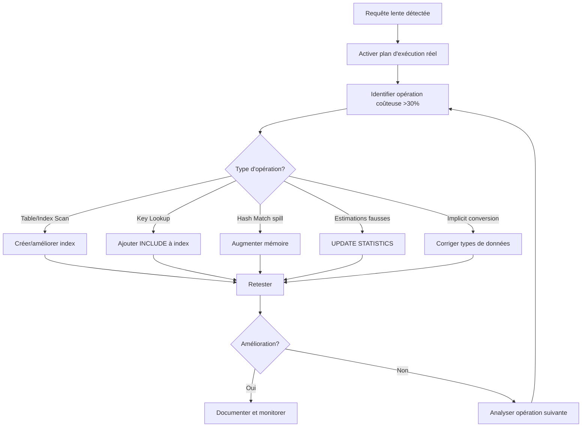

## Ce qu'il faut retenir

Les plans d'exécution ne sont pas là pour faire joli dans SSMS. Ce sont des outils de diagnostic puissants qui vous disent exactement :

1. **Ce que SQL Server fait** avec votre requête
2. **Où il perd du temps**
3. **Comment améliorer** les choses

Trois règles d'or :

**Règle 1** : Chercher le gros pourcentage (> 30% du coût)
**Règle 2** : Comparer estimated vs actual rows
**Règle 3** : Les scans ne sont pas toujours mauvais, mais souvent suspects

Et le plus important : **lire le plan AVANT de créer des index au hasard**.

## Mon checklist personnelle

Quand j'analyse un plan :

- [ ] Identifier l'opération la plus coûteuse
- [ ] Vérifier estimated vs actual rows
- [ ] Chercher les Table Scans sur grandes tables
- [ ] Repérer les Key Lookups en série
- [ ] Vérifier les warnings
- [ ] Analyser les IO statistics
- [ ] Tester avec des statistiques à jour
- [ ] Documenter avant/après

## Conclusion

Les plans d'exécution, c'était mon cauchemar. Aujourd'hui, c'est mon outil préféré. Parce qu'ils ne mentent jamais.

SQL Server vous dit : "Voilà ce que je fais, voilà pourquoi c'est lent, voilà comment améliorer". Si vous ne l'écoutez pas, c'est votre problème, pas le sien.

J'ai passé des années à optimiser des requêtes au feeling : "peut-être qu'un index ici ?" "et si j'essayais un hint là ?". Résultats aléatoires et frustration garantie.

Depuis que je lis systématiquement les plans, mes optimisations fonctionnent. À chaque fois. Parce que je sais exactement ce qui ne va pas.

Alors la prochaine fois qu'une requête est lente, ne devinez pas. Ne googlez pas "comment optimiser SQL Server". Ouvrez le plan d'exécution et laissez SQL Server vous dire ce qui ne va pas.

Il parle, il faut juste apprendre sa langue.

---

*PS : Si votre plan d'exécution ressemble vraiment à l'arbre généalogique des Targaryen, avec 47 opérations et 23 niveaux de profondeur, c'est peut-être le signe que votre requête fait trop de choses. Découpez-la.*

*PPS : Oui, j'ai déjà passé 4 heures à optimiser une requête pour gagner 2ms. Non, ce n'était pas une bonne utilisation de mon temps. Oui, je l'ai quand même fait.*
