# Comment fonctionne réellement le HTTPS (et pourquoi votre banque ne vous volera probablement pas)

## Ou l'histoire de comment j'ai cessé de m'inquiéter et appris à aimer les certificats

Il y a quelques années, un collègue m'a demandé : "Tu peux m'expliquer comment marche HTTPS ? Genre, vraiment ?" J'ai ouvert la bouche, confiant, prêt à expliquer... et je me suis rendu compte que je ne savais pas vraiment. Je connaissais les mots-clés : "certificat", "chiffrement", "sécurisé". Mais le mécanisme exact ? Mystère.

Cette question m'a hantée. Alors j'ai creusé. Et ce que j'ai découvert est à la fois brillant et terrifiant : HTTPS repose sur une série de concepts cryptographiques qui, s'ils échouent, exposent toutes vos données. Mot de passe, numéro de carte bancaire, messages privés : tout.

Aujourd'hui, je vais vous expliquer comment ça marche vraiment. Pas la version marketing "c'est sécurisé, faites-nous confiance", mais la vraie mécanique. Avec les certificats, les clés, les poignées de main, et pourquoi ce petit cadenas vert dans votre navigateur est bien plus complexe qu'il n'y paraît.

## Le problème : Internet est une postcarte

Par défaut, Internet fonctionne en clair. Quand vous envoyez des données, elles transitent par des dizaines de routeurs, FAI, et autres équipements réseau. N'importe qui sur le chemin peut les lire.

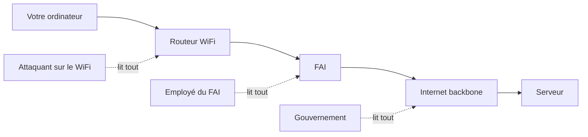

Imaginez envoyer votre mot de passe bancaire sur une carte postale. Tout le monde peut la lire. Le facteur, les voisins, le chien du voisin.

HTTP fonctionne exactement comme ça.

C'est pour ça que HTTPS existe.

## La solution : le chiffrement bout-en-bout

HTTPS = HTTP + TLS (Transport Layer Security, anciennement SSL).

Le principe : chiffrer les données avant de les envoyer, pour que même si quelqu'un les intercepte, il ne puisse rien en faire.

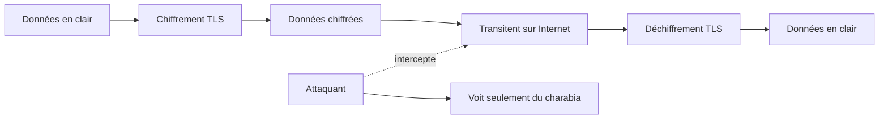

Mais voilà le problème : pour chiffrer, il faut une clé. Et pour déchiffrer, il faut la même clé (chiffrement symétrique) ou une clé liée (chiffrement asymétrique).

Comment partager cette clé de manière sécurisée sur un canal non sécurisé ?

C'est LE problème fondamental de la cryptographie. Et HTTPS le résout élégamment.

## Les deux types de chiffrement

Avant d'aller plus loin, il faut comprendre deux concepts :

### Chiffrement symétrique : une seule clé

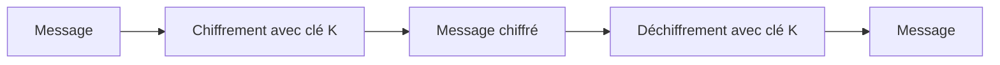

**Avantage** : Rapide. AES-256 peut chiffrer des gigaoctets par seconde.
**Problème** : Comment partager la clé K de manière sécurisée ?

### Chiffrement asymétrique : deux clés liées

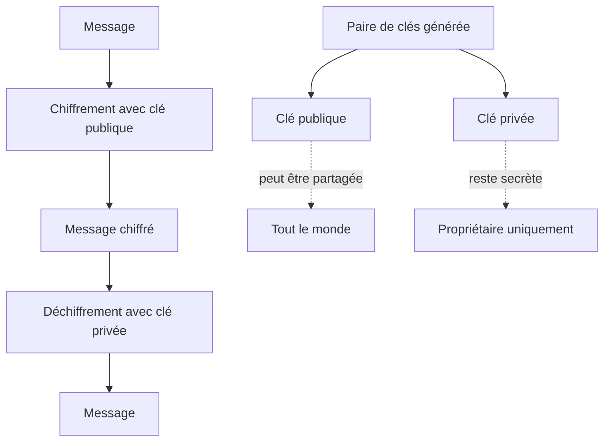

**Clé publique** : tout le monde peut la connaître. Sert à chiffrer.
**Clé privée** : gardée secrète. Seule elle peut déchiffrer ce que la clé publique a chiffré.

**Avantage** : Pas besoin de partager un secret.
**Problème** : Lent. RSA est 100-1000× plus lent qu'AES.

### La solution hybride de TLS

HTTPS utilise les DEUX :

1. **Asymétrique** pour échanger une clé symétrique de manière sécurisée
2. **Symétrique** pour chiffrer les données réelles

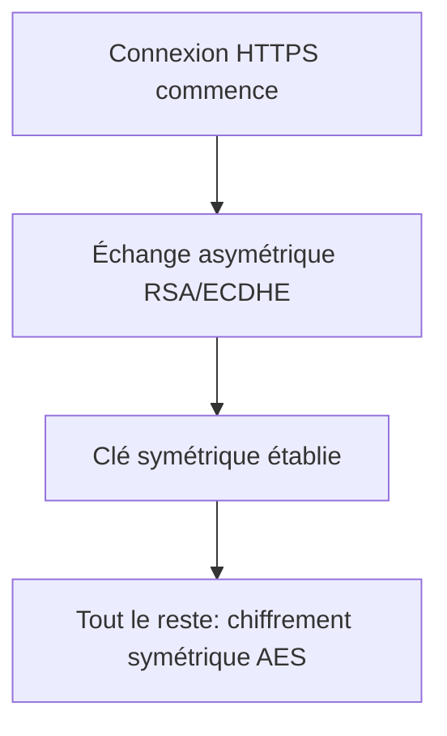

Brillant : on combine la sécurité de l'asymétrique et la vitesse du symétrique.

## Le TLS Handshake : la poignée de main cryptographique

Quand vous tapez `https://exemple.com`, voici ce qui se passe :

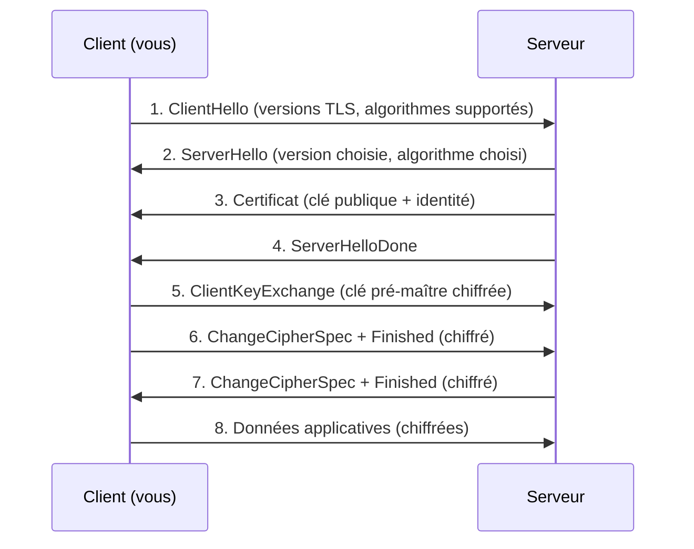

Décortiquons chaque étape :

### Étape 1 : ClientHello

Votre navigateur dit :
```
Salut serveur !
- Je supporte TLS 1.2 et 1.3
- Je connais ces algorithmes de chiffrement : AES-256-GCM, ChaCha20-Poly1305...
- Voici un nombre aléatoire : 8f3a9c2b... (pour éviter les replay attacks)
```

### Étape 2 : ServerHello

Le serveur répond :
```
Ok client !
- On va utiliser TLS 1.3
- On va utiliser AES-256-GCM pour chiffrer
- Voici mon nombre aléatoire : 2c7e4f1a...
```

### Étape 3 : Le certificat - la pièce centrale

Le serveur envoie son **certificat numérique**. C'est comme une carte d'identité électronique qui contient :

```
Certificat pour: exemple.com
Clé publique: MIIBIjANBgkqhkiG9w0BAQEFAAOCAQ8A...
Émis par: Let's Encrypt Authority X3
Valide du: 2024-01-01 au 2025-01-01
Signature numérique: 8a3f2c9e... (signée par l'autorité)
```

#### Pourquoi faire confiance au certificat ?

C'est LE point crucial. N'importe qui peut générer une paire de clés et dire "je suis google.com". Comment savoir que le certificat est légitime ?

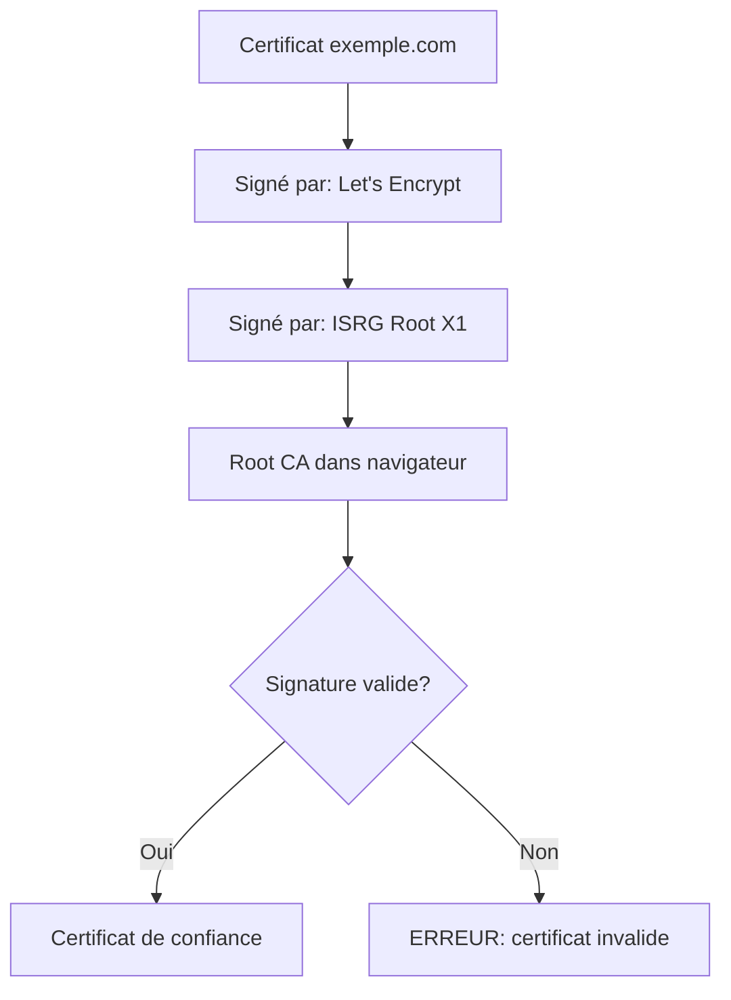

**Les Certificate Authorities (CA)** sont des organisations de confiance (Let's Encrypt, DigiCert, etc.) qui vérifient votre identité avant de signer votre certificat.

Votre navigateur a une liste de **Root CAs** en qui il fait confiance. Si la chaîne de signatures remonte jusqu'à une Root CA connue, le certificat est valide.

C'est comme une chaîne de recommandations :
- "exemple.com est légitime" - signé par Let's Encrypt
- "Let's Encrypt est légitime" - signé par ISRG Root
- "ISRG Root est légitime" - présent dans votre navigateur

### Étapes 4-5 : Échange de clé

Avec TLS 1.2 (RSA) :
```
Client génère une clé symétrique aléatoire
Client la chiffre avec la clé publique du serveur
Client envoie cette clé chiffrée
Serveur la déchiffre avec sa clé privée
→ Les deux ont maintenant la même clé symétrique
```

Avec TLS 1.3 (ECDHE - Elliptic Curve Diffie-Hellman Ephemeral) :
```
Les deux calculent une clé partagée via mathématiques avancées
Impossible de retrouver la clé même en interceptant l'échange
→ Perfect Forward Secrecy
```

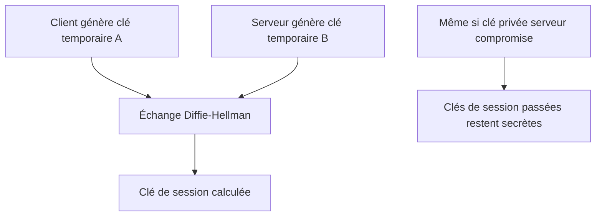

**Perfect Forward Secrecy** : même si un attaquant vole la clé privée du serveur dans 10 ans, il ne pourra pas déchiffrer les communications passées. Chaque session a des clés éphémères uniques.

### Étapes 6-7 : Confirmation

Les deux côtés confirment :
```
"J'ai la clé, je passe en mode chiffré maintenant"
```

Ils envoient un message chiffré avec la nouvelle clé pour vérifier que tout fonctionne.

### Étape 8 : Communication sécurisée

À partir de maintenant, tout est chiffré avec la clé symétrique établie.

```
GET /api/user/profile HTTP/1.1
Cookie: session=abc123
→ Chiffré avec AES-256-GCM
→ Impossible à déchiffrer sans la clé
```

## Voir HTTPS en action

Vous pouvez capturer un handshake TLS avec Wireshark :

```bash
# Installer Wireshark
# Démarrer capture sur interface réseau
# Visiter un site HTTPS dans le navigateur
# Filtrer : tls.handshake
```

Vous verrez exactement les paquets décrits plus haut. C'est fascinant et terrifiant : toute la sécurité d'Internet repose sur cette danse cryptographique.

## Les attaques possibles

### 1. Man-in-the-Middle (MitM)

L'attaquant s'insère entre vous et le serveur :

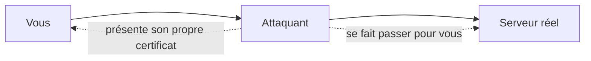

**Protection** : Votre navigateur vérifie que le certificat est signé par une CA de confiance. Si l'attaquant présente son propre certificat, le navigateur affiche un gros avertissement rouge.

Sauf si :
- Vous cliquez sur "Accepter le risque" (ne faites JAMAIS ça)
- L'attaquant a compromis une CA (très très rare, mais ça arrive)
- Votre entreprise a installé sa propre CA pour surveiller le trafic (légal dans certains contextes)

### 2. Certificat expiré

```
Certificat valide jusqu'au: 2024-12-31
Date actuelle: 2025-01-15
→ EXPIRÉ
```

Le navigateur refuse de se connecter. C'est voulu : un certificat expiré pourrait avoir été révoqué pour cause de compromission.

### 3. Downgrade attack

Forcer l'utilisation d'une vieille version vulnérable :

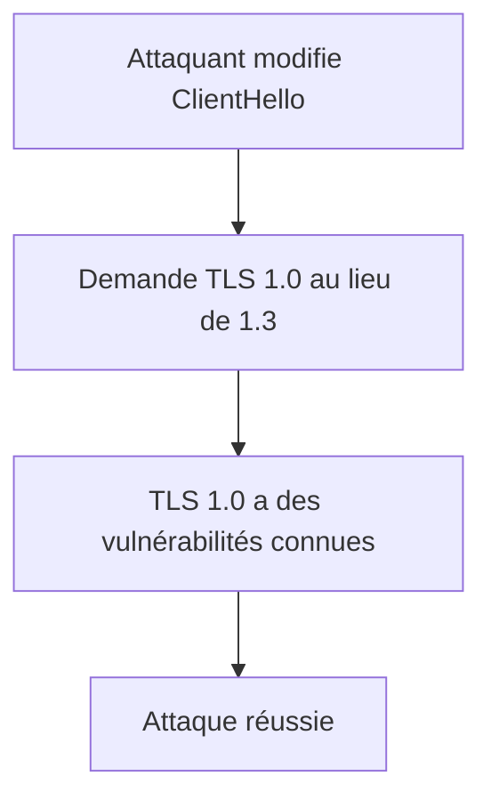

**Protection** : TLS 1.3 inclut une protection contre ça. Les messages incluent un hash de tous les échanges précédents. Toute modification est détectée.

### 4. Certificate pinning bypass

Les apps mobiles peuvent "épingler" un certificat spécifique :

```java
// Android : n'accepter QUE ce certificat
CertificatePinner pinner = new CertificatePinner.Builder()
    .add("exemple.com", "sha256/AAAAAAAAAA...")
    .build();
```

Même si une CA est compromise, l'app refuse tout autre certificat.

## Les erreurs de certificat à comprendre

### "Ce certificat n'est pas de confiance"

```
Le certificat est signé par: UnknownCA
Votre navigateur ne connaît pas cette CA
→ Impossible de vérifier l'identité
```

Causes possibles :
- Certificat auto-signé (test local)
- CA compromise et retirée de la liste
- Attaque MitM

### "Le nom du certificat ne correspond pas"

```
Vous visitez: www.exemple.com
Certificat valide pour: exemple.com
→ Mismatch
```

Pas forcément malveillant (mauvaise config), mais à ne pas ignorer.

### "Ce certificat a été révoqué"

```
Le certificat 8f3a9c2b... est dans la Certificate Revocation List
→ La clé privée a peut-être été compromise
```

Le navigateur refuse catégoriquement la connexion. Bien joué, navigateur.

## Générer son propre certificat (pour dev local)

Pour tester en local avec HTTPS :

```bash
# Générer une clé privée
openssl genrsa -out localhost.key 2048

# Générer un Certificate Signing Request
openssl req -new -key localhost.key -out localhost.csr
# Répondre aux questions (Common Name = localhost)

# Auto-signer le certificat (valide 365 jours)
openssl x509 -req -days 365 -in localhost.csr \
  -signkey localhost.key -out localhost.crt

# Utiliser dans votre serveur web
# Apache : SSLCertificateFile, SSLCertificateKeyFile
# Nginx : ssl_certificate, ssl_certificate_key
# Node.js : https.createServer({ key, cert }, app)
```

Votre navigateur va crier que c'est dangereux (c'est auto-signé), mais pour du dev local, c'est OK.

**En production** : utilisez Let's Encrypt (gratuit) ou un vrai CA.

## Let's Encrypt : démocratiser HTTPS

Avant Let's Encrypt (2015), obtenir un certificat coûtait de l'argent et était pénible.

Let's Encrypt a tout changé :
- Gratuit
- Automatisé
- Renouvelable automatiquement tous les 90 jours

```bash
# Installer certbot
sudo apt install certbot

# Obtenir un certificat pour votre domaine
sudo certbot certonly --standalone -d exemple.com -d www.exemple.com

# Renouveler automatiquement
sudo certbot renew --dry-run
```

Résultat : 90% du web est maintenant en HTTPS. C'était 40% en 2015.

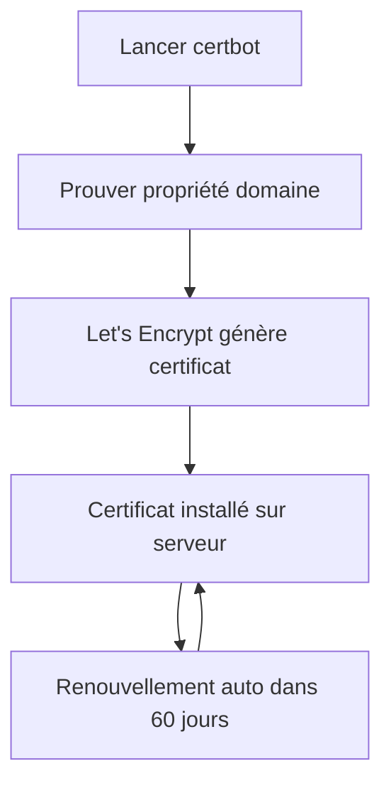

## TLS 1.3 : ce qui a changé

TLS 1.3 (2018) a simplifié et sécurisé le protocole :

**Avant (TLS 1.2)** : 2 round-trips pour le handshake
**Après (TLS 1.3)** : 1 seul round-trip

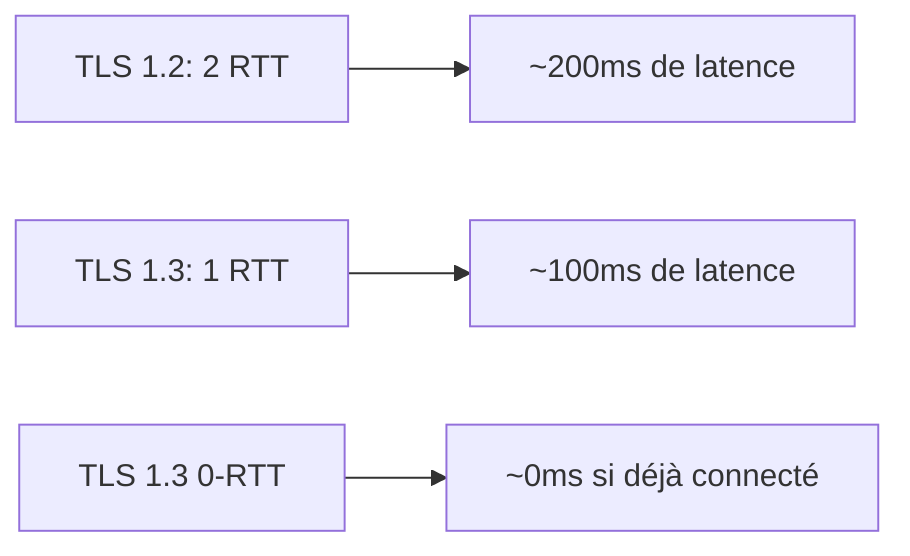

**0-RTT Resumption** : Si vous avez déjà visité le site, les données peuvent être envoyées dès le premier paquet. Encore plus rapide.

**Suppression d'algorithmes faibles** : TLS 1.3 a retiré RSA key exchange, MD5, SHA-1, RC4, et autres crypto obsolètes. Seuls les algorithmes sécurisés restent.

## Ce qu'il faut retenir

HTTPS, c'est complexe. Mais voici l'essentiel :

1. **Chiffrement hybride** : asymétrique pour l'échange, symétrique pour les données
2. **Certificats signés** : la chaîne de confiance remonte aux Root CAs
3. **Perfect Forward Secrecy** : chaque session a des clés uniques
4. **TLS 1.3** : plus rapide, plus sécurisé, moins de choix = moins d'erreurs

### Pourquoi vous DEVEZ utiliser HTTPS

- Google pénalise le HTTP dans les résultats de recherche
- Les navigateurs affichent "Non sécurisé" en rouge
- Les API modernes (Geolocation, Notifications, Service Workers) nécessitent HTTPS
- C'est gratuit (Let's Encrypt)
- Ça protège vraiment vos utilisateurs

### Ce que HTTPS ne fait PAS

- Ne protège pas contre les malwares côté client
- N'empêche pas le phishing (https://gooogle.com peut être malveillant)
- Ne chiffre pas les métadonnées (destination, taille des paquets)
- Ne cache pas votre IP

Pour ça, il faut combiner HTTPS avec :
- VPN (masquer IP et destination)
- DNSSEC (sécuriser DNS)
- HSTS (forcer HTTPS)
- Certificate Transparency (détecter certificats frauduleux)

## La checklist de sécurité HTTPS

Si vous gérez un serveur web :

- [ ] Certificat valide d'une vraie CA (Let's Encrypt ou payant)
- [ ] TLS 1.2 minimum (idéalement TLS 1.3 uniquement)
- [ ] Cipher suites modernes (AES-GCM, ChaCha20)
- [ ] HSTS activé : `Strict-Transport-Security: max-age=31536000`
- [ ] Redirection HTTP → HTTPS automatique
- [ ] Pas de mixed content (ressources HTTP sur page HTTPS)
- [ ] Renouvellement automatique du certificat
- [ ] Tester sur ssllabs.com (viser A+)

## Conclusion

HTTPS n'est pas de la magie. C'est de la cryptographie bien pensée, des protocoles éprouvés, et une infrastructure de confiance.

Quand j'ai commencé à comprendre HTTPS en profondeur, j'ai réalisé deux choses :

1. **C'est brillant** : l'élégance de combiner chiffrement asymétrique et symétrique, la chaîne de confiance des certificats, le Perfect Forward Secrecy... C'est beau.

2. **C'est fragile** : il suffit d'une CA compromise, d'un certificat mal configuré, d'un algorithme faible pour tout casser.

Mais globalement, ça marche. Des milliards de transactions sécurisées par jour. Votre banque, vos emails, vos messages privés : tout passe par là.

Alors oui, votre banque ne vous volera probablement pas. Non pas parce qu'elle est gentille, mais parce que HTTPS rend ça techniquement très difficile.

Et franchement, c'est rassurant.

---

*PS : Si vous voyez HTTPS:// avec une IP (genre https://192.168.1.1), le certificat va crier. Les certificats sont faits pour des noms de domaine, pas des IPs. C'est normal, ne paniquez pas.*

*PPS : J'ai un jour configuré un serveur avec un certificat expiré en production. Les utilisateurs ne pouvaient plus se connecter. J'ai appris ce jour-là l'importance des alertes de renouvellement. Mettez des alertes de renouvellement.*

*PPPS : Le "S" dans HTTPS devrait signifier "Secure", mais je propose "Sanity". Parce que gérer des certificats, c'est épuisant.*
