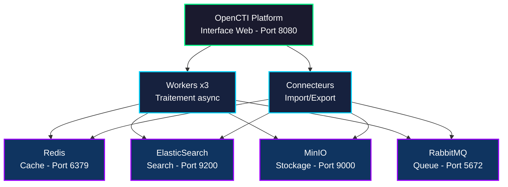

# OpenCTI : ou comment j'ai arrêté de googler "latest APT campaigns" à 2h du matin

## L'histoire de comment j'ai découvert qu'être DBA ne suffisait pas

Laissez-moi vous raconter une histoire. Un vendredi soir (parce que c'est toujours un vendredi soir), je suis en train de nourrir mes chèvres quand je reçois un appel paniqué de mon équipe SOC. Quelqu'un a détecté des IoCs suspects dans nos logs. Des IPs russes. Des hashes de malwares inconnus. Du trafic bizarre vers des domaines fraîchement créés.

"Tely, c'est quoi cette IP ?"
"Aucune idée, laisse-moi googler..."
"Et ce hash ?"
"Attends, je check VirusTotal..."
"Et ce domaine ?"
"Euh... AlienVault peut-être ?"

Trois heures plus tard, j'avais 47 onglets ouverts, une migraine, et toujours aucune vision d'ensemble. C'est là que j'ai réalisé : je faisais du threat intelligence à la main. Comme un animal.

Mes chèvres m'ont regardée avec pitié. Même Ragnar, qui passe son temps à voler la nourriture des autres, semblait penser que ma méthode de travail était inefficace.

C'est comme ça que j'ai découvert **OpenCTI**. Et que ma vie a changé.

## Qu'est-ce qu'OpenCTI (et pourquoi vos chèvres approuveraient)

**OpenCTI** (Open Cyber Threat Intelligence) est une plateforme open-source développée par Filigran (une boîte française, cocorico) qui centralise toute votre threat intelligence au même endroit.

Imaginez : au lieu d'avoir des données de menaces éparpillées entre VirusTotal, AlienVault, MITRE ATT&CK, vos notes Notion, ce fichier Excel que personne ne met à jour, et les 12 channels Slack où quelqu'un a posté "tiens regarde ce truc bizarre", vous avez **tout au même endroit**.

C'est comme transformer vos chèvres chaotiques en troupeau organisé. Sauf que là, on parle de données de cybersécurité.

---

## Pourquoi utiliser OpenCTI (et arrêter de souffrir)

### Parce que vous en avez marre de...

**...googler chaque IP suspecte** : "Tiens, 185.220.101.42, c'est quoi déjà ? Un VPN ? Un exit node Tor ? Une infrastructure APT28 ? Attends je checke 5 sources différentes..."

**...avoir 47 onglets ouverts** : VirusTotal, AlienVault OTX, MITRE ATT&CK, Shodan, GreyNoise, AbuseIPDB, et ce PDF de l'analyse de malware que vous avez téléchargé il y a 3 semaines et que vous ne retrouvez plus.

**...perdre le contexte** : "Attends, cette campagne APT, c'est celle avec les faux docs Word ou celle avec le spearphishing LinkedIn ? Et ils utilisaient quelle technique MITRE déjà ?"

**...expliquer pour la 15ème fois** : "Non, APT29 et Cozy Bear c'est pareil. Oui, ils sont aussi appelés The Dukes. Non, ne confonds pas avec APT28 qui est Fancy Bear..."

### Ce qu'OpenCTI fait pour vous

- **Centralise tout** : MITRE, CVEs, IoCs, rapports d'analyse, relations entre menaces
- **Automatise la collecte** : Les connecteurs vont chercher les données pour vous pendant que vous dormez (ou nourrissez vos chèvres)
- **Corrèle les données** : "Tiens, cette IP a été vue dans 3 campagnes différentes du même groupe APT"
- **Visualise les relations** : Graphes interactifs qui montrent qui attaque qui avec quoi
- **S'intègre avec vos outils** : SIEM, EDR, firewalls - envoyez vos IoCs automatiquement

**Et surtout** : c'est gratuit et open-source. Pas de licence à 50k€/an pour avoir accès aux données que la communauté partage déjà.

---

## L'architecture (ou : pourquoi vous allez avoir besoin de RAM)

OpenCTI, c'est pas un petit service qui tourne gentiment dans un coin. C'est une armée de conteneurs Docker qui travaillent ensemble. Pensez à mes chèvres : chacune a son rôle, et elles communiquent entre elles (souvent en bêlant, mais c'est une autre histoire).

Voici la stack complète :



### Rôle de chaque composant

| Composant | Rôle | Port |
|-----------|------|------|
| **OpenCTI Platform** | Interface utilisateur et API GraphQL | 8080 |
| **Workers** | Traitement asynchrone des tâches (import, enrichissement) | - |
| **Connecteurs** | Import/export de données depuis sources externes | - |
| **Redis** | Cache en mémoire pour les performances | 6379 |
| **ElasticSearch** | Moteur de recherche et indexation | 9200 |
| **MinIO** | Stockage S3-compatible pour fichiers | 9000 |
| **RabbitMQ** | File de messages pour orchestration | 5672 |

---

## Ce dont vous avez besoin (spoiler: plus que votre Raspberry Pi)

### La vraie config matérielle

| Composant | Si vous testez | Si c'est sérieux | Si vous êtes un château fort |
|-----------|----------------|------------------|------------------------------|
| **CPU** | 4 cores | 8 cores | 16+ cores |
| **RAM** | 8 GB (ça va ramer) | 16 GB (confortable) | 32+ GB (le luxe) |
| **Disque** | 50 GB (pour commencer) | 100 GB (raisonnable) | 500+ GB SSD (vous collectez TOUTES les CVEs depuis 1999) |

**Ma config perso** : 16 GB de RAM, 8 cores, 200 GB de SSD. Ça tourne bien pour un lab/usage perso. ElasticSearch est un goinfre de mémoire, préparez-vous psychologiquement.

### OS : Linux uniquement (déso Windows)

- **Ubuntu 22.04 ou 24.04 LTS** : Le choix sûr, tout marche out of the box
- **Debian 11/12** : Si vous aimez la stabilité (et l'ennui)
- **Rocky Linux / AlmaLinux** : Si vous êtes nostalgique de CentOS

Windows avec WSL2 ? Techniquement possible. Recommandé ? Non. C'est comme essayer de faire garder mes chèvres par un chat : ça peut marcher, mais c'est pas l'idéal.

### Les outils requis

- **Docker** + **Docker Compose** : L'orchestrateur de tout ce bazar
- **Git** : Pour cloner des configs
- **Sudo access** : Parce qu'on va toucher à des trucs sensibles
- **Patience** : Le premier démarrage prend 5-10 minutes. Allez vous faire un café.

---

## Installation : le moment où vous regrettez de ne pas avoir pris plus de RAM

### Étape 1 : Préparer le serveur (et votre mental)

SSH dans votre serveur et commençons par les bases :

```bash
# Mise à jour du système
sudo apt update && sudo apt upgrade -y

# Installation des dépendances
sudo apt install -y curl wget git nano ufw fail2ban

# Configuration du firewall (si vous utilisez UFW)
sudo ufw allow 22/tcp      # SSH
sudo ufw allow 8080/tcp    # OpenCTI (ou 80/443 si reverse proxy)
sudo ufw enable
```

### Étape 2 : Installer Docker (parce qu'on va en avoir besoin)

Docker, c'est le truc qui va orchestrer toute cette stack. Si vous l'avez déjà, passez à l'étape suivante. Sinon, accrochez-vous :

```bash
# Supprimer les anciennes versions
sudo apt remove docker docker-engine docker.io containerd runc

# Ajouter le dépôt officiel Docker
curl -fsSL https://download.docker.com/linux/ubuntu/gpg | sudo gpg --dearmor -o /usr/share/keyrings/docker-archive-keyring.gpg

echo "deb [arch=$(dpkg --print-architecture) signed-by=/usr/share/keyrings/docker-archive-keyring.gpg] https://download.docker.com/linux/ubuntu $(lsb_release -cs) stable" | sudo tee /etc/apt/sources.list.d/docker.list > /dev/null

# Installation de Docker
sudo apt update
sudo apt install -y docker-ce docker-ce-cli containerd.io docker-compose-plugin

# Ajouter votre utilisateur au groupe docker (pour éviter sudo)
sudo usermod -aG docker $USER

# Démarrer Docker au boot
sudo systemctl enable docker
sudo systemctl start docker

# Vérifier l'installation
docker --version
docker compose version
```

**Important :** Déconnectez-vous et reconnectez-vous pour que l'ajout au groupe docker soit pris en compte, ou faites :

```bash
newgrp docker
```

Si vous oubliez cette étape, vous allez passer 20 minutes à vous demander pourquoi Docker vous répond "permission denied". J'ai appris ça à mes dépens. Ragnar m'a regardée galérer pendant 20 minutes avant que je comprenne. Elle avait raison d'avoir l'air blasée.

### Étape 3 : ElasticSearch et ses exigences de diva

ElasticSearch, c'est le composant qui va indexer toutes vos données. C'est aussi celui qui va bouffer le plus de RAM. Et il a des exigences spécifiques :

```bash
# Augmenter vm.max_map_count (requis pour ElasticSearch)
sudo sysctl -w vm.max_map_count=262144

# Rendre le changement permanent
echo "vm.max_map_count=262144" | sudo tee -a /etc/sysctl.conf
```

### Étape 4 : Création de la structure de dossiers

```bash
# Créer le répertoire d'installation
sudo mkdir -p /opt/opencti
sudo chown $USER:$USER /opt/opencti
cd /opt/opencti
```

### Étape 5 : Téléchargement de la configuration

Créez le fichier `docker-compose.yml` :

```bash
nano docker-compose.yml
```

Copiez la configuration suivante (version simplifiée pour démarrer) :

```yaml
services:
  redis:
    image: redis:8.2.2
    container_name: opencti-redis
    restart: always
    volumes:
      - redis-data:/data
    networks:
      - opencti-network

  elasticsearch:
    image: docker.elastic.co/elasticsearch/elasticsearch:8.11.1
    container_name: opencti-elasticsearch
    restart: always
    volumes:
      - elasticsearch-data:/usr/share/elasticsearch/data
    environment:
      - discovery.type=single-node
      - xpack.ml.enabled=false
      - xpack.security.enabled=false
      - "ES_JAVA_OPTS=-Xms4G -Xmx4G"
    networks:
      - opencti-network
    ulimits:
      memlock:
        soft: -1
        hard: -1
      nofile:
        soft: 65536
        hard: 65536

  minio:
    image: minio/minio:latest
    container_name: opencti-minio
    restart: always
    command: server /data --console-address ":9001"
    environment:
      MINIO_ROOT_USER: ${MINIO_ROOT_USER}
      MINIO_ROOT_PASSWORD: ${MINIO_ROOT_PASSWORD}
    volumes:
      - minio-data:/data
    networks:
      - opencti-network
    ports:
      - "9001:9001"

  rabbitmq:
    image: rabbitmq:3.13-management-alpine
    container_name: opencti-rabbitmq
    restart: always
    environment:
      - RABBITMQ_DEFAULT_USER=${RABBITMQ_DEFAULT_USER}
      - RABBITMQ_DEFAULT_PASS=${RABBITMQ_DEFAULT_PASS}
    volumes:
      - rabbitmq-data:/var/lib/rabbitmq
    networks:
      - opencti-network
    ports:
      - "15672:15672"

  opencti:
    image: opencti/platform:6.8.10
    container_name: opencti-platform
    restart: always
    environment:
      - NODE_OPTIONS=--max-old-space-size=8096
      - APP__PORT=8080
      - APP__BASE_URL=${OPENCTI_BASE_URL}
      - APP__ADMIN__EMAIL=${OPENCTI_ADMIN_EMAIL}
      - APP__ADMIN__PASSWORD=${OPENCTI_ADMIN_PASSWORD}
      - APP__ADMIN__TOKEN=${OPENCTI_ADMIN_TOKEN}
      - REDIS__HOSTNAME=redis
      - REDIS__PORT=6379
      - ELASTICSEARCH__URL=http://elasticsearch:9200
      - MINIO__ENDPOINT=minio
      - MINIO__PORT=9000
      - MINIO__USE_SSL=false
      - MINIO__ACCESS_KEY=${MINIO_ROOT_USER}
      - MINIO__SECRET_KEY=${MINIO_ROOT_PASSWORD}
      - RABBITMQ__HOSTNAME=rabbitmq
      - RABBITMQ__PORT=5672
      - RABBITMQ__USERNAME=${RABBITMQ_DEFAULT_USER}
      - RABBITMQ__PASSWORD=${RABBITMQ_DEFAULT_PASS}
    ports:
      - "8080:8080"
    depends_on:
      - redis
      - elasticsearch
      - minio
      - rabbitmq
    networks:
      - opencti-network

  worker-1:
    image: opencti/worker:6.8.10
    container_name: opencti-worker-1
    restart: always
    environment:
      - OPENCTI_URL=http://opencti:8080
      - OPENCTI_TOKEN=${OPENCTI_ADMIN_TOKEN}
    depends_on:
      - opencti
    networks:
      - opencti-network

networks:
  opencti-network:
    driver: bridge

volumes:
  redis-data:
  elasticsearch-data:
  minio-data:
  rabbitmq-data:
```

### Étape 6 : Configuration des variables d'environnement

Créez le fichier `.env` qui contient toutes les configurations sensibles :

```bash
nano .env
```

Ajoutez le contenu suivant (en personnalisant les valeurs) :

```bash
# ============================================
# CONFIGURATION OPENCTI 6.8.10
# ============================================

# Credentials OpenCTI
OPENCTI_ADMIN_EMAIL=votre.email@exemple.com
OPENCTI_ADMIN_PASSWORD=VotreMotDePasseSecurise123!
OPENCTI_ADMIN_TOKEN=$(uuidgen)  # Générez un UUID unique
OPENCTI_BASE_URL=http://votre-ip-serveur:8080
OPENCTI_HEALTHCHECK_ACCESS_KEY=SecureHealthCheckKey2025!

# MinIO (Stockage S3)
MINIO_ROOT_USER=opencti
MINIO_ROOT_PASSWORD=$(openssl rand -base64 32)

# RabbitMQ
RABBITMQ_DEFAULT_USER=opencti
RABBITMQ_DEFAULT_PASS=$(openssl rand -base64 32)
```

**Astuce :** Pour générer automatiquement des mots de passe sécurisés :

```bash
# Générer un UUID pour le token admin
uuidgen

# Générer un mot de passe aléatoire
openssl rand -base64 32
```

### Étape 7 : Premier démarrage

Lancez OpenCTI pour la première fois :

```bash
# Lancer tous les services
docker compose up -d

# Vérifier que tous les conteneurs démarrent
docker compose ps

# Suivre les logs en temps réel
docker compose logs -f opencti
```

Le premier démarrage prend **5 à 10 minutes**. OpenCTI doit :
1. Initialiser la base de données ElasticSearch
2. Créer les index
3. Importer les données de base
4. Créer le compte administrateur

Vous verrez des logs similaires à :

```
opencti-platform | {"level":"info","message":"Platform initialization"}
opencti-platform | {"level":"info","message":"Creating default admin user"}
opencti-platform | {"level":"info","message":"Platform started"}
```

### Étape 8 : Accéder à l'interface web

Une fois tous les services démarrés (vérifiez avec `docker compose ps`), ouvrez votre navigateur :

```
http://votre-ip-serveur:8080
```

Connectez-vous avec :
- **Email :** Celui configuré dans `OPENCTI_ADMIN_EMAIL`
- **Mot de passe :** Celui configuré dans `OPENCTI_ADMIN_PASSWORD`

**Félicitations !** OpenCTI est installé et fonctionnel.

---

## Configuration des connecteurs

Les connecteurs sont des modules qui importent automatiquement des données de threat intelligence depuis des sources externes. Voici comment les configurer.

### Connecteurs gratuits (sans clé API)

Ces connecteurs fonctionnent immédiatement sans configuration supplémentaire :

#### 1. MITRE ATT&CK Enterprise

Importe les techniques, tactiques, et groupes APT du framework MITRE.

Ajoutez au `docker-compose.yml` :

```yaml
  connector-mitre-enterprise:
    image: opencti/connector-mitre:6.8.10
    container_name: opencti-connector-mitre-enterprise
    restart: always
    environment:
      - OPENCTI_URL=http://opencti:8080
      - OPENCTI_TOKEN=${OPENCTI_ADMIN_TOKEN}
      - CONNECTOR_ID=mitre-enterprise-$(uuidgen)
      - CONNECTOR_TYPE=EXTERNAL_IMPORT
      - CONNECTOR_NAME=MITRE ATT&CK Enterprise
      - CONNECTOR_SCOPE=marking-definition,identity,attack-pattern,course-of-action,intrusion-set,campaign,malware,tool,report
      - CONNECTOR_CONFIDENCE_LEVEL=100
      - CONNECTOR_UPDATE_EXISTING_DATA=true
      - CONNECTOR_LOG_LEVEL=info
      - MITRE_ENTERPRISE_FILE_URL=https://raw.githubusercontent.com/mitre-attack/attack-stix-data/master/enterprise-attack/enterprise-attack.json
      - MITRE_INTERVAL=7  # Mise à jour tous les 7 jours
    depends_on:
      - opencti
    networks:
      - opencti-network
```

#### 2. OpenCTI Datasets

Importe les données de référence (secteurs d'activité, géographie, entreprises).

```yaml
  connector-opencti-datasets:
    image: opencti/connector-opencti:6.8.10
    container_name: opencti-connector-datasets
    restart: always
    environment:
      - OPENCTI_URL=http://opencti:8080
      - OPENCTI_TOKEN=${OPENCTI_ADMIN_TOKEN}
      - CONNECTOR_ID=opencti-datasets-$(uuidgen)
      - CONNECTOR_TYPE=EXTERNAL_IMPORT
      - CONNECTOR_NAME=OpenCTI Datasets
      - CONNECTOR_SCOPE=marking-definition,identity,location
      - CONNECTOR_CONFIDENCE_LEVEL=100
      - CONNECTOR_UPDATE_EXISTING_DATA=true
      - CONNECTOR_LOG_LEVEL=info
      - CONFIG_SECTORS_FILE_URL=https://raw.githubusercontent.com/OpenCTI-Platform/datasets/master/data/sectors.json
      - CONFIG_GEOGRAPHY_FILE_URL=https://raw.githubusercontent.com/OpenCTI-Platform/datasets/master/data/geography.json
      - CONFIG_INTERVAL=7
    depends_on:
      - opencti
    networks:
      - opencti-network
```

#### 3. URLhaus (Abuse.ch)

Importe les URLs malveillantes détectées quotidiennement.

```yaml
  connector-urlhaus:
    image: opencti/connector-urlhaus:6.8.10
    container_name: opencti-connector-urlhaus
    restart: always
    environment:
      - OPENCTI_URL=http://opencti:8080
      - OPENCTI_TOKEN=${OPENCTI_ADMIN_TOKEN}
      - CONNECTOR_ID=urlhaus-$(uuidgen)
      - CONNECTOR_TYPE=EXTERNAL_IMPORT
      - CONNECTOR_NAME=URLhaus
      - CONNECTOR_SCOPE=urlhaus
      - CONNECTOR_CONFIDENCE_LEVEL=40
      - CONNECTOR_UPDATE_EXISTING_DATA=false
      - CONNECTOR_LOG_LEVEL=info
      - URLHAUS_CSV_URL=https://urlhaus.abuse.ch/downloads/csv_recent/
      - URLHAUS_IMPORT_OFFLINE=true
      - URLHAUS_CREATE_INDICATORS=true
      - URLHAUS_INTERVAL=3
    depends_on:
      - opencti
    networks:
      - opencti-network
```

### Connecteurs nécessitant une clé API gratuite

#### 4. AlienVault OTX - Indicateurs de Compromission

**Gratuit :** Oui, avec inscription
**Quota :** 10,000 requêtes/heure

**Comment obtenir votre clé API :**

1. Créez un compte sur https://otx.alienvault.com/
2. Confirmez votre email
3. Une fois connecté, allez dans **Settings** (icône engrenage en haut à droite)
4. Cliquez sur **API Integration** dans le menu
5. Copiez votre **OTX Key**

**Configuration :**

Ajoutez dans votre `.env` :

```bash
ALIENVAULT_API_KEY=votre_clé_api_ici
```

Ajoutez dans `docker-compose.yml` :

```yaml
  connector-alienvault:
    image: opencti/connector-alienvault:6.8.10
    container_name: opencti-connector-alienvault
    restart: always
    environment:
      - OPENCTI_URL=http://opencti:8080
      - OPENCTI_TOKEN=${OPENCTI_ADMIN_TOKEN}
      - CONNECTOR_ID=alienvault-otx-$(uuidgen)
      - CONNECTOR_TYPE=EXTERNAL_IMPORT
      - CONNECTOR_NAME=AlienVault OTX
      - CONNECTOR_SCOPE=alienvault
      - CONNECTOR_CONFIDENCE_LEVEL=60
      - CONNECTOR_UPDATE_EXISTING_DATA=false
      - CONNECTOR_LOG_LEVEL=info
      - ALIENVAULT_BASE_URL=https://otx.alienvault.com
      - ALIENVAULT_API_KEY=${ALIENVAULT_API_KEY}
      - ALIENVAULT_TLP=White
      - ALIENVAULT_CREATE_OBSERVABLES=true
      - ALIENVAULT_CREATE_INDICATORS=true
      - ALIENVAULT_PULSE_START_TIMESTAMP=2025-01-01T00:00:00
      - ALIENVAULT_INTERVAL=10
    depends_on:
      - opencti
    networks:
      - opencti-network
```

#### 5. VirusTotal - Enrichissement de fichiers et IPs

**Gratuit :** Oui, avec inscription (500 requêtes/jour)
**Payant :** API Premium pour plus de requêtes

**Comment obtenir votre clé API :**

1. Créez un compte sur https://www.virustotal.com/
2. Connectez-vous
3. Cliquez sur votre avatar en haut à droite → **API Key**
4. Copiez votre **API Key**

**Configuration :**

Ajoutez dans votre `.env` :

```bash
VIRUSTOTAL_API_KEY=votre_clé_api_virustotal
```

Ajoutez dans `docker-compose.yml` :

```yaml
  connector-virustotal:
    image: opencti/connector-virustotal:6.8.10
    container_name: opencti-connector-virustotal
    restart: always
    environment:
      - OPENCTI_URL=http://opencti:8080
      - OPENCTI_TOKEN=${OPENCTI_ADMIN_TOKEN}
      - CONNECTOR_ID=virustotal-$(uuidgen)
      - CONNECTOR_TYPE=INTERNAL_ENRICHMENT
      - CONNECTOR_NAME=VirusTotal
      - CONNECTOR_SCOPE=StixFile,Artifact,IPv4-Addr,Domain-Name,Url
      - CONNECTOR_AUTO=true  # Enrichissement automatique
      - CONNECTOR_CONFIDENCE_LEVEL=50
      - CONNECTOR_LOG_LEVEL=info
      - VIRUSTOTAL_TOKEN=${VIRUSTOTAL_API_KEY}
      - VIRUSTOTAL_MAX_TLP=TLP:AMBER
      - VIRUSTOTAL_REPLACE_WITH_LOWER_SCORE=false
      - VIRUSTOTAL_FILE_CREATE_NOTE_FULL_REPORT=true
    depends_on:
      - opencti
    networks:
      - opencti-network
```

#### 6. IPInfo - Géolocalisation IP

**Gratuit :** 50,000 requêtes/mois
**Inscription :** https://ipinfo.io/signup

**Comment obtenir votre clé API :**

1. Créez un compte sur https://ipinfo.io/signup
2. Connectez-vous
3. Allez sur https://ipinfo.io/account/token
4. Copiez votre **Access Token**

**Configuration :**

Ajoutez dans votre `.env` :

```bash
IPINFO_TOKEN=votre_token_ipinfo
```

Ajoutez dans `docker-compose.yml` :

```yaml
  connector-ipinfo:
    image: opencti/connector-ipinfo:6.8.10
    container_name: opencti-connector-ipinfo
    restart: always
    environment:
      - OPENCTI_URL=http://opencti:8080
      - OPENCTI_TOKEN=${OPENCTI_ADMIN_TOKEN}
      - CONNECTOR_ID=ipinfo-$(uuidgen)
      - CONNECTOR_TYPE=INTERNAL_ENRICHMENT
      - CONNECTOR_NAME=IPInfo
      - CONNECTOR_SCOPE=IPv4-Addr
      - CONNECTOR_AUTO=true
      - CONNECTOR_CONFIDENCE_LEVEL=75
      - CONNECTOR_LOG_LEVEL=info
      - IPINFO_TOKEN=${IPINFO_TOKEN}
      - IPINFO_MAX_TLP=TLP:AMBER
    depends_on:
      - opencti
    networks:
      - opencti-network
```

#### 7. CVE (National Vulnerability Database)

**Gratuit :** Oui, mais API key recommandée (sinon limité à 5 requêtes/30s)
**Avec API key :** 50 requêtes/30s

**Comment obtenir votre clé API :**

1. Allez sur https://nvd.nist.gov/developers/request-an-api-key
2. Remplissez le formulaire avec votre email
3. Vérifiez votre boîte email
4. Cliquez sur le lien de confirmation
5. Copiez votre **API Key**

**Configuration :**

Ajoutez dans votre `.env` :

```bash
NVD_API_KEY=votre_clé_api_nvd
```

Ajoutez dans `docker-compose.yml` :

```yaml
  connector-cve:
    image: opencti/connector-cve:6.8.10
    container_name: opencti-connector-cve
    restart: always
    environment:
      - OPENCTI_URL=http://opencti:8080
      - OPENCTI_TOKEN=${OPENCTI_ADMIN_TOKEN}
      - CONNECTOR_ID=cve-connector-$(uuidgen)
      - CONNECTOR_TYPE=EXTERNAL_IMPORT
      - CONNECTOR_NAME=CVE
      - CONNECTOR_SCOPE=vulnerability
      - CONNECTOR_CONFIDENCE_LEVEL=75
      - CONNECTOR_UPDATE_EXISTING_DATA=true
      - CONNECTOR_LOG_LEVEL=info
      - CVE_API_KEY=${NVD_API_KEY}
      - CVE_IMPORT_HISTORY=true
      - CVE_INTERVAL=2
      - CVE_HISTORY_START_YEAR=2020
    depends_on:
      - opencti
    networks:
      - opencti-network
```

---

## Obtenir vos clés API gratuites

Voici un récapitulatif des clés API gratuites que vous pouvez obtenir pour enrichir OpenCTI :

### Tableau récapitulatif des clés API

| Service | Gratuit | Quota gratuit | URL d'inscription | Temps d'obtention |
|---------|---------|---------------|-------------------|-------------------|
| **AlienVault OTX** | Oui | 10k req/h | https://otx.alienvault.com/ | 2 min |
| **VirusTotal** | Oui | 500 req/jour | https://www.virustotal.com/ | 2 min |
| **IPInfo** | Oui | 50k req/mois | https://ipinfo.io/signup | 2 min |
| **NVD (CVE)** | Oui | 50 req/30s | https://nvd.nist.gov/developers/request-an-api-key | 5 min |
| **URLScan.io** | Oui | Limité | https://urlscan.io/user/signup | 2 min |
| **CrowdSec CTI** | Oui | Illimité | https://app.crowdsec.net/signup | 5 min |
| **AbuseIPDB** | Oui | 1k req/jour | https://www.abuseipdb.com/api | 2 min |
| **GreyNoise** | Oui Community | Limité | https://www.greynoise.io/viz/signup | 2 min |
| **Shodan** | Oui | Basique | https://account.shodan.io/register | 2 min |

### Guide pas-à-pas : AlienVault OTX (exemple détaillé)

1. **Inscription**
   - Allez sur https://otx.alienvault.com/
   - Cliquez sur **Sign Up** (en haut à droite)
   - Remplissez le formulaire :
     - Username
     - Email
     - Password
   - Cochez **I agree to the Terms of Service**
   - Cliquez sur **Create Account**

2. **Confirmation email**
   - Vérifiez votre boîte email
   - Cliquez sur le lien de confirmation

3. **Obtention de la clé API**
   - Connectez-vous sur https://otx.alienvault.com/
   - Cliquez sur l'icône **engrenage** (Settings) en haut à droite
   - Dans le menu de gauche, cliquez sur **API Integration**
   - Copiez votre **OTX Key**

4. **Configuration dans OpenCTI**
   ```bash
   nano /opt/opencti/.env
   # Ajoutez la ligne :
   ALIENVAULT_API_KEY=votre_clé_copiée_ici
   ```

5. **Redémarrage du connecteur**
   ```bash
   docker compose restart connector-alienvault
   ```

6. **Vérification**
   ```bash
   # Voir les logs du connecteur
   docker compose logs -f connector-alienvault

   # Vous devriez voir :
   # {"level":"info","message":"Starting AlienVault OTX connector"}
   # {"level":"info","message":"Fetching pulses from AlienVault OTX"}
   ```

---

## Premiers pas dans OpenCTI

### 1. Premier login et configuration initiale

Après vous être connecté pour la première fois :

1. **Changez votre mot de passe**
   - Cliquez sur votre avatar en haut à droite
   - **Profile** → **Password** → Changez le mot de passe

2. **Configurez votre profil**
   - Ajoutez une photo de profil
   - Configurez votre fuseau horaire
   - Sélectionnez votre langue (français disponible !)

3. **Explorez le dashboard**
   - **Dashboard** : Vue d'ensemble de vos données
   - **Analyses** : Rapports et campagnes
   - **Observations** : IoCs (IPs, domaines, hashes)
   - **Menaces** : Threat actors, malwares, campagnes
   - **Arsenal** : Outils et techniques d'attaque
   - **Entités** : Secteurs, organisations, localisations


### 2. Vérifier que les connecteurs fonctionnent

1. Allez dans **Data** → **Connectors** (dans le menu)
2. Vous devriez voir vos connecteurs avec un statut :
   - **Vert** : Connecteur actif et fonctionnel
   - **Rouge** : Connecteur en erreur

3. Cliquez sur un connecteur pour voir :
   - Dernière synchronisation
   - Nombre d'entités importées
   - Logs d'activité


### 3. Explorer les données MITRE ATT&CK

1. Allez dans **Arsenal** → **Techniques**
2. Vous verrez toutes les techniques MITRE ATT&CK importées
3. Cliquez sur une technique (ex : **T1566.001 - Spearphishing Attachment**)
4. Explorez :
   - Description détaillée
   - Procédures d'utilisation
   - Mitigations
   - Détections
   - Groupes APT utilisant cette technique


### 4. Créer votre premier indicateur de compromission (IoC)

1. Allez dans **Observations** → **Indicators**
2. Cliquez sur **+** (en bas à droite)
3. Choisissez le type : **IPv4 Address**
4. Remplissez :
   - **Value** : `192.0.2.1` (exemple)
   - **Valid from** : Date du jour
   - **Confidence** : High
   - **Description** : "IP de serveur C2 APT28"
5. Cliquez sur **Create**

### 5. Enrichir automatiquement avec VirusTotal

Si vous avez configuré le connecteur VirusTotal :

1. Créez un indicateur **Domain** : `malicious-domain.com`
2. OpenCTI va automatiquement enrichir le domaine via VirusTotal
3. Vous verrez apparaître :
   - Score de réputation
   - Relations avec des malwares connus
   - Historique de détection

---

## Maintenance et bonnes pratiques

### Backup régulier

Créez un script de backup automatique :

```bash
#!/bin/bash
# /opt/opencti/backup.sh

BACKUP_DIR="/opt/opencti/backups"
DATE=$(date +%Y%m%d_%H%M%S)
mkdir -p $BACKUP_DIR

# Backup des volumes Docker
docker run --rm \
  -v opencti_elasticsearch-data:/data \
  -v $BACKUP_DIR:/backup \
  alpine tar czf /backup/elasticsearch-$DATE.tar.gz /data

docker run --rm \
  -v opencti_minio-data:/data \
  -v $BACKUP_DIR:/backup \
  alpine tar czf /backup/minio-$DATE.tar.gz /data

# Backup de la configuration
cp .env $BACKUP_DIR/env-$DATE.backup
cp docker-compose.yml $BACKUP_DIR/docker-compose-$DATE.yml

# Nettoyage (garder 7 derniers backups)
ls -t $BACKUP_DIR/*.tar.gz | tail -n +8 | xargs -r rm

echo "Backup terminé : $BACKUP_DIR"
```

Automatisez avec cron :

```bash
# Éditer crontab
crontab -e

# Ajouter (backup tous les jours à 2h du matin)
0 2 * * * /opt/opencti/backup.sh >> /var/log/opencti-backup.log 2>&1
```

### Monitoring des connecteurs

Surveillez les logs régulièrement :

```bash
# Vérifier qu'aucun connecteur n'est en erreur
docker compose ps | grep connector

# Voir les logs des connecteurs en erreur
docker compose logs --tail 100 connector-nom-du-connecteur

# Vérifier l'utilisation des ressources
docker stats --no-stream
```

### Mise à jour d'OpenCTI

Pour mettre à jour vers une nouvelle version :

```bash
# 1. Faire un backup complet
./backup.sh

# 2. Arrêter les services
docker compose down

# 3. Mettre à jour docker-compose.yml
nano docker-compose.yml
# Changez les versions des images : 6.8.10 → 6.9.0 (exemple)

# 4. Redémarrer
docker compose pull
docker compose up -d

# 5. Vérifier les logs
docker compose logs -f opencti
```

### Optimisation des performances

**Si vous avez moins de 16 GB de RAM :**

```bash
# Réduire la mémoire ElasticSearch dans .env
ELASTIC_MEMORY_SIZE=2G

# Désactiver certains connecteurs gourmands
docker compose stop connector-alienvault
```

**Si ElasticSearch est lent :**

```bash
# Augmenter la mémoire
ELASTIC_MEMORY_SIZE=6G

# Optimiser les index
curl -X POST "http://localhost:9200/_forcemerge?max_num_segments=1"
```

---

## Troubleshooting

### Problème : OpenCTI ne démarre pas

**Symptôme :** Le conteneur `opencti-platform` crash en boucle

**Solution :**

```bash
# Vérifier les logs
docker compose logs opencti

# Vérifier qu'ElasticSearch est prêt
curl http://localhost:9200/_cluster/health?pretty

# Augmenter vm.max_map_count si nécessaire
sudo sysctl -w vm.max_map_count=262144
```

### Problème : ElasticSearch sort de mémoire (OOM)

**Symptôme :** Le conteneur `opencti-elasticsearch` redémarre constamment

**Solution :**

```bash
# Réduire la mémoire allouée dans .env
ELASTIC_MEMORY_SIZE=2G

# Redémarrer
docker compose restart elasticsearch
```

### Problème : Un connecteur ne synchronise pas

**Symptôme :** Le connecteur est en vert mais n'importe pas de données

**Solution :**

```bash
# 1. Vérifier les logs
docker compose logs connector-nom

# 2. Vérifier la clé API dans .env
nano .env

# 3. Forcer une resynchronisation (supprime le state)
docker compose rm -s -f connector-nom
docker compose up -d connector-nom

# 4. Vérifier dans OpenCTI : Data → Connectors
```

### Problème : VirusTotal dépasse le quota (429 errors)

**Symptôme :** Le connecteur VirusTotal affiche des erreurs "Too Many Requests"

**Solution :**

```bash
# 1. Désactiver l'auto-enrichissement
# Dans docker-compose.yml, changez :
CONNECTOR_AUTO=false

# 2. Ou arrêter temporairement le connecteur
docker compose stop connector-virustotal

# 3. Il redémarrera automatiquement le lendemain (quota reset à minuit UTC)
```

### Problème : Dashboard vide après installation

**Symptôme :** Aucune donnée visible dans OpenCTI

**Solution :**

```bash
# Attendre que les connecteurs importent les données (peut prendre 30 min - 2h)
docker compose logs -f connector-mitre-enterprise

# Vérifier que les connecteurs sont bien actifs
docker compose ps | grep connector

# Forcer une synchronisation immédiate
docker compose restart connector-mitre-enterprise
docker compose restart connector-opencti-datasets
```

---

## Conclusion : ce que mes chèvres m'ont appris sur la threat intelligence

Quand j'ai commencé ce projet, j'avais 47 onglets ouverts, une migraine, et aucune vision d'ensemble de mes menaces. Aujourd'hui, j'ai OpenCTI qui fait le boulot pendant que je m'occupe de choses importantes. Comme empêcher Ragnar de monopoliser la mangeoire.

**Ce que vous avez maintenant :**

- Une plateforme qui centralise toute votre threat intel
- Des connecteurs qui travaillent pendant que vous dormez
- Des graphes qui montrent qui attaque qui avec quoi
- La capacité d'impressionner votre N+1 avec des "knowledge graphs"
- Plus jamais 47 onglets ouverts à 2h du matin

**Ce que j'ai appris en installant OpenCTI (et en élevant des chèvres) :**

**Leçon 1** : La centralisation, c'est puissant. Ragnar a compris ça en se positionnant entre la mangeoire et les autres chèvres. OpenCTI fait pareil avec vos données de menaces.

**Leçon 2** : L'automatisation sauve des vies. Ou au moins votre santé mentale. Les connecteurs font le travail de collecte pendant que vous faites des trucs utiles.

**Leçon 3** : La communauté open-source, c'est beau. Filigran a créé un outil incroyable et l'a rendu gratuit. Respectons ça en contribuant (rapports de bugs, partage de données, etc.).

**Leçon 4** : ElasticSearch bouffe beaucoup de RAM. Acceptez-le. Embrassez-le. Budgétez pour ça.

## Les vraies prochaines étapes

1. **Explorez** : Cliquez partout, importez des IoCs, créez des rapports
2. **Intégrez** : Connectez à votre SIEM pour automatiser la détection
3. **Partagez** : Rejoignez le Slack Filigran, c'est une communauté sympa
4. **Sécurisez** : Mettez un reverse proxy avec HTTPS, ne laissez pas le port 8080 ouvert sur Internet (sérieusement)
5. **Sauvegardez** : ElasticSearch peut crasher, MinIO peut mourir, ayez des backups

## Ressources utiles

- **Docs officielles** : https://docs.opencti.io/ (bien faites, lisez-les)
- **Community Slack** : https://community.filigran.io/ (posez vos questions)
- **GitHub** : https://github.com/OpenCTI-Platform/opencti (pour les issues et PRs)
- **Training Filigran** : https://training.filigran.io/ (formations officielles)

## La réflexion finale

Avant OpenCTI, je faisais de la threat intelligence comme mes chèvres font du gardiennage : de manière chaotique, sans coordination, et avec beaucoup de bruit.

Maintenant, c'est structuré. Automatisé. Visualisé. Et je dors mieux la nuit.

Est-ce que OpenCTI va arrêter les attaques ? Non. Est-ce qu'il va vous donner une vision claire de qui vous attaque, comment, et avec quoi ? Absolument.

Et dans le monde de la cybersécurité en 2025, la visibilité, c'est la moitié de la bataille.

L'autre moitié, c'est d'avoir assez de RAM pour faire tourner ElasticSearch.

---

*PS : Oui, Ragnar continue de contrôler l'accès à la mangeoire. Non, je n'ai toujours pas trouvé de solution. Elle a un talent naturel pour le positionnement stratégique. Elle devrait travailler en threat intelligence.*

*PPS : Si votre ElasticSearch crashe avec "Out of Memory", n'essayez pas de lui donner plus de 50% de votre RAM totale. J'ai essayé. Le serveur entier est devenu inutilisable. Ragnar m'a regardée avec ce regard qui dit "je te l'avais bien dit".*

*PPPS : La vraie question : est-ce que centraliser toute votre threat intelligence dans une seule plateforme est une bonne pratique de sécurité ? Probablement pas. Est-ce que c'est pratique ? Absolument. Sécurisez bien cet accès. HTTPS, auth forte, network segmentation. Ne soyez pas celui qui se fait pwn via sa plateforme de threat intelligence. L'ironie serait trop douloureuse.*

*PPPPS : Shoutout à l'équipe Filigran pour avoir créé un outil aussi bon et l'avoir rendu open-source. Dans un monde où tout coûte des milliers d'euros par an, c'est rafraîchissant. Considérez faire un don ou contribuer au projet si vous l'utilisez en prod.*
